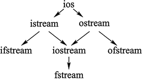
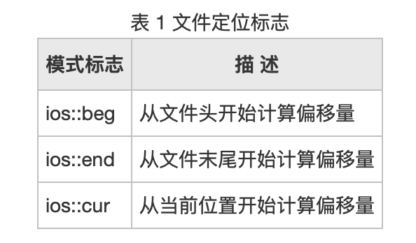

# 输入流和输出流

通常情况下，C++ 程序中使用 cin 输入流实现数据的输入，用 cout 输出流实现数据的输出。除此之外，C++ 还提供有适用于特定场景的输入输出流，比如 cerr、clog 等。

C++输入输出流本质上就是已经定义好的类对象，之所以称它们为"流"，C++ 开发者认为数据传输（包含输入和输出）的过程像水一样，从一个地方流到另一个地方，所以称实现输入的为输入流，实现数据输出的为输出流。

作为类对象，C++输入流和输出流不仅可以实现基本的输入输出操作，通过类内部的成员函数，还可以满足特殊场景中的输入输出需求

## 一、基础

学过 C 语言的读者应该知道，它有一整套完成数据读写（I/O）的解决方案：

- 使用 scanf()、gets() 等函数从键盘读取数据，使用 printf()、puts() 等函数向屏幕上输出数据；
- 使用 fscanf()、fgets() 等函数读取文件中的数据，使用 fprintf()、fputs() 等函数向文件中写入数据。

要知道，C 语言的这套 I/O 解决方案也适用于 C++ 程序，但 C++ 并没有“偷懒”，它自己独立开发了一套全新的 I/O 解决方案，其中就包含大家一直使用的 cin 和 cout。前面章节中，我们一直在用 cin 接收从键盘输入的数据，用 cout 向屏幕上输出数据（这 2 个过程又统称为“标准 I/O”）。除此之外，C++ 也对从文件中读取数据和向文件中写入数据做了支持（统称为“文件 I/O”）

本质上来说，C++ 的这套 I/O 解决方案就是一个包含很多类的类库（作为 C++ 标准库的组成部分），这些类常被称为“流类”



> 其中，图中的箭头代表各个类之间的派生关系。比如，ios 是所有流类的基类，它派生出 istream 和 ostream。特别需要指出的是，为了避免多继承的二义性，从 ios 派生出 istream 和 ostream 时，均使用了 virtual 关键字（虚继承）

这些流类各自的功能分别为：

- istream：常用于接收从键盘输入的数据；
- ostream：常用于将数据输出到屏幕上；
- ifstream：用于读取文件中的数据；
- ofstream：用于向文件中写入数据；
- iostream：继承自 istream 和 ostream 类，因为该类的功能兼两者于一身，既能用于输入，也能用于输出；
- fstream：兼 ifstream 和 ofstream 类功能于一身，既能读取文件中的数据，又能向文件中写入数据。

## 二、C++输入流和输出流

其实，cin 就是 istream 类的对象，cout 是 ostream 类的对象，它们都声明在 <iostream> 头文件中，这也解释了“为什么在 C++ 程序中引入 <iostream> 就可以使用 cin 和 cout”（当然使用 cin 和 cout，还需要声明 std 命名空间）。

除此之外，<iostream> 头文件中还声明有 2 个 ostream 类对象，分别为 cerr 和 clog。它们的用法和 cout 完全一样，但 cerr 常用来输出警告和错误信息给程序的使用者，clog 常用来输出程序执行过程中的日志信息（此部分信息只有程序开发者看得到，不需要对普通用户公开）。

cout、cerr 和 clog 之间的区别如下：

1. cout 除了可以将数据输出到屏幕上，通过重定向（后续会讲），还可以实现将数据输出到指定文件中；而 cerr 和 clog 都不支持重定向，它们只能将数据输出到屏幕上；
2. cout 和 clog 都设有缓冲区，即它们在输出数据时，会先将要数据放到缓冲区，等缓冲区满或者手动换行（使用换行符 '\n' 或者 endl）时，才会将数据全部显示到屏幕上；而 cerr 则不设缓冲区，它会直接将数据输出到屏幕上。

> 值得一提的是，类似 cin、cout、cerr 和 clog 这样，它们都是 C++ 标准库的开发者创建好的，可以直接拿来使用，这种在 C++ 中提前创建好的对象称为内置对象。实际上，<iostream> 头文件中还声明有处理宽字符的 4 个内置对象，分别为 wcin、wcout、wcerr 以及 wclog

```c++
#include <iostream>
#include <string>

int main() {
    std::string url;
    std::cin >> url;
    std::cout << "cout: " << url << std::endl;
    std::cerr << "cerr: " << url << std::endl;
    std::clog << "clog: " << url << std::endl;
    return 0;
}
// akak
// cout: akak
// cerr: akak
// clog: akak
```

istream 和 ostream 类提供了很多实用的函数，cin、cout、cerr 和 clog 作为类对象，当然也能调用

**cin 输入流对象常用成员方法**:

| 成员方法名        | 功能                                                         |
| ----------------- | ------------------------------------------------------------ |
| getline(str,n,ch) | 从输入流中接收 n-1 个字符给 str 变量，当遇到指定 ch 字符时会停止读取，默认情况下 ch 为 '\0'。 |
| get()             | 从输入流中读取一个字符，同时该字符会从输入流中消失。         |
| gcount()          | 返回上次从输入流提取出的字符个数，该函数常和 get()、getline()、ignore()、peek()、read()、readsome()、putback() 和 unget() 联用。 |
| peek()            | 返回输入流中的第一个字符，但并不是提取该字符。               |
| putback(c)        | 将字符 c 置入输入流（缓冲区）。                              |
| ignore(n,ch)      | 从输入流中逐个提取字符，但提取出的字符被忽略，不被使用，直至提取出 n 个字符，或者当前读取的字符为 ch。 |
| operator>>        | 重载 >> 运算符，用于读取指定类型的数据，并返回输入流对象本身。 |

**cout、cerr 和 clog 对象常用的一些成员方法以及它们的功能**:

| 成员方法名 | 功能                                             |
| ---------- | ------------------------------------------------ |
| put()      | 输出单个字符。                                   |
| write()    | 输出指定的字符串。                               |
| tellp()    | 用于获取当前输出流指针的位置。                   |
| seekp()    | 设置输出流指针的位置。                           |
| flush()    | 刷新输出流缓冲区。                               |
| operator<< | 重载 << 运算符，使其用于输出其后指定类型的数据。 |


```c++
#include <iostream>
using namespace std;

int main() {
    char url[30] = {0};

    cin.getline(url, 30);  //读取一行字符串
    //输出上一条语句读取字符串的个数
    cout << "read: " << cin.gcount() << endl;
    //输出 url 数组存储的字符串
    cout.write(url, 30);
    return 0;
}
// asdf
// read: 5
```

## 三、cout.put() 输出单个字符

一般用 ostream 类的 cout 输出流对象和 << 输出运算符实现输出，并且 cout 输出流在内存中有相应的缓冲区。但有时用户还有特殊的输出需求，例如只输出一个字符，这种情况下可以借助该类提供的 put() 成员方法实现

put() 方法专用于向输出流缓冲区中添加单个字符，其语法格式如下：

```c++
ostream＆put(char c);
```

其中，参数 c 为要输出的字符。

可以看到，该函数会返回一个 ostream 类的引用对象，可以理解返回的是 cout 的引用。这意味着，我们可以像下面这样使用 put() 函数：

```c++
cout.put(c1).put(c2).put(c3);
```

因为 cout.put(c1) 向输出流缓冲区中添加 c1 字符的同时，返回一个引用形式的 cout 对象，所以可以继续用此对象调用 put(c2)，依次类推。 

```c++
#include <iostream>
using namespace std;

int main() {
    cout.put('a');
    cout << endl;
    cout.put('a').put('b').put('c');
    return 0;
}
// a
// abc
```

除了使用 cout.put() 函数输出一个字符外，还可以用 putchar() 函数输出一个字符。putchar() 函数是C语言中使用的，在 <stdio.h> 头文件中定义，C++保留了这个函数，在 <iostream> 头文件中定义

## 四、cout.write() 输出字符串

需要输出指定的字符串，这时可以使用 ostream 类提供的 write() 成员方法

write() 成员方法专用于向输出流缓冲区中添加指定的字符串，初学者可以简单的理解为输出指定的字符串。其语法格式如下：

```c++
ostream＆write（const char *s，streamsize n）;
```

其中，s 用于指定某个长度至少为 n 的字符数组或字符串；n 表示要输出的前 n 个字符

可以看到，该函数会返回一个 ostream 类的引用对象，可以理解返回的是 cout 的引用。这意味着，我们可以像下面这样使用 write() 方法：

```c++
cout.write(c1, 1).write(c2, 2).write(c3, 3);
```


```c++
#include <iostream>
using namespace std;
int main() {
    const char* str = "abcdefghighlmn";
    cout.write(str, 3);
    cout << endl;
    cout.write(str, 3).write(str, 3).write(str, 3);
    return 0;
}
// abc
// abcabcabc
```

## 五、cout.tellp()和cout.seekp()方法

无论是使用 cout 输出普通数据，用 cout.put() 输出指定字符，还是用 cout.write() 输出指定字符串，数据都会先放到输出流缓冲区，待缓冲区刷新，数据才会输出到指定位置（屏幕或者文件中）。

值得一提的是，**当数据暂存于输出流缓冲区中时，我们仍可以对其进行修改**。ostream 类中提供有 tellp() 和 seekp() 成员方法，借助它们就可以修改位于输出流缓冲区中的数据。

### tellp()

tellp() 成员方法用于**获取当前输出流缓冲区中最后一个字符所在的位置**，其语法格式如下：

```c++
streampos tellp();
```

显然，tellp() 不需要传递任何参数，会返回一个 streampos 类型值。事实上，streampos 是 fpos 类型的别名，而 fpos 通过自动类型转换，可以直接赋值给一个整形变量（即 short、int 和 long）。也就是说，在使用此函数时，我们可以用一个整形变量来接收该函数的返回值。

注意，当输出流缓冲区中没有任何数据时，该函数返回的整形值为 0；当指定的输出流缓冲区不支持此操作，或者操作失败时，该函数返回的整形值为 -1。

```c++
#include <fstream>   //文件输入输出流
#include <iostream>  //cin 和 cout
int main() {
    //定义一个文件输出流对象
    std::ofstream outfile;
    //打开 tmp.txt，等待接收数据
    outfile.open("test.txt");
    const char* str = "abcde";
    //将 str 字符串中的字符逐个输出到 test.txt 文件中，每个字符都会暂时存在输出流缓冲区中
    for (int i = 0; i < strlen(str); i++) {
        outfile.put(str[i]);
        //获取当前输出流
        long pos = outfile.tellp();
        std::cout << pos << std::endl;
    }
    //关闭文件之前，刷新 outfile 输出流缓冲区，使所有字符由缓冲区流入test.txt文件
    outfile.close();
    return 0;
}
// 1
// 2
// 3
// 4
// 5
```

### seekp()

seekp() 方法用于**指定下一个进入输出缓冲区的字符所在的位置**

seekp() 方法有如下 2 种语法格式：

```c++
//指定下一个字符存储的位置
ostream& seekp (streampos pos);
//通过偏移量间接指定下一个字符的存储位置   
ostream& seekp (streamoff off, ios_base::seekdir way);
```

其中，各个参数的含义如下：

- pos：用于接收一个正整数；、
- off：用于指定相对于 way 位置的偏移量，其本质也是接收一个整数，可以是正数（代表正偏移）或者负数（代表负偏移）；
- way：用于指定偏移位置，即从哪里计算偏移量，它可以接收表 1 所示的 3 个值。



同时，seekp() 方法会返回一个引用形式的 ostream 类对象，这意味着 seekp() 方法可以这样使用：

```c++
cout.seekp(23) << "当前位置为：" << cout.tellp();
```

```c++
#include <fstream>   //文件输入输出流
#include <iostream>  //cin 和 cout
using namespace std;
int main() {
    //定义一个文件输出流对象
    ofstream outfile;
    //打开 test.txt，等待接收数据
    outfile.open("test.txt");
    const char* str = "abcde";
    //将 str 字符串中的字符逐个输出到 test.txt 文件中，每个字符都会暂时存在输出流缓冲区中
    for (int i = 0; i < strlen(str); i++) {
        outfile.put(str[i]);
        //获取当前输出流
    }
    cout << "now position: " << outfile.tellp() << endl;
    //调整新进入缓冲区字符的存储位置
    outfile.seekp(3);  //等价于：
                       // outfile.seekp(3, ios::beg);
                       // outfile.seekp(-2, ios::cur);
                       // outfile.seekp(-2, ios::end);

    cout << "new position: " << outfile.tellp() << endl;
    outfile.write("tttt", 4);
    //关闭文件之前，刷新 outfile 输出流缓冲区，使所有字符由缓冲区流入test.txt文件
    outfile.close();
    return 0;
}
// now position: 5
// new position: 3
// test文件里为 abctttt
```

## 六、cout格式化输出

在某些实际场景中，我们经常需要按照一定的格式输出数据，比如输出浮点数时保留 2 位小数，再比如以十六进制的形式输出整数，等等。

C++ 通常使用 cout 输出数据，和 printf() 函数相比，cout 实现格式化输出数据的方式更加多样化。一方面，cout 作为 ostream 类的对象，该类中提供有一些成员方法，可实现对输出数据的格式化；另一方面，为了方面用户格式化输出数据，C++ 标准库专门提供了一个 <iomanip> 头文件，该头文件中包含有大量的格式控制符（严格意义上称为“流操纵算子”），使用更加方便。

### cout成员方法

ostream 类中还包含一些可实现格式化输出的成员方法，这些成员方法都是从 ios 基类（以及 ios_base 类）中继承来的，cout（以及 cerr、clog）也能调用

| 成员函数          | 说明                                                         |
| ----------------- | ------------------------------------------------------------ |
| flags(fmtfl)      | 当前格式状态全部替换为 fmtfl。注意，fmtfl 可以表示一种格式，也可以表示多种格式。 |
| precision(n)      | 设置输出浮点数的精度为 n。                                   |
| width(w)          | 指定输出宽度为 w 个字符。                                    |
| fill(c)           | 在指定输出宽度的情况下，输出的宽度不足时用字符 c 填充（默认情况是用空格填充）。 |
| setf(fmtfl, mask) | 在当前格式的基础上，追加 fmtfl 格式，并删除 mask 格式。其中，mask 参数可以省略。 |
| unsetf(mask)      | 在当前格式的基础上，删除 mask 格式。                         |

对于表 1 中 flags() 函数的 fmtfl 参数、setf() 函数中的 fmtfl 参数和 mask 参数以及 unsetf() 函数 mask 参数，可以选择表 2 中列出的这些值

| 标 志           | 作 用                                                        |
| --------------- | ------------------------------------------------------------ |
| ios::boolapha   | 把 true 和 false 输出为字符串                                |
| ios::left       | 输出数据在本域宽范围内向左对齐                               |
| ios::right      | 输出数据在本域宽范围内向右对齐                               |
| ios::internal   | 数值的符号位在域宽内左对齐，数值右对齐，中间由填充字符填充   |
| ios::dec        | 设置整数的基数为 10                                          |
| ios::oct        | 设置整数的基数为 8                                           |
| ios::hex        | 设置整数的基数为 16                                          |
| ios::showbase   | 强制输出整数的基数（八进制数以 0 开头，十六进制数以 0x 打头） |
| ios::showpoint  | 强制输出浮点数的小点和尾数 0                                 |
| ios::uppercase  | 在以科学记数法格式 E 和以十六进制输出字母时以大写表示        |
| ios::showpos    | 对正数显示“+”号                                              |
| ios::scientific | 浮点数以科学记数法格式输出                                   |
| ios::fixed      | 浮点数以定点格式（小数形式）输出                             |
| ios::unitbuf    | 每次输出之后刷新所有的流                                     |

```c++
#include <iostream>
using namespace std;

int main() {
    double a = 1.23;
    //设定后续输出的浮点数的精度为 4
    cout.precision(4);
    cout << "precision: " << a << endl;
    //设定后续以科学计数法的方式输出浮点数
    cout.setf(ios::scientific);
    cout << "scientific: " << a << endl;
    return 0;
}

// precision: 1.23
// scientific: 1.2300e+00
```

值得一提的是，当调用 unsetf() 或者 2 个参数的 setf() 函数时，为了提高编写代码的效率，可以给 mask 参数传递如下 3 个组合格式：

- ios::adjustfield：等价于 ios::left | ios::right | ios::internal；
- ios::basefield：等价于 ios::dec | ios::oct | ios::hex；
- ios::floatfield：等价于 ios::scientific | ios::fixed。

```c++
#include <iostream>
using namespace std;

int main() {
    double f = 123;
    //设定后续以科学计数法表示浮点数
    cout.setf(ios::scientific);
    cout << f << '\n';
    //删除之前有关浮点表示的设定
    cout.unsetf(ios::floatfield);
    cout << f;
    return 0;
}
// 1.230000e+02
// 123
```

### 使用流操纵算子格式化输出

罗列了 <iomanip> 头文件中定义的一些常用的格式控制符，它们都可用于格式化输出。

| 流操纵算子          | 作  用                                                       |        |
| ------------------- | ------------------------------------------------------------ | ------ |
| *dec                | 以十进制形式输出整数                                         | 常用   |
| hex                 | 以十六进制形式输出整数                                       |        |
| oct                 | 以八进制形式输出整数                                         |        |
| fixed               | 以普通小数形式输出浮点数                                     |        |
| scientific          | 以科学计数法形式输出浮点数                                   |        |
| left                | 左对齐，即在宽度不足时将填充字符添加到右边                   |        |
| *right              | 右对齐，即在宽度不足时将填充字符添加到左边                   |        |
| setbase(b)          | 设置输出整数时的进制，b=8、10 或 16                          |        |
| setw(w)             | 指定输出宽度为 w 个字符，或输入字符串时读入 w 个字符。注意，该函数所起的作用是一次性的，即只影响下一次 cout 输出。 |        |
| setfill(c)          | 在指定输出宽度的情况下，输出的宽度不足时用字符 c 填充（默认情况是用空格填充） |        |
| setprecision(n)     | 设置输出浮点数的精度为 n。  在使用非 fixed 且非 scientific 方式输出的情况下，n 即为有效数字最多的位数，如果有效数字位数超过 n，则小数部分四舍五人，或自动变为科学计 数法输出并保留一共 n 位有效数字。  在使用 fixed 方式和 scientific 方式输出的情况下，n 是小数点后面应保留的位数。 |        |
| setiosflags(mask)   | 在当前格式状态下，追加 mask 格式，mask 参数可选择表 2 中的所有值。 |        |
| resetiosflags(mask) | 在当前格式状态下，删除 mask 格式，mask 参数可选择表 2 中的所有值。 |        |
| boolapha            | 把 true 和 false 输出为字符串                                | 不常用 |
| *noboolalpha        | 把 true 和 false 输出为 0、1                                 |        |
| showbase            | 输出表示数值的进制的前缀                                     |        |
| *noshowbase         | 不输出表示数值的进制.的前缀                                  |        |
| showpoint           | 总是输出小数点                                               |        |
| *noshowpoint        | 只有当小数部分存在时才显示小数点                             |        |
| showpos             | 在非负数值中显示 +                                           |        |
| *noshowpos          | 在非负数值中不显示 +                                         |        |
| uppercase           | 十六进制数中使用 A~E。若输出前缀，则前缀输出 0X，科学计数法中输出 E |        |
| *nouppercase        | 十六进制数中使用 a~e。若输出前缀，则前缀输出 0x，科学计数法中输出 e。 |        |
| internal            | 数值的符号（正负号）在指定宽度内左对齐，数值右对 齐，中间由填充字符填充。 |        |

> 注意：“流操纵算子”一栏带有星号 * 的格式控制符，默认情况下就会使用。例如在默认情况下，整数是用十进制形式输出的，等效于使用了 dec 格式控制符。

```c++
#include <iomanip>
#include <iostream>
using namespace std;

int main() {
    //以十六进制输出整数
    cout << hex << 16 << endl;
    cout << 32 << endl;
    //删除之前设定的进制格式，以默认的 10 进制输出整数
    cout << resetiosflags(ios::basefield) << 16 << endl;
    double a = 123;
    //以科学计数法的方式输出浮点数
    cout << scientific << a << endl;
    //删除之前设定的科学计数法的方法
    cout << resetiosflags(ios::scientific) << a << endl;
    return 0;
}
// 10
// 20
// 16
// 1.230000e+02
// 123
```

注意，如果两个相互矛盾的标志同时被设置，如先设置 setiosflags(ios::fixed)，然后又设置 setiosflags(ios::scientific)，那么结果可能就是两个标志都不起作用。因此，在设置了某标志，又要设置其他与之矛盾的标志时，就应该用 resetiosflags 清除原先的标志。

## 七、对输入输出重定向

cout 允许被重定向，而 cerr 和 clog 都不支持。值得一提的是，cin 也允许被重定向。

那么，什么是重定向呢？在默认情况下，cin 只能接收从键盘输入的数据，cout 也只能将数据输出到屏幕上。**通过重定向，cin 可以将指定文件作为输入源，即接收文件中早已准备好的数据，同样 cout 可以将原本要输出到屏幕上的数据转而写到指定文件中**。

### 1、freopen()函数实现重定向

freopen() 定义在`<stdio.h>`头文件中，是 C 语言标准库中的函数，专门用于重定向输入流（包括 scanf()、gets() 等）和输出流（包括 printf()、puts() 等）。值得一提的是，该函数也可以对 C++ 中的 cin 和 cout 进行重定向。

手动创建一个 in.txt 文件，其包含的内容如下：

```c++
abc
gggggg
```

```c++
#include <stdio.h>  // freopen

#include <iostream>  // cin、cout
#include <string>    // string
using namespace std;

int main() {
    string name, url;
    //将标准输入流重定向到 in.txt 文件
    freopen("in.txt", "r", stdin);
    cin >> name >> url;
    //将标准输出重定向到 out.txt文件
    freopen("out.txt", "w", stdout);
    cout << name << "\n"
         << url;
    return 0;
}
```

控制台中，既不需要手动输入，也没有任何输出

与此同时，会自动生成一个 out.txt 文件，其包含的内容和 in.txt 文件相同：

### 2、rdbuf()函数实现重定向

dbuf() 函数定义在`<ios>`头文件中，专门用于实现 C++ 输入输出流的重定向。

值得一提的是，ios 作为 istream 和 ostream 类的基类，rdbuf() 函数也被继承，因此 cin 和 cout 可以直接调用该函数实现重定向。

值得一提的是，ios 作为 istream 和 ostream 类的基类，rdbuf() 函数也被继承，因此 cin 和 cout 可以直接调用该函数实现重定向。

```c++
streambuf * rdbuf() const;
streambuf * rdbuf(streambuf * sb);
```

streambuf 是 C++ 标准库中用于表示缓冲区的类，该类的指针对象用于代指某个具体的流缓冲区。

其中，第一种语法格式仅是返回一个指向当前流缓冲区的指针；第二种语法格式用于将 sb 指向的缓冲区设置为当前流的新缓冲区，并返回一个指向旧缓冲区的对象。

仍以前面创建好的 in.txt 文件为例，执行此程序后，控制台不会输出任何数据，而是会在该项目的目录下生成一个 out.txt 文件

```c++
#include <fstream>
#include <iostream>
using namespace std;
int main() {
    //打开 in.txt 文件，等待读取
    ifstream fin("in.txt");
    //打开 out.txt 文件，等待写入
    ofstream fout("out.txt");
    streambuf *oldcin;
    streambuf *oldcout;
    char a[100];
    //用 rdbuf() 重新定向，返回旧输入流缓冲区指针
    oldcin = cin.rdbuf(fin.rdbuf());
    //从input.txt文件读入
    cin >> a;
    //用 rdbuf() 重新定向，返回旧输出流缓冲区指针
    oldcout = cout.rdbuf(fout.rdbuf());
    //写入 out.txt
    cout << a << endl;
    //还原标准输入输出流
    cin.rdbuf(oldcin);    // 恢复键盘输入
    cout.rdbuf(oldcout);  //恢复屏幕输出
    //打开的文件，最终需要手动关闭
    fin.close();
    fout.close();
    return 0;
}
```

### 3、通过控制台实现重定向

```c++
#include <iostream>
#include <string>
using namespace std;

int main() {
    string name, url;
    cin >> name >> url;
    cout << name << '\n'
         << url;
    return 0;
}
```

先编译

**在控制台中使用 > 或者 < 实现重定向的方式**，DOS、windows、Linux 以及 UNIX 都能自动识别。

```shell
./a.out < in.txt > out.txt
```

out.txt 文件下就有 in.txt 的内容

## 八、如何管理输出缓冲区？

每个输出流都管理一个缓冲区，用来保存程序读写的数据。例如，如果执行下而的代码：

```c++
cout << "hello world";
```

文本串可能立即打印出来，但也有可能被操作系统保存在缓冲区中，随后再打印。

有了缓冲机制，操作系统就可以将程序的多个输出操作组合成单一的系统级写操作。由于设备的写操作可能很耗时，允许操作系统将多个输出操作组合为单一的设备写操作可以带来很大的性能提升。

导致缓冲刷新（**数据真正写到输出设备或文件**）的原因有很多：

- 程序正常结束，作为 main() 函数的 return 操作的一部分，缓冲刷新被执行。
- 缓冲区满时，需要刷新缓冲，而后新的数据才能继续写入缓冲区。
- 我们可以使用操纵符如 endl 来显式刷新缓冲区。
- 在每个输出操作之后，我们可以用操作符 unitbuf 设置流的内部状态，来清空缓冲区。默认情况下，对 cerr 是设置 unitbuf 的，因此写到 cerr 的内容都是立即刷新的。
- 一个输出流可能被关联到另一个流。在这种情况下，当读写被关联的流时，关联到的流的缓冲区会被刷新。例如，默认情况下，cin 和 cerr 都关联到 cout。因此，读 cin 或写 cerr 都会导致 cout 的缓冲区被刷新。

### 1、endl()、flush()、ends() 刷新输出缓冲区

我们已经使用过操作符 endl，它完成换行并刷新缓冲区的工作。IO 库中还有两个类似的操纵符：

- flush 刷新缓冲区，但不输出任何额外的字符；
- ends向缓冲区插入一个空字符，然后刷新缓冲区

```c++
#include <iostream>
using namespace std;

int main() {
    cout << "hi!" << endl;   // 输出hi和一个换行，然后刷新缓冲区
    cout << "hi!" << flush;  // 输出hi，然后刷新缓冲区，不附加任何额外字符
    cout << "hi!" << ends;   // 输出hi和一个空字符，然后刷新缓冲区
    return 0;
}
// hi!\r\n
// hi!hi!\x00
```

### 2、unitbuf 操作符

如果想在每次输出操作后都刷新缓冲区，我们可以使用 unitbuf 操作符，它告诉流在接下来的每次写操作之后都进行一次 flush 操作。而 nounitbuf 操作符则重置流， 使其恢复使用正常的系统管理的缓冲区刷新机制：

```c++
cout << unitbuf;  //所有输出操作后都会立即刷新缓冲区
//任何输出都立即刷新，无缓冲
cout << nounitbuf;  //回到正常的缓冲方式
```

警告：**如果程序崩溃，输出缓冲区不会被刷新**

如果程序异常终止，输出缓冲区是不会被刷新的。当一个程序崩溃后，它所输出的数据很可能停留在输出缓冲区中等待打印。

当调试一个已经崩溃的程序时，需要确认那些你认为已经输出的数据确实已经刷新了。否则，可能将大量时间浪费在追踪代码为什么没有执行上，而实际上代码已经执行了，只是程序崩溃后缓冲区没有被刷新，输出数据被挂起没有打印而已。

### 3、关联输入和输出流

当一个输入流被关联到一个输出流时，任何试图从输入流读取数据的操作都会先刷新关联的输出流。标准库将 cout 和 cin 关联在一起，因此下面语句：

```c++
cin >> ival;
```

导致 cout 的缓冲区被刷新。

交互式系统通常应该关联输入流和输出流。这意味着所有输出，包括用户提示信息，都会在读操作之前被打印出来。

tie() 函数可以用来绑定输出流，它有两个重载的版本：

```c++
ostream* tie ( ) const;  	// 返回指向绑定的输出流的指针。
ostream* tie (ostream* os); // 将 os 指向的输出流绑定的该对象上，并返回上一个绑定的输出流指针。
```

第一个版本不带参数，返冋指向出流的指针。如果本对象当前关联到一个输出流，则返回的就是指向这个流的指针，如果对象未关联到流，则返回空指针。

tie() 的第二个版本接受一个指向 ostream 的指针，将自己关联到此 ostream，即，x.tie(&o) 将流 x 关联到输出流 o。

我们既可以将一个 istream 对象关联到另一个 ostream，也可以将一个 ostream 关联到另一个 ostream：

```c++
cin.tie(&cout);  //仅仅是用来展示，标准库已经将 cin 和 cout 关联在一起
//old_tie 指向当前关联到 cin 的流（如果有的话）
ostream *old_tie = cin.tie(nullptr);  // cin 不再与其他流关联
//将 cin 与 cerr 关联，这不是一个好主意，因为 cin 应该关联到 cout
cin.tie(&cerr);  //读取 cin 会刷新 cerr 而不是 cout
cin.tie(old_tie);  //重建 cin 和 cout 间的正常关联
```

在这段代码中，为了将一个给定的流关联到一个新的输出流，我们将新流的指针传递给了 tie()。为了彻底解开流的关联，我们传递了一个空指针。每个流同时最多关联到一个流， 但多个流可以同时关联到同一个ostream。

## 九、get() 读取单个字符

get() 是 istream 类的成员函数，它有多种重载形式（请[猛击这里](http://www.cplusplus.com/reference/istream/istream/get/)了解详情），不过本文只介绍最简单最常用的一种：

```c++
int get();
```

此函数从输入流中读入一个字符，返回值就是该字符的 ASCII 码。如果碰到输入的末尾，则返回值为 EOF。

EOF 是 End of File 的缩写。istream 类中从输入流（包括文件）中读取数据的成员函数，在把输入数据都读取完后再进行读取，就会返回 EOF。EOF 是在 iostream 类中定义的一个整型常量，值为 -1。

get() 函数不会跳过空格、制表符、回车等特殊字符，所有的字符都能被读入。例如下面的程序：

```c++
#include <iostream>
using namespace std;

int main() {
    int c;
    while ((c = cin.get()) != EOF)
        cout.put(c);
    return 0;
}
```

程序中的变量 c 应为 int 类型，而不能是 char 类型。在输入流中碰到 ASCII 码等于 0xFF 的字符时，cin.get() 返回 0xFF，0xFF 赋值给 c，此时如果 c 是 char 类型的，那么其值就是 -1（因为符号位为 1 代表负数），即等于 EOF，于是程序就错误地认为输入已经结束。

而在 c 为 int 类型的情况下，将 0xFF 赋值给 c，c 的值是 255（因为符号位为 0，是正数），而非 -1，即除非读到输入末尾，c 的值都不可能是 -1。

要将文本文件 test.txt 中的全部内容原样显示出来，程序可以如下编写：

```c++
#include <iostream>
using namespace std;

int main() {
    int c;
    freopen("test.txt", "r", stdin);  //将标准输入重定向为 test.txt
    while ((c = cin.get()) != EOF)
        cout.put(c);
    return 0;
}
```

## 十、getline() 读入一行字符串（整行数据）

```c++
istream & getline(char* buf, int bufSize);
istream & getline(char* buf, int bufSize, char delim);
```

第一个版本从输入流中读取 bufSize-1 个字符到缓冲区 buf，或遇到`\n`为止（哪个条件先满足就按哪个执行）。函数会自动在 buf 中读入数据的结尾添加`\0`。

第二个版本和第一个版本的区别在于，第一个版本是读到`\n`为止，第二个版本是读到 delim 字符为止。`\n`或 delim 都不会被读入 buf，但会被从输入流中取走。

这两个函数的返回值就是函数所作用的对象的引用。如果输入流中`\n`或 delim 之前的字符个数达到或超过 bufSize，就会导致读入出错，其结果是：虽然本次读入已经完成，但是之后的读入都会失败。

从输入流中读入一行，可以用第一个版本。用`cin >> str`这种写法是不行的，因为此种读法在碰到行中的空格或制表符时就会停止，因此就不能保证 str 中读入的是整行。

```c++
#include <iostream>
using namespace std;

int main() {
    char szBuf[20];
    int n = 120;
    if (!cin.getline(szBuf, 6))  //如果输入流中一行字符超过5个，就会出错
        cout << "error" << endl;
    cout << szBuf << endl;
    cin >> n;
    cout << n << endl;
    cin.clear();  // clear能够清除cin内部的错误标记，使之恢复正常
    cin >> n;
    cout << n << endl;
    return 0;
}
```

例如，要将文件 test.txt 中的全部内容

```c++
#include <iostream>
using namespace std;

const int MAX_LINE_LEN = 10000;  //假设文件中一行最长 10000 个字符

int main() {
    char szBuf[MAX_LINE_LEN + 10];
    freopen("test.txt", "r", stdin);  //将标准输入重定向为 test.txt
    while (cin.getline(szBuf, MAX_LINE_LEN + 5))
        cout << szBuf << endl;
    return 0;
}
```

程序每次读入文件中的一行到 szBuf 并输出。szBuf 中不会读入回车符，因此输出 szBuf 后要再输出 endl 以换行

## 十一、ignore() 跳过（忽略）指定字符

ignore() 是 istream 类的成员函数，它的原型是：

```c++
istream & ignore(int n =1, int delim = EOF);
```

此函数的作用是**跳过输入流中的 n 个字符，或跳过 delim 及其之前的所有字符，哪个条件先满足就按哪个执行**。两个参数都有默认值，因此 cin.ignore() 就等效于 cin.ignore(1, EOF)， 即跳过一个字符。

该函数常用于跳过输入中的无用部分，以便提取有用的部分。例如，输入的电话号码形式是`Tel:63652823`，`Tel:`就是无用的内容。例如下面的程序：

```c++
#include <iostream>
using namespace std;

int main() {
    int n;
    cin.ignore(5, 'A');
    cin >> n;
    cout << n;
    return 0;
}
```

```shell
./a.out
abcde34
34
```

## 十二、peek() 查看输入流中的下一个字符

peek() 是 istream 类的成员函数，它的原型是：

```c++
int peek();
```

此函数返回输入流中的下一个字符，但是并不将该字符从输入流中取走——相当于只是看了一眼下一个字符，因此叫 peek。

cin.peek() 不会跳过输入流中的空格、回车符。在输入流已经结束的情况下，cin.peek() 返回 EOF。

在输入数据的格式不同，需要预先判断格式再决定如何输入时，peek() 就能起到作用。

例题：编写一个日期格式转换程序，输入若干个日期，每行一个，要求全部转换为“mm-dd-yyyy”格式输出。输入的日期格式可以是“2011.12.24”（中式格式），也可以是“Dec 24 2011”（西式格式）。要求该程序对于以下输入数据：

```
Dec 3 1990
2011.2.3
458.12.1
Nov 4 1998
Feb 12 2011
```

输出结果应为：

```
12-03-1990
02-03-2011
12-01-0458
11-04-1998
02-12-2011
```

编写这个程序时，如果输入的是中式格式，就用 cin>>year（假设 year 是 int 类型变量）读取年份，然后再读取后面的内容；如果输入是西式格式，就用 cin>>sMonth（假设 sMonth 是 string 类型对象）读取月份，然后读取后面的内容。

可是，如果没有将数据从输入流中读取出来，就无法判断输入到底是哪种格式。即便用 cin.get() 读取一个字符后再作判断，也很不方便。例如，在输入为`2011.12.24`的情况下，读取第一个字符`2`后就知道是格式一，问题是输入流中的已经被读取了，剩下的表示年份的部分只有`011`，如何将这个`011`和前面读取的`2`奏成一个整数 2011，也是颇费周折的事情。使用 peek() 函数很容易解决这个问题。

```c++
#include <iomanip>
#include <iostream>
#include <string>
using namespace std;

string Months[12] = {"Jan", "Feb", "Mar", "Apr", "May", "Jun",
                     "Jul", "Aug", "Sep", "Oct", "Nov", "Dec"};

int main() {
    int c;
    while ((c = cin.peek()) != EOF) {  //取输入流中的第一个字符进行查看
        int year, month, day;
        if (c >= 'A' && c <= 'Z') {  //美国日期格式
            string sMonth;
            cin >> sMonth >> day >> year;
            for (int i = 0; i < 12; ++i)  //查找月份
                if (sMonth == Months[i]) {
                    month = i + 1;
                    break;
                }
        } else {  //中国日期格式
            cin >> year;
            cin.ignore() >> month;  //用ignore跳过 "2011.12.3"中的'.'
            cin.ignore() >> day;
        }
        cin.ignore();                              //跳过行末 '\n'
        cout << setfill('0') << setw(2) << month;  //设置填充字符'\0'，输出宽度2
        cout << "-" << setw(2) << day << "-" << setw(4) << year << endl;
    }
    return 0;
}
```

istream 还有一个成员函数 istream & putback(char c)，可以将一个字符插入输入流的最前面。对于上面的例题，也可以在用 get() 函数读取一个字符并判断是中式格式还是西式格式时，将刚刚读取的字符再用 putback() 成员函数放回流中，然后再根据判断结果进行不同方式的读入。

## 十三、cin是判断输入结束

cin 可以用来从键盘输入数据；将标准输入重定向为文件后，cin 也可以用来从文件中读入数据。在输入数据的多少不确定，且没有结束标志的情况下，该如何判断输入数据已经读完了呢？

从文件中读取数据很好办，到达文件末尾就读取结束了。从控制台读取数据怎么办呢？总不能把控制台关闭吧？这样程序也运行结束了！

其实，在控制台中输入特殊的控制字符就表示输入结束了：

- 在 Windows 系统中，通过键盘输入时，按 Ctrl+Z 组合键后再按回车键，就代表输入结束。
- 在 UNIX/Linux/Mac OS 系统中，Ctrl+D 代表输入结束。

不管是文件末尾，还是 Ctrl+Z 或者 Ctrl+D，它们都是结束标志；cin 在正常读取时返回 true，遇到结束标志时返回 false，我们可以根据 cin 的返回值来判断是否读取结束。

### 1、判断控制台（键盘）读取结束

```c++
#include <iostream>
using namespace std;

int main() {
    int n;
    int maxN = 0;
    while (cin >> n) {  //输入没有结束，cin 就返回 true，条件就为真
        if (maxN < n)
            maxN = n;
    }
    cout << maxN << endl;
    return 0;
}
```

```
10↙
30↙
93↙
206↙
^Z↙
206
```

### 2、判断文件读取结束

如果将标准输入重定向为某个文件，如在程序开始添加`freopen("test.txt", "r", stdin);`语句，或者不添加上述语句，但是在 Windows 的“命令提示符”窗口中输入：

```shell
mycin < test.txt  // 假设编译生成的可执行文件的名字为 mycin.exe
```

则都能使得本程序不再从键盘输入数据，而是从 test.txt 文件输入数据（前提是 test.txt 文件和 mycin.exe 在同一个文件夹中）。在这种情况下，test.txt 文件中并不需要包含 Ctrl+Z，只要有用空格或回车隔开的若干个正整数即可。

cin 读到文件末尾时，`cin>>n`就会返回 false，从而导致程序结束。例如，假定 test.txt 文件中的内容如下所示：

```
112
23123
34 444 55
44
```

对于前面的代码，在“命令提示符”窗口中先 cd 到 mycin.exe 所在目录，然后输入`mycin < test.txt`，则程序的输出是：23123

## 十四、处理输入输出错误

当处理输入输出时，我们必须预计到其中可能发生的错误并给出相应的处理措施。

- 当我们输入时，可能会由于人的失误（错误理解了指令、打字错误、允许自家的小猫在键盘上散步等）、文件格式不符、错误估计了情况等原因造成读取失败。
- 当我们输出时，如果输出设备不可用、队列满或者发生了故障等，都会导致写入失败。


发生输入输出错误的可能情况是无限的！但 C++ 将所有可能的情况归结为四类，称为流状态（stream state）。每种流状态都用一个 iostate 类型的标志位来表示。

| 标志位  | 意义                                                         |
| ------- | ------------------------------------------------------------ |
| badbit  | 发生了（或许是物理上的）致命性错误，流将不能继续使用。       |
| eofbit  | 输入结束（文件流的物理结束或用户结束了控制台流输入，例如用户按下了 Ctrl+Z 或 Ctrl+D 组合键。 |
| failbit | I/O 操作失败，主要原因是非法数据（例如，试图读取数字时遇到字母）。流可以继续使用，但会设置 failbit 标志。 |
| goodbit | 一切止常，没有错误发生，也没有输入结束。                     |

ios_base 类定义了以上四个标志位以及 iostate 类型，但是 ios 类又派生自 ios_base 类，所以可以使用 ios::failbit 代替 ios_base::failbit 以节省输入。

一旦流发生错误，对应的标志位就会被设置，我们可以通过下表列出的函数检测流状态。

| 检测函数 | 对应的标志位 | 说明                                                         |
| -------- | ------------ | ------------------------------------------------------------ |
| good()   | goodbit      | 操作成功，没有发生任何错误。                                 |
| eof()    | eofbit       | 到达输入末尾或文件尾。                                       |
| fail()   | failbit      | 发生某些意外情况（例如，我们要读入一个数字，却读入了字符 'x'）。 |
| bad()    | badbit       | 发生严重的意外（如磁盘读故障）。                             |

不幸的是，fail() 和 bad() 之间的区别并未被准确定义，程序员对此的观点各种各样。但是，基本的思想很简单：

- 如果输入操作遇到一个简单的格式错误，则使流进入 fail() 状态，也就是假定我们（输入操作的用户）可以从错误中恢复。
- 如果错误真的非常严重，例如发生了磁盘故障，输入操作会使得流进入 bad() 状态。也就是假定面对这种情况你所能做的很有限，只能退出输入。

下面是一个如何使用流状态的例子：

假定我们要读取一个整数序列并存入 vector 中，字符`*`或“文件尾”表示序列结束。Windows 平台按下 Ctrl+Z 组合键，再按下回车键表示到达文件末尾；类Unix系统按下 Ctrl+D 组合键表示到达文件末尾。

```c++
//从 ist 中读入整数到 v 中，直到遇到 eof() 或终结符
void fill_vector(istream& ist, vector<int>& v, char terminator){
    for( int i; ist>>i; ) v.push_back(i);
    //正常情况
    if(ist.eof()) return;  //发现到了文件尾，正确，返回
    //发生严重错误，只能退出函数
    if (ist.bad()){
        error("cin is bad!");  //error是自定义函数，它抛出异常，并给出提示信息
    }
    //发生意外情况
    if (ist.fail()) {  //最好清除混乱，然后汇报问题
        ist.clear();  //清除流状态
        //检测下一个字符是否是终结符
        char c;
        ist>>c;  //读入一个符号，希望是终结符
        if(c != terminator) { // 非终结符
            ist.unget(); //放回该符号
            ist.clear(ios_base::failbit);  //将流状态设置为 fail()
        }
    }
}
```

如果发生了 fail()，我们尝试检测下一个字符是否是结束符：如果是，那么就完整得读取了数据，使用 clear() 恢复状态就可以；如果不是，我们就没有办法处理了，所以将状态重新设置为 fail()，以期望 fill_vector() 的调用者（上层函数）有能力处理。

我们通过调用 ist.clear(ios_base::failbit) 来将流状态设置为 fail()。对照简单的cleal()，带参数的用法有些令人迷惑：当 clear() 带参数时，参数中所指出的 iostream 状态位会被置位（进入相应状态)，而未指出的状态位会被复位。通过将流状态设置为 fail()，我们表明遇到了一个格式错误，而不是一个更为严重的问题。

可以用 unget() 将字符放回 ist，以便 fill_vector() 的调用者可能使用该字符。unget() 函数是 putback() 的简化版本，它依赖于流对象记住最后一个字符是什么，所以在这里可以不用考虑它的用法。

如果 fill_vector() 的调用者想知道是什么原因终止了输入，那么可以检测流是处于 fail() 还是 eof() 状态。当然也可以捕获 error() 抛出的 runtime_error 异常，但当 istream 处于 bad() 状态时，继续获取数据是不可能的。大多数的调用者无须为此烦恼。因为这意味着，几乎在所有情况下，对于 bad() 状态，我们所能做的只是抛出一个异常。

简单起见，可以让 istream 帮我们抛出这个异常。

```c++
//从ist中读入整数到v中，直到遇到eof()或终结符
void fill_vector(istream& ist, vector<int>& v, char terminator){
    ist.exceptions(ist.exceptions() | ios_base:: badbit);
    for (int i; ist>>i; ) v.push_back(i);
    if (ist.eof()) return;  //发现到了文件尾
    //不是good()，不是bad()，不是eof()，ist的状态一定是fail()
    ist.clear();  //清除流状态
    char c;
    ist>>c;    //读入一个符号，希望是终结符
    if (c != terminator) { //不是终结符号，一定是失败了
        ist.unget();    //也许程序调用者可以使用这个符号
        ist.clear(ios_base::failbit); //将流状态设置为 fail()
    }
}
```

这里使用了 ios_base，它是 iostream 的一部分，包含了对常量如 badbit 的定义、异常如 failure 的定义，以及其他一些有用的定义。可以通过`::`操作符来使用它们，例如 ios_ base::badbit。

我们无须如此深入地讨论 iostream 库的细节，若要学习 iostream的所有内容，可能需要一门完整的课程。例如，iostream 可以处理不同的字符集，实现不同的缓冲策略，还包含一些工具，能按不同语言的习惯格式化货币金额的输入输出。我们曾经收到过一份关于乌克兰货币输入输出格式的错误报告。如果需要了解更多 iostream 库的内容，可以参考 Stroustrup 的《The C++ Programming Language》和 Langer 的《Standard C++ IOStreams and Locales》。

与 istream—样，ostream 也有四个状态：good()、fail()、eof() 和 bad()。不过，对于本教程的读者来说，输出错误要比输入错误少得多，因此通常不对 ostream 进行状态检测。如果程序运行环境中输出设备不可用、队列满或者发生故障的概率很高，我们就可以像处理输入操作那样，在每次输出操作之后都检测其状态。
