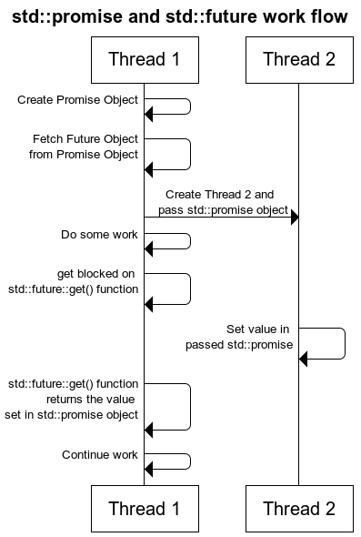

# std::thread

来源：https://www.runoob.com/w3cnote/cpp-std-thread.html

来源：https://www.cnblogs.com/pluviophile/p/cpp11-future.html

c++ 11 之后有了标准的线程库：std::thread。

之前一些编译器使用 C++11 的编译参数是 -std=c++11

```
g++ -std=c++11 test.cpp 
```

## std::thread 构造函数

| 说明                   | 调用                                                         |
| :--------------------- | ------------------------------------------------------------ |
| 默认构造函数           | thread() noexcept;                                           |
| 初始化构造函数         | template <class Fn, class... Args> explicit thread(Fn&& fn, Args&&... args); |
| 拷贝构造函数 [deleted] | thread(const thread&) = delete;                              |
| Move 构造函数          | thread(thread&& x) noexcept;                                 |

- 默认构造函数，创建一个空的 `std::thread` 执行对象。
- 初始化构造函数，创建一个 `std::thread` 对象，该 `std::thread` 对象可被 `joinable`，新产生的线程会调用 `fn` 函数，该函数的参数由 `args` 给出。
- 拷贝构造函数(被禁用)，意味着 `std::thread` 对象不可拷贝构造。
- Move 构造函数，move 构造函数(move 语义是 C++11 新出现的概念，详见附录)，调用成功之后 `x` 不代表任何 `std::thread` 执行对象。

*注意：可被* `joinable` *的* `std::thread` *对象必须在他们销毁之前被主线程* `join` *或者将其设置为* `detached`*.*

**std::thread** 各种构造函数例子如下：

```c++
#include <iostream>
#include <utility>
#include <thread>
#include <chrono>
#include <functional>
#include <atomic>

void f1(int n)
{
    for (int i = 0; i < 5; ++i) {
        std::cout << "Thread " << n << " executing\n";
        std::this_thread::sleep_for(std::chrono::milliseconds(10));
    }
}

void f2(int& n)
{
    for (int i = 0; i < 5; ++i) {
        std::cout << "Thread 2 executing\n";
        ++n;
        std::this_thread::sleep_for(std::chrono::milliseconds(10));
    }
}

int main()
{
    int n = 0;
    std::thread t1; // t1 is not a thread
    std::thread t2(f1, n + 1); // pass by value
    std::thread t3(f2, std::ref(n)); // pass by reference
    std::thread t4(std::move(t3)); // t4 is now running f2(). t3 is no longer a thread
    t2.join();
    t4.join();
    std::cout << "Final value of n is " << n << '\n';
}
```

## std::thread 赋值操作

| 说明                   | 调用                                       |
| ---------------------- | ------------------------------------------ |
| Move 赋值操作          | thread& operator=(thread&& rhs) noexcept;  |
| 拷贝赋值操作 [deleted] | thread& operator=(const thread&) = delete; |

- Move 赋值操作(1)，如果当前对象不可 `joinable`，需要传递一个右值引用(`rhs`)给 `move` 赋值操作；如果当前对象可被 `joinable`，则会调用 `terminate`() 报错。
- 拷贝赋值操作(2)，被禁用，因此 `std::thread` 对象不可拷贝赋值。

请看下面的例子：

```c++
#include <stdio.h>
#include <stdlib.h>

#include <chrono>    // std::chrono::seconds
#include <iostream>  // std::cout
#include <thread>    // std::thread, std::this_thread::sleep_for

void thread_task(int n) {
    std::this_thread::sleep_for(std::chrono::seconds(n));
    std::cout << "hello thread "
        << std::this_thread::get_id()
        << " paused " << n << " seconds" << std::endl;
}

int main(int argc, const char *argv[])
{
    std::thread threads[5];
    std::cout << "Spawning 5 threads...\n";
    for (int i = 0; i < 5; i++) {
        threads[i] = std::thread(thread_task, i + 1);
    }
    std::cout << "Done spawning threads! Now wait for them to join\n";
    for (auto& t: threads) {
        t.join();
    }
    std::cout << "All threads joined.\n";

    return EXIT_SUCCESS;
}
```

## 其他成员函数

**get_id**: 获取线程 ID，返回一个类型为 std::thread::id 的对象。请看下面例子：

```c++
#include <iostream>
#include <thread>
#include <chrono>

void foo()
{
  std::this_thread::sleep_for(std::chrono::seconds(1));
}

int main()
{
  std::thread t1(foo);
  std::thread::id t1_id = t1.get_id();

  std::thread t2(foo);
  std::thread::id t2_id = t2.get_id();

  std::cout << "t1's id: " << t1_id << '\n';
  std::cout << "t2's id: " << t2_id << '\n';

  t1.join();
  t2.join();
}
```

**joinable**: 检查线程是否可被 join。检查当前的线程对象是否表示了一个活动的执行线程，由默认构造函数创建的线程是不能被 join 的。另外，如果某个线程 已经执行完任务，但是没有被 join 的话，该线程依然会被认为是一个活动的执行线程，因此也是可以被 join 的。

```c++
#include <iostream>
#include <thread>
#include <chrono>

void foo()
{
  std::this_thread::sleep_for(std::chrono::seconds(1));
}

int main()
{
  std::thread t;
  std::cout << "before starting, joinable: " << t.joinable() << '\n';

  t = std::thread(foo);
  std::cout << "after starting, joinable: " << t.joinable() << '\n';

  t.join();
}
join: Join 线程，调用该函数会阻塞当前线程，直到由 *this 所标示的线程执行完毕 join 才返回。

#include <iostream>
#include <thread>
#include <chrono>

void foo()
{
  // simulate expensive operation
  std::this_thread::sleep_for(std::chrono::seconds(1));
}

void bar()
{
  // simulate expensive operation
  std::this_thread::sleep_for(std::chrono::seconds(1));
}

int main()
{
  std::cout << "starting first helper...\n";
  std::thread helper1(foo);

  std::cout << "starting second helper...\n";
  std::thread helper2(bar);

  std::cout << "waiting for helpers to finish..." << std::endl;
  helper1.join();
  helper2.join();

  std::cout << "done!\n";
}
```

**detach**: Detach 线程。 将当前线程对象所代表的执行实例与该线程对象分离，使得线程的执行可以单独进行。一旦线程执行完毕，它所分配的资源将会被释放。

调用 detach 函数之后：

- `*this` 不再代表任何的线程执行实例。
- joinable() == false
- get_id() == std::thread::id()

另外，如果出错或者 joinable() == false，则会抛出 std::system_error。

```c++
#include <iostream>
#include <chrono>
#include <thread>
 
void independentThread() 
{
    std::cout << "Starting concurrent thread.\n";
    std::this_thread::sleep_for(std::chrono::seconds(2));
    std::cout << "Exiting concurrent thread.\n";
}
 
void threadCaller() 
{
    std::cout << "Starting thread caller.\n";
    std::thread t(independentThread);
    t.detach();
    std::this_thread::sleep_for(std::chrono::seconds(1));
    std::cout << "Exiting thread caller.\n";
}
 
int main() 
{
    threadCaller();
    std::this_thread::sleep_for(std::chrono::seconds(5));
}
```

**swap**: Swap 线程，交换两个线程对象所代表的底层句柄(underlying handles)。

```c++
#include <iostream>
#include <thread>
#include <chrono>

void foo()
{
  std::this_thread::sleep_for(std::chrono::seconds(1));
}

void bar()
{
  std::this_thread::sleep_for(std::chrono::seconds(1));
}

int main()
{
  std::thread t1(foo);
  std::thread t2(bar);

  std::cout << "thread 1 id: " << t1.get_id() << std::endl;
  std::cout << "thread 2 id: " << t2.get_id() << std::endl;

  std::swap(t1, t2);

  std::cout << "after std::swap(t1, t2):" << std::endl;
  std::cout << "thread 1 id: " << t1.get_id() << std::endl;
  std::cout << "thread 2 id: " << t2.get_id() << std::endl;

  t1.swap(t2);

  std::cout << "after t1.swap(t2):" << std::endl;
  std::cout << "thread 1 id: " << t1.get_id() << std::endl;
  std::cout << "thread 2 id: " << t2.get_id() << std::endl;

  t1.join();
  t2.join();
}
```

执行结果如下：

```
thread 1 id: 1892
thread 2 id: 2584
after std::swap(t1, t2):
thread 1 id: 2584
thread 2 id: 1892
after t1.swap(t2):
thread 1 id: 1892
thread 2 id: 2584
```

**native_handle**: 返回 native handle（由于 std::thread 的实现和操作系统相关，因此该函数返回与 std::thread 具体实现相关的线程句柄，例如在符合 Posix 标准的平台下(如 Unix/Linux)是 Pthread 库）。

```c++
#include <thread>
#include <iostream>
#include <chrono>
#include <cstring>
#include <pthread.h>

std::mutex iomutex;
void f(int num)
{
  std::this_thread::sleep_for(std::chrono::seconds(1));

 sched_param sch;
 int policy; 
 pthread_getschedparam(pthread_self(), &policy, &sch);
 std::lock_guard<std::mutex> lk(iomutex);
 std::cout << "Thread " << num << " is executing at priority "
           << sch.sched_priority << '\n';
}

int main()
{
  std::thread t1(f, 1), t2(f, 2);

  sched_param sch;
  int policy; 
  pthread_getschedparam(t1.native_handle(), &policy, &sch);
  sch.sched_priority = 20;
  if(pthread_setschedparam(t1.native_handle(), SCHED_FIFO, &sch)) {
      std::cout << "Failed to setschedparam: " << std::strerror(errno) << '\n';
  }

  t1.join();
  t2.join();
}
```

执行结果如下：

Thread 2 is executing at priority 0 Thread 1 is executing at priority 20

**hardware_concurrency [static]**: 检测硬件并发特性，返回当前平台的线程实现所支持的线程并发数目，但返回值仅仅只作为系统提示(hint)。

```c++
#include <iostream>
#include <thread>

int main() {
  unsigned int n = std::thread::hardware_concurrency();
  std::cout << n << " concurrent threads are supported.\n";
}
```

## std::this_thread 命名空间中相关辅助函数介绍

**get_id**: 获取线程 ID。

```c++
#include <iostream>
#include <thread>
#include <chrono>
#include <mutex>

std::mutex g_display_mutex;

void foo()
{
  std::thread::id this_id = std::this_thread::get_id();

  g_display_mutex.lock();
  std::cout << "thread " << this_id << " sleeping...\n";
  g_display_mutex.unlock();

  std::this_thread::sleep_for(std::chrono::seconds(1));
}

int main()
{
  std::thread t1(foo);
  std::thread t2(foo);

  t1.join();
  t2.join();
}
```

**yield**: 当前线程放弃执行，操作系统调度另一线程继续执行。

```c++
#include <iostream>
#include <chrono>
#include <thread>

// "busy sleep" while suggesting that other threads run 
// for a small amount of time
void little_sleep(std::chrono::microseconds us)
{
  auto start = std::chrono::high_resolution_clock::now();
  auto end = start + us;
  do {
      std::this_thread::yield();
  } while (std::chrono::high_resolution_clock::now() < end);
}

int main()
{
  auto start = std::chrono::high_resolution_clock::now();

  little_sleep(std::chrono::microseconds(100));

  auto elapsed = std::chrono::high_resolution_clock::now() - start;
  std::cout << "waited for "
            << std::chrono::duration_cast<std::chrono::microseconds>(elapsed).count()
            << " microseconds\n";
}
```

**sleep_until**: 线程休眠至某个指定的时刻(time point)，该线程才被重新唤醒。

```c++
template< class Clock, class Duration >
void sleep_until( const std::chrono::time_point<Clock,Duration>& sleep_time );
```

**sleep_for**: 线程休眠某个指定的时间片(time span)，该线程才被重新唤醒，不过由于线程调度等原因，实际休眠时间可能比 sleep_duration 所表示的时间片更长。

```c++
#include <iostream>
#include <chrono>
#include <thread>

int main()
{
  std::cout << "Hello waiter" << std::endl;
  std::chrono::milliseconds dura( 2000 );
  std::this_thread::sleep_for( dura );
  std::cout << "Waited 2000 ms\n";
}
```

执行结果如下：

```
Hello waiter
Waited 2000 ms
```

## 获取线程的返回值

C++11 `std::future` and `std::promise`

在许多时候，我们会有这样的需求——即我们想要得到线程返回的值。

但是在[C++11 多线程](http://www.cplusplus.com/reference/thread/thread/)中我们注意到，**std::thread**对象会忽略顶层函数的返回值。

那问题来了，我们要怎么获得线程的返回值呢？

我们通过一个例子来说明如何实现这个需求。

假设我们的app会创建一个线程来压缩一个文件夹，该线程在压缩完文件夹后会返回压缩文件 ***.zip** 和这个zip文件的大小，我们现在就想获得这个线程的返回值。

有两种方法可以实现这个需求：

### 1. 传统的方法：在线程间共享指针

传递一个指针给压缩文件的线程，表示压缩文件的线程将会把值写入指针指向的内存空间。此时主线程将用条件变量等待值被写入，当压缩文件线程把值写入指针指定的内存后，将唤醒(signal)条件变量，然后主线程将被唤醒，然后从指针指向的内存中获取返回值。

为了实现获取一个返回值的需求，使用传统的方法，我们需要条件变量(condition variable), 互斥量(mutex)，和指针三个对象。

如果假设，我们需要获得压缩线程里三个返回值，情况会变得更加复杂。

那**std::future**就是来简化这个编程过程的

### 2. C++11的方法：使用 std::future 和 std::promise

人如其名，**std::future**和**std::promise**对象就和他们的名字一样。这两个类在获取程序返回值的时候需要配合使用

**std::future**，是一个类模板，它存储着一个未来的值。
那问题来了，未来的值是什么鬼？

实际上一个**std::future**对象里存储着一个在未来会被赋值的变量，这个变量可以通过**std::future**提供的成员函数`std::future::get()`来得到。如果在这个变量被赋值之前就有别的线程试图通过`std::future::get()`获取这个变量，那么这个线程将会被阻塞到这个变量可以获取为止。

**std::promise**同样也是一个类模板，它的对象**承诺**会在未来设置变量(这个变量也就是**std::future**中的变量)。每一个**std::promise**对象都有一个与之关联的**std::future**对象。当**std::promise**设置值的时候，这个值就会赋给**std::future**中的对象了。

我们一步一步来看一下如何做

1. 在主线程中创建**std::promise**对象

```
std::promise<int> promiseObj;
```

上面定义的promise对象还没有任何关联的值。但是它承诺某个线程将会设置与其关联的值，并且，当值被设置以后，可以通过与promise关联的`std::future`对象来获取该值。

假设我们的主线程将创建的**std::promise**对象传递给了压缩线程，那主线程要怎么知道压缩线程已经设置好了值呢？

答案就是使用 **std::future**对象

```c++
// main thread
std::future<int> futureObj = promiseObj.get_future();
int val = futureObj.get();

// compression thread
promiseObj.set_value(45);
```

在**compression thread**未执行**set_value()**时，如果主线程调用了`futureObj.get()`，那么主线程将会被阻塞。

看整个时序图：



最终代码

```c++
#include<iostream>    //std::cout std::endl
#include<thread>      //std::thread
#include<future>      //std::future std::promise
#include<utility>     //std::ref
#include<chrono>      //std::chrono::seconds

void initiazer(std::promise<int> &promiseObj){
    std::cout << "Inside thread: " << std::this_thread::get_id() << std::endl;
    std::this_thread::sleep_for(std::chrono::seconds(1));
    promiseObj.set_value(35);
}

int main(){
    std::promise<int> promiseObj;
    std::future<int> futureObj = promiseObj.get_future();
    std::thread th(initiazer, std::ref(promiseObj));
    
    std::cout << futureObj.get() << std::endl;

    th.join();
    return 0;
}
```

本文参考于[C++11 Multithreading – Part 8: stdfuture , stdpromise and Returning values from Thread](http://thispointer.com/c11-multithreading-part-8-stdfuture-stdpromise-and-returning-values-from-thread/),并做了适当修改
