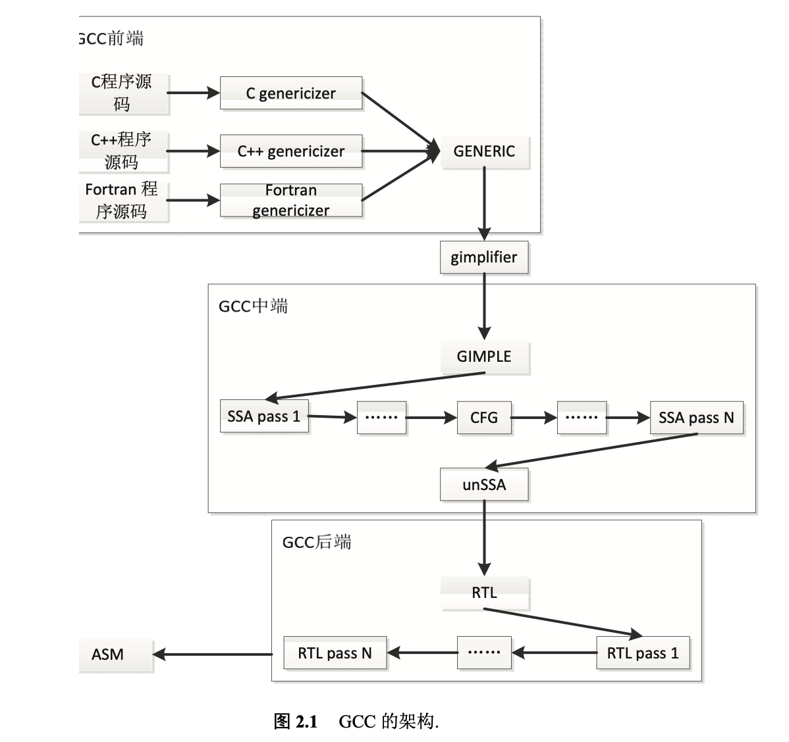
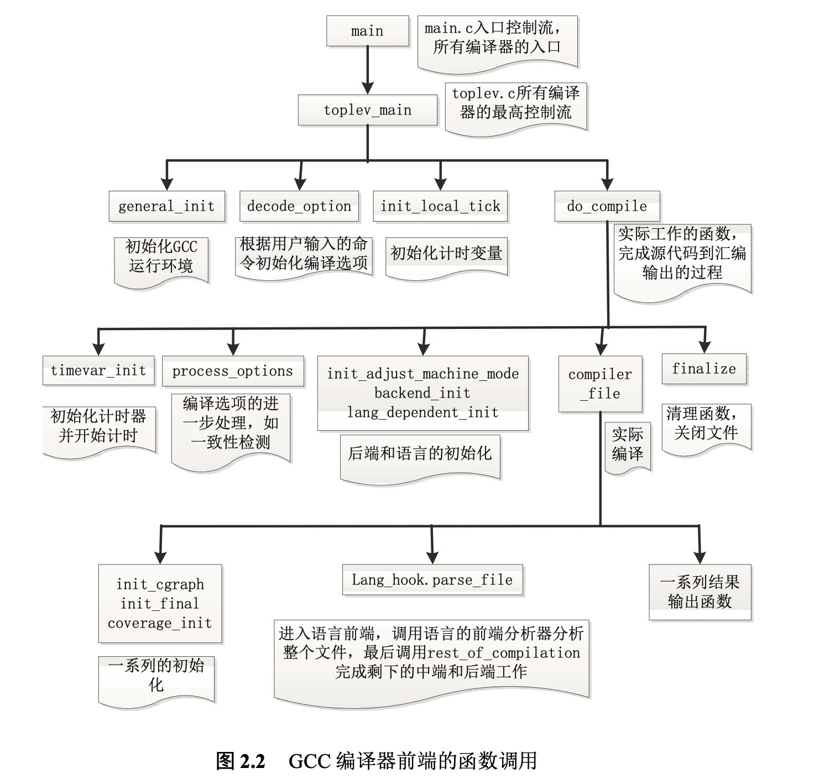
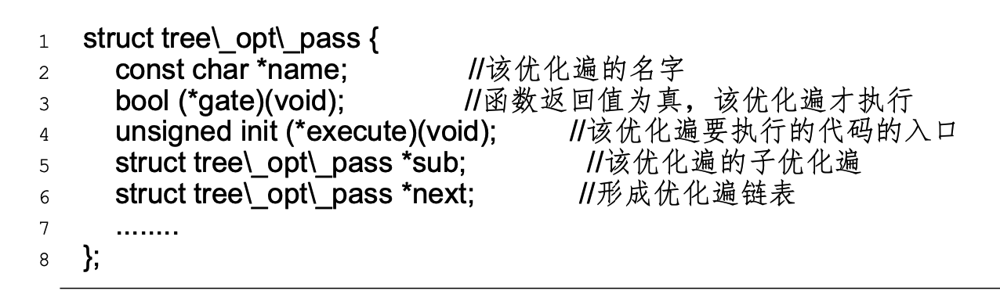

# GCC

**GCC 是 GNU 编译器集合的意思, 对于用户能用的常用命令, 有「gcc」和「g++」**

无论是 gcc 还是 g++, 他们的定位都是 driver.

driver 负责调用编译器(狭义), 把源码编译到汇编代码. 比如 C 语言的编译器(狭义)是 `cc1`, 而 C++ 语言的编译器(狭义)是 `cc1plus`.

driver 再调用 as, 把汇编代码变成二进制代码. 最后调用 ld, 负责把二进制代码拼在一起.

## 一、静态编译器 GCC 的架构

GCC 编译器从架构上可以按照编译过程的先后顺序依次分为前端语言分析，中端过程优化以及后端汇编生成三个部分。

自 4.0 版本之后，GCC 引入了静态单一赋值 (Static Single Assignment，SSA) 的中间表示形式，其新的架构 如图 2.1 所示 。

- 其中，前端接受多种语言的源代码的输入，并依次对它们进行词法分析、语法分析和语义分析。在语法分析后，会为源码生成与语言相关的暂时语法树，然后再将它们转换成统一的中间的 GENERIC 树表示。之后， 使用“gimplifier”技术降低 GENERIC 的复杂结构，成为一较简单的具有静态 唯一形式(SSA)基础的 GIMPLE 形式。
- 中端首先将 GIMPLE 形式彻底的 SSA 话，然后再在 SSA 结构上依次进行大量的优化，优化后的树形式再借助 unSSA 技术，转换成原来的 GIMPLE 形式。
- 后端将 GIMPLE 形式转换成较底层的 RTL 形式并再次优化，最后生成与平台相关的汇编指令。



可以看到，正是由于非常清晰的结构布局和前后端分离，才使得 GCC 可以异常的灵活而高效的支持多语言多平台。只要扩展前端就可以做到支持不同的语言，在中端添加新的优化遍就可以作用于任何语言的程序和平台，而如果 GCC 需要支持新的平台，只需要在后端做扩展就可以了。

### 1、GCC 编译器的前端

GCC 前端是指在 GCC 的编译中与源代码中所使用的语言直接相关的部分，主要包括词法、语法和语义分析等【预编译】。

在 GCC 编译的过程中

- 首先由 gcc 接受命令并解释命令行参数。

> GCC 提供了完整且丰富的参数，通过这些参数可 以精细地控制整个编译过程和配置优化选项。关于这些编译选项的说明及使用方法，用户可以从 GCC 提供的官方手册中找到。

- 其次，gcc 驱动程序分析待编译文件的类型(.c 或者.cpp 或者其他)

> 不同语言的源码需要不同的编译器前端分析引擎来分析

- 然后，据此来调用对应的编译器前端，完成词法、语法和语义分析，并最终生成 GENERIC 树结构。
- 最后，gcc 调用 rest_of_compilation 完成剩下的中端和后端的工作。

图 2.2 描述了 GCC 编译器前端的主要函数调用关系，并给出了各主要函数所在的文件。

1. 入口函数是 main 函数，主要工作有 toplev_main 函数完成。而 toplev_main 函数首先初始化 gcc 的运行时环境，然后根据用户输入的命令初始化编译选项。
2. 接着，该函数初始化计时变量，并最后调用函数 do_compile 完成其核心功能。do_compile 完成实际的从源码到汇编的工作，可以分为以下几个步骤：
   1. 首先，完成计时器的初始化并开始计时;
   2. 然后，进一步处理的编译选项;
   3. 紧接着，初始化后端和语言;
   4. 最后，调用函数 compiler_file 完后剩下的编译和清理工作。
      1. compiler_file 函数通过分析待编译源代码的文件类型
      2. 调用对应语言类型的钩子函数 lang_hook.parse_file 来实际地执行词法分析、语法分析和语义分析，生成 GENERIC 树结构
      3. 最终调用 rest_of_compilation 函数完成中端和后端的工作



### 2、GCC 编译器的中端

GCC 在 gcc/tree.def 文件中一共定义了 127 种不同的 GENERIC 树节点。它是前端处理所有类型语言程序后得到的统一的形式。GIMPLE 树是在 GENERIC 树的基础上，使用“gimplifier”技术降低结构复杂性而得到的。其主要特点是表达式只能含有三个操作数。

SSA 形式，顾名思义，就是每个变量最多只被赋值一次。该形式是所有中端优化工作的基础，而该形式的特点亦非常有利于设计和执行优化算法。

从图 2.1的编译器中端结构可以看出，中端的所有优化均是以 SSA 树形式为基础展开的。

- GCC 中端首先为待编译程序生成一个控制流图(Control Flow Graph，CFG)，
- 然后将 GIMPLE 树结构转换成 SSA 形式的树结构，
- 再根据编译命令中指定的优化配置依次完成一系列的优化
- 最后，借助 unSSA 技术转换成原来的后端可以识别的 GIMPLE 形式。

GCC 的内部提供了统一的优化方法实现接口，其主体代码则是通过依次访 问接口变量来执行每个优化遍。每个优化遍对应于一个 tree_opt_pass 结构体的对象，该结构体的定义如下:



其中，name 域给出了该优化方法的名字。gate 域是优化方法的开关函数， 只有 gate 指定的函数返回真时该优化遍才会真正被执行，编译器在初始化阶段就根据编译命令设置好各个优化方法的开关。execute 域是实际执行该优化方法 的接口，优化方法的具体的工作在这里面完成。sub 域定义了该优化方法可能包含的子优化遍。所有优化方法通过 next 域连接成了单链表，并依次被 GCC 调用。

在这样的结构设计下，新增加一个优化方法变得非常简单，只需要如下三 步即可:

首先，在 gcc 目录下创建实现新优化方法的文件，命名如 tree-ssa-new- opti.c。在该文件中编写优化方法的代码，并赋值新的 struct tree_opt_pass 对象，如:

```
struct tree_opt_pass pass_new_opti = .......
```

其次，该对象的外部声明的外部声明添加到文件 tree_pass.h 中。如:

```
extern struct tree_opt_pass pass_new_opti;
```

最后，将该优化对象插入到在 pass.c 的优化链表中。如:

```
........;
NEXT _PASS(pass_new_opti);
........;
```

### 3、GCC 编译器的后端

GCC 的后端主要完成三个方面的工作:

- 一是从 GIMPLE 树结构转换到 RTL 树结构;
- 二是以 RTL 树结构为基础的优化;
- 三是 RTL 树结构到汇编指令的生成 。编译器的后端定义了各类型的 RTL 表达式与其目标平台的汇编指令的一一对应关系。因此，汇编指令的生成相对比较直接。

从 GIMPLE 树结构到 RTL 树结构的转换从逻辑上分为两个步骤:平台独立层和平台依赖层。根据不同的语法，平台独立层的扩展分为语句级别的扩展，表达式级别的扩展以及运算级别的扩展等三个部分。每个部分都是将对应的树结构转换成语义一直的等价 RTL 树结构。平台独立层的扩展函数在 GCC 内部用 `expand_*` 来命名。在转换过程中，平台依赖层的扩展函数(低级别的 扩展函数)被平台独立层的扩展函数(高级别的扩展函数)调用，共同完成底层的扩展工作。低级别的扩展函数可以分为两个系列:`gen_*` 系列和 `emit_*` 系 列。这两个函数系列是 GCC 根据后端的配置文件 machine.md，machine.c 以及 machine.h 自动生成的。GCC 一共提供了 11 个以 `gen*` 作为文件名的一组工具。 在编译 GCC 的过程中，这些工具根据编译的平台会读取 machine.md，machine.c 和 machine.h 中的信息，生成一批新的 GCC 后端的源码文件，这些文件中就会包含这两个系列的函数。

## 二、gcc 与 g++ 异同

gcc 和 g++ 的区别无非就是调用的编译器不同, 并且传递给链接器的参数不同.

具体而言

**g++** 会把 `.c` 文件当做是 C++ 语言 (在 `.c` 文件前后分别加上 `-xc++` 和 `-xnone`, 强行变成 C++), 从而调用 `cc1plus`进行编译.

**g++** 遇到 `.cpp` 文件也会当做是 C++, 调用 `cc1plus` 进行编译. 

**g++** 还会默认告诉链接器, 让它链接上 C++ 标准库.


**gcc** 会把 `.c` 文件当做是 C 语言. 从而调用 `cc1` 进行编译.

**gcc** 遇到 `.cpp` 文件, 会处理成 C++ 语言. 调用 `cc1plus` 进行编译. 

**gcc** 默认不会链接上 C++ 标准库.

## 三、g++ 使用

```shell
g++ main.cpp -o main -std=c++11
```

-o 指定输出二进制名

-std 指定 c++ 标准，如 c++11  c++17

**查看 g++ 版本**

```c++
#include <iostream>
using namespace std;

int main() {
    cout << __cplusplus << endl;
    // 输出如：199711、201103、201703
    return 0;
}
```

## 四、从源码到可执行文件


1. 预处理阶段：对源代码文件中文件包含关系（头文件）、预编译语句（宏定义）进行分析和替换，生成预编译文件（.i文件）

2. 编译阶段：将经过预处理后的预编译文件转换成特定汇编代码，生成汇编文件(.s文件)

3. 汇编阶段：将编译阶段生成的汇编文件转化成机器码，生成可重定位目标文件 (.o或.obj文件)

4. 链接阶段：将多个目标文件及所需要的库连接成最终的可执行目标文件(.out或.exe文件)

### 1、预处理阶段

在预处理阶段中，hello.cpp(源程序文本)会由**预处理器(cpp)** 修改，即让 hello.cpp 变为 hello.i 文件。

g++命令行如下：

```c++
g++ hello.cpp -E > hello.i
```

其中-E选项是只运行C预处理器的选项；>是重定向一个输出文件 test.i

**预处理器(cpp) 的作用**：提供了预处理命令

**预处理(cpp)的过程：**主要处理那些源代码文件中只能够以“#”开始的预处理指令。具体指令如下：

主要规则如下：

- 对所有的“#define”进行宏展开；“#undef” 取消宏定义
- 处理所有的条件编译指令，比如“#if”,“#ifdef”，“#elif”，“#else”,“#endif” 
- 处理“#include”指令，这个过程是递归的，也就是说被包含的文件可能还包含其他文件 
- 删除所有的注释“//”和“/**/” 
- 添加行号和文件标识 
- 保留所有的“#pragma”编译器指令 经过预处理后的 .i 文件不包含任何宏定义，因为所有的宏已经被展开，并且包含的文件也已经被插入到.i文件中。

结束当前阶段后，如果用文本编辑器打开test.i文件，发现我们的程序前面多了很多东西。该阶段编译原理就是将头文件**#include** 库中的内容插入程序文本当中，得到了test.i文件。

### 2、编译阶段

当我们得到了 hello.i 文件后,就可以进入编译阶段了，

在编译阶段，接下来需要的是用「编译器(ccl)」将文本文件 hello.i 翻译成文本文件 hello.s，这是一个汇编程序.

**编译的过程就是将预处理完的文件进行一系列词法分析，语法分析，语义分析及优化后生成相应的汇编代码文件(.s文件)**

使用-S编译选项即可以得到.s程序

```shell
g++ hello.i -S
```

或由 hello.cpp 直接得到汇编文件

```shell
g++ hello.cpp -S
```

#### 1）词法分析

词法分析主要使用词法分析器（也叫**扫描器**），将源代码的字符序列分割成一系列的**符号**（Token）

词法分析产生的记号一般可以分为：关键字，标识符，字面量（包括数字和字符串等）和特殊符号（加号减号等）。在识别记号的同时，扫描器也完成其他工作，比如讲标识符存放到符号表，讲数字字符串常量存放到文字表，以备后面的步骤使用。

#### 2）语法分析

接下来**语法分析器**将对由扫描器产生的记号进行语法分析，从而产生语法树。整个分析过程采用了**上下文无关语法**的分析手段。

#### 3）语义分析

这个阶段由**语义分析器**来完成。语法分析仅仅完成了对表达式的语法层面的分析，他并不了解这个语句是不是真的有意义。比如两个指针相乘是没有意义的，但是在语法上是合法的。

编译器可以分析的语义是静态语义，即在编译器就可以确定的语义；与之对应的是动态语义，即在运行期才可以确定的语义。

静态语义通常包括声明和类型的匹配，类型的转换。比如一个浮点型表达式赋值给整形表达式的时候，语义分析会完成浮点型到整形的转换。动态语义使之运行期出现的语义相关问题，比如除数是0的时候会报运行期语义错误。

#### 4）源代码优化

现代编译器有很多层的优化，往往在源代码级别会有一个优化过程。**源代码优化器**会在源码级别进行优化，比如一行代码：

```
array[index] = (index + 4) * (2 + 6);
```

在这行代码中，(2+6)这个表达式就可以被优化掉，因为他的值在编译器就可以确定。

在进行了语法分析和语义分析阶段的工作之后，有的编译程序将源程序变成一种内部表示形式，这种内部表示形式叫做中间语言或中间表示或中间代码。所谓“中间代码”是一种结构简单、含义明确的记号系统，这种记号系统复杂性介于源程序语言和机器语言之间，容易将它翻译成目标代码。

中间代码使得编译器可以分为前端和后端，前端负责产生机器无关的中间代码，编译器后端将中间代码转换成目标机器代码。这样对于一些跨平台的编程语言，他们可以针对不同平台使用同一个前端和针对不同平台的数个后端。

### 3、汇编阶段

得到了汇编程序后，**汇编器（as）** 会将 hello.s 文件进行汇编，将复杂晦涩难懂的汇编指令变为机器语言指令，每一个汇编语句几乎都对应一条机器指令，并把这些指令打包成一种 **可重定位目标程序**并将结果保存在hello.o(.o或.obj文件)中

使用 -c 编译选项，该选项只编译生成目标文件，不链接，链接动作是在链接阶段完成的。

```shell
g++ -c hello.s -o hello.o
```

对于被翻译系统处理的每一个C语言源程序，都将最终经过这一处理而得到相应的目标文件。目标文件中所存放的也就是与源程序等效的目标的机器语言代码。目标文件由段组成，通常一个**目标文件中至少有两个段**：

1. **代码段**：该段中所包含的**主要是程序的指令**。该段一般是可读和可执行的，但一般却不可写。
2. **数据段**：主要存放程序中要用到的各种**全局变量或静态的数据**。一般数据段都是可读，可写，可执行的。

UNIX环境下主要有**三种类型的目标文件**：

1. 可重定位文件：其中包含有适合于其它目标文件链接来创建一个可执行的或者共享的目标文件的代码和数据。
2. 共享的目标文件：这种文件存放了适合于在两种上下文里链接的代码和数据。第一种事链接程序可把它与其它可重定位文件及共享的目标文件一起处理来创建另一个目标文件；第二种是动态链接程序将它与另一个可执行文件及其它的共享目标文件结合到一起，创建一个进程映象。
3. 可执行文件：它包含了一个可以被操作系统创建一个进程来执行之的文件。

汇编程序生成的实际上是第一种类型的目标文件。对于后两种还需要其他的一些处理方能得到，这个就是链接程序的工作了。

### 4、链接阶段

当一个程序调用了标准库中的函数，例如printf、cout等，这个函数已经存在于一个已经单独预编译好了的.o文件中，而这个文件必须以某种方式合并到我们的 hello.o 当中，得到可执行的 hello 文件。

**链接的过程主要包括了地址和空间分配(Address and Storage Allocation)、符号决议(Symbol Resolution)和重定位(Relocation)**。

链接就是把每个源代码独立的编译，然后按照它们的要求将它们组装起来，链接主要解决的是源代码之间的相互依赖问题，链接的过程包括地址和空间的分配，符号决议，和重定位等这些步骤。最基本的静态链接如图所示：

g++命令行如下：

```shell
# 动态链接
g++ hello.o -o hello

# 静态链接
g++ hello.o -static -o hello
```

2种都可生成可执行文件，前者文件只包含文件名，运行时再链接相关函数，后者编译时便链接相关函数，前者体积小，运行时没后者快，后者体积大。

这样得到一个可执行目标文件，就可以被加载到内存当中，即可被执行。

每个目标文件除了拥有自己的数据和二进制代码外，还拥有三个表，未解决符号表，地址重定向表，导出符号表。根据开发人员指定的同库函数的链接方式的不同，链接处理可分为两种：

#### 1）静态链接/库

在链接阶段，会将汇编生成的目标文件.o与引用到的库一起链接打包到可执行文件中，因此对应的链接方式称为静态链接。

**静态库可以简单看成是一组目标文件（.o/.obj文件）的集合，即很多目标文件经过压缩打包后形成的一个文件**

**静态库的缺点在于：浪费空间和资源，因为所有相关的目标文件与牵涉到的函数库被链接合成一个可执行文件**

#### 2）动态链接/库

**动态库在程序编译时并不会被连接到目标代码中，而是在程序运行是才被载入。不同的应用程序如果调用相同的库，那么在内存里只需要有一份该共享库的实例，规避了空间浪费问题**。动态库在程序运行是才被载入，也解决了静态库对程序的更新、部署和发布页会带来麻烦。用户只需要更新动态库即可，增量更新。
