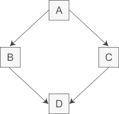
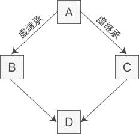
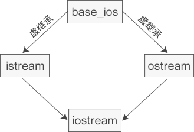
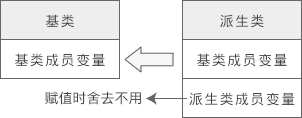
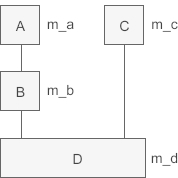

# 继承与派生

来源：[http://c.biancheng.net/cplus/inherit/](http://c.biancheng.net/cplus/inherit/)

**继承（Inheritance）**可以理解为一个类从另一个类获取成员变量和成员函数的过程。例如类 B 继承于类 A，那么 B 就拥有 A 的成员变量和成员函数。

在C++中，**派生（Derive）**和继承是一个概念，只是站的角度不同。继承是儿子接收父亲的产业，派生是父亲把产业传承给儿子。

被继承的类称为父类或基类，继承的类称为子类或派生类。“子类”和“父类”通常放在一起称呼，“基类”和“派生类”通常放在一起称呼。

派生类除了拥有基类的成员，还可以定义自己的新成员，以增强类的功能。

以下是两种典型的使用继承的场景：

1. 当你创建的新类与现有的类相似，只是多出若干成员变量或成员函数时，可以使用继承，这样不但会减少代码量，而且新类会拥有基类的所有功能。

2. 当你需要创建多个类，它们拥有很多相似的成员变量或成员函数时，也可以使用继承。可以将这些类的共同成员提取出来，定义为基类，然后从基类继承，既可以节省代码，也方便后续修改成员。

下面我们定义一个基类 People，然后由此派生出 Student 类：

```c++
#include <iostream>
using namespace std;

class People {  //基类 Pelple
public:
    void setname(char *name);
    void setage(int age);
    char *getname();
    int getage();

private:
    char *m_name;
    int m_age;
};
void People::setname(char *name) { m_name = name; }
void People::setage(int age) { m_age = age; }
char *People::getname() { return m_name; }
int People::getage() { return m_age; }

class Student : public People {  //派生类 Student，可以不写 public
public:
    void setscore(float score);
    float getscore();

private:
    float m_score;
};
void Student::setscore(float score) { m_score = score; }
float Student::getscore() { return m_score; }

int main() {
    Student stu;
    stu.setname("XiaoXiao");
    stu.setage(16);
    stu.setscore(95.5f);
    cout << stu.getname() << " age:" << stu.getage() << " score:" << stu.getscore() << endl;
    // XiaoXiao age:16 score:95.5
    return 0;
}
```

## 一、三种继承方式

继承的一般语法为：

```c++
class 派生类名:［继承方式］ 基类名{
    派生类新增加的成员
};
```

继承方式限定了基类成员在派生类中的访问权限，包括 public（公有的）、private（私有的）和 protected（受保护的）。此项是可选项，如果不写，默认为 private（成员变量和成员函数默认也是 private）。

现在我们知道，public、protected、private 三个关键字除了可以修饰类的成员，还可以指定继承方式。

### 1、public、protected、private 修饰类的成员

类成员的访问权限由高到低依次为 public --> protected --> private，我们在《[C++类成员的访问权限以及类的封装](http://c.biancheng.net/view/2217.html)》一节中讲解了 public 和 private：public 成员可以通过对象来访问，private 成员不能通过对象访问。

现在再来补充一下 protected。protected 成员和 private 成员类似，也不能通过对象访问。但是当存在继承关系时，protected 和 private 就不一样了：**基类中的 protected 成员可以在派生类中使用，而基类中的 private 成员不能在派生类中使用**，下面是详细讲解。

### 2、public、protected、private 指定继承方式

| 继承方式/基类成员 | public成员 | protected成员 | private成员 |
| ----------------- | ---------- | ------------- | ----------- |
| public继承        | public     | protected     | 不可见      |
| protected继承     | protected  | protected     | 不可见      |
| private继承       | private    | private       | 不可见      |

不同的继承方式会影响基类成员在派生类中的访问权限。

**public继承方式**

- 基类中所有 public 成员在派生类中为 public 属性；
- 基类中所有 protected 成员在派生类中为 protected 属性；
- 基类中所有 private 成员在派生类中不能使用。

**protected继承方式**

- 基类中的所有 public 成员在派生类中为 protected 属性；
- 基类中的所有 protected 成员在派生类中为 protected 属性；
- 基类中的所有 private 成员在派生类中不能使用。

**private继承方式**

- 基类中的所有 public 成员在派生类中均为 private 属性；
- 基类中的所有 protected 成员在派生类中均为 private 属性；
- 基类中的所有 private 成员在派生类中不能使用。

通过上面的分析可以发现：

1）**基类成员在派生类中的访问权限不得高于继承方式中指定的权限**。

例如，当继承方式为 protected 时，那么基类成员在派生类中的访问权限最高也为 protected，高于 protected 的会降级为 protected，但低于 protected 不会升级。再如，当继承方式为 public 时，那么基类成员在派生类中的访问权限将保持不变。

也就是说，继承方式中的 public、protected、private 是用来指明基类成员在派生类中的最高访问权限的。

2）不管继承方式如何，**基类中的 private 成员在派生类中始终不能使用**（不能在派生类的成员函数中访问或调用）。

3）如果希望基类的成员能够被派生类继承并且毫无障碍地使用，那么这些成员只能声明为 public 或 protected；**只有那些不希望在派生类中使用的成员才声明为 private**

4）如果希望基类的成员既不向外暴露（不能通过对象访问），还能在派生类中使用，那么只能声明为 protected

> 注意，我们这里说的是基类的 private 成员不能在派生类中使用，并没有说基类的 private 成员不能被继承。实际上，基类的 private 成员是能够被继承的，并且（成员变量）会占用派生类对象的内存，它只是在派生类中不可见，导致无法使用罢了。private 成员的这种特性，能够很好的对派生类隐藏基类的实现，以体现面向对象的封装性。

由于 private 和 protected 继承方式会改变基类成员在派生类中的访问权限，导致继承关系复杂，所以**实际开发中我们一般使用 public**

```c++
#include <iostream>
using namespace std;

class People {  // 基类People
public:
    void setname(char *name);
    void setage(int age);
    void sethobby(char *hobby);
    char *gethobby();

protected:
    char *m_name;
    int m_age;

private:
    char *m_hobby;
};
void People::setname(char *name) { m_name = name; }
void People::setage(int age) { m_age = age; }
void People::sethobby(char *hobby) { m_hobby = hobby; }
char *People::gethobby() { return m_hobby; }

class Student : public People {  //派生类Student
public:
    void setscore(float score);

protected:
    float m_score;
};
void Student::setscore(float score) { m_score = score; }

class Pupil : public Student {  //派生类Pupil
public:
    void setranking(int ranking);
    void display();

private:
    int m_ranking;
};
void Pupil::setranking(int ranking) { m_ranking = ranking; }
void Pupil::display() {
    cout << m_name << " age:" << m_age << " score:" << m_score << " range:" << m_ranking << " hobby:" << gethobby() << endl;
}
int main() {
    Pupil pup;
    pup.setname("DoDo");
    pup.setage(15);
    pup.setscore(92.5f);
    pup.setranking(4);
    pup.sethobby("football");
    pup.display();
    // DoDo age:15 score:92.5 range:4 hobby:football
    return 0;
}
```

### 3、改变访问权限

使用 using 关键字可以改变基类成员在派生类中的访问权限，例如将 public 改为 private、将 protected 改为 public

注意：using 只能改变基类中 public 和 protected 成员的访问权限，**不能改变 private 成员的访问权限**，因为基类中 private 成员在派生类中是不可见的，根本不能使用，所以基类中的 private 成员在派生类中无论如何都不能访问。

```c++
#include <iostream>
using namespace std;

class People {  // 基类People
public:
    void show();

protected:
    char *m_name;
    int m_age;
};
void People::show() {
    cout << m_name << " age:" << m_age << endl;
}

class Student : public People {  // 派生类Student
public:
    void learning();

public:
    using People::m_age;   // 将protected改为public
    using People::m_name;  // 将protected改为public
    float m_score;

private:
    using People::show;  // 将public改为private
};
void Student::learning() {
    cout << m_name << " age:" << m_age << " score:" << m_score << endl;
}

int main() {
    Student stu;
    stu.m_name = "DoDo";
    stu.m_age = 16;
    stu.m_score = 99.5f;
    // stu.show();  // compile error
    stu.learning();
    // DoDo age:16 score:99.5
    return 0;
}
```

## 二、继承时的名字遮蔽问题（成员重名）

如果派生类中的成员（包括成员变量和成员函数）和基类中的成员重名，那么就会遮蔽从基类继承过来的成员。所谓遮蔽，就是在派生类中使用该成员（包括在定义派生类时使用，也包括通过派生类对象访问该成员）时，**实际上使用的是派生类新增的成员，而不是从基类继承来的**

```c++
#include <iostream>
using namespace std;

class People {  //基类People
public:
    void show();

protected:
    char *m_name;
    int m_age;
};
void People::show() {
    cout << "from People " << m_name << " age:" << m_age << endl;
}

class Student : public People {  //派生类Student
public:
    Student(char *name, int age, float score);

public:
    void show();  //遮蔽基类的show()
private:
    float m_score;
};
Student::Student(char *name, int age, float score) {
    m_name = name;
    m_age = age;
    m_score = score;
}
void Student::show() {
    cout << "from Student " << m_name << " age:" << m_age << " score:" << m_score << endl;
}

int main() {
    Student stu("DoDo", 16, 90.5);

    // 使用的是派生类新增的成员函数，而不是从基类继承的
    stu.show();  // from Student DoDo age:16 score:90.5

    // 使用的是从基类继承来的成员函数
    stu.People::show();  // from People DoDo age:16

    return 0;
}
```

### 基类成员函数和派生类成员函数不构成重载

基类成员和派生类成员的名字一样时会造成遮蔽，这句话对于成员变量很好理解，**对于成员函数要引起注意，不管函数的参数如何，只要名字一样就会造成遮蔽**。换句话说，基类成员函数和派生类成员函数不会构成重载，如果派生类有同名函数，那么就会遮蔽基类中的所有同名函数，不管它们的参数是否一样

```c++
#include <iostream>
using namespace std;

class Base {  // 基类Base
public:
    void func();
    void func(int);
};
void Base::func() { cout << "Base::func()" << endl; }
void Base::func(int a) { cout << "Base::func(int)" << endl; }

class Derived : public Base {  // 派生类Derived
public:
    void func(char *);
    void func(bool);
};
void Derived::func(char *str) { cout << "Derived::func(char *)" << endl; }
void Derived::func(bool is) { cout << "Derived::func(bool)" << endl; }

int main() {
    Derived d;
    d.func("DoDo");  // Derived::func(bool)
    d.func(true);    // Derived::func(bool)
    // d.func();    // compile error
    d.func(10);         // Derived::func(bool)
    d.Base::func();     // Base::func()
    d.Base::func(100);  // Base::func(int)
    return 0;
}
```

## 三、基类和派生类的构造函数

前面我们说基类的成员函数可以被继承，可以通过派生类的对象访问，但这仅仅指的是普通的成员函数，**类的构造函数不能被继承**。构造函数不能被继承是有道理的，因为即使继承了，它的名字和派生类的名字也不一样，不能成为派生类的构造函数，当然更不能成为普通的成员函数。

在设计派生类时，对继承过来的成员变量的初始化工作也要由派生类的构造函数完成，但是大部分基类都有 private 属性的成员变量，它们在派生类中无法访问，更不能使用派生类的构造函数来初始化。

这种矛盾在C++继承中是普遍存在的，**解决这个问题的思路是：在派生类的构造函数中调用基类的构造函数**

```c++
#include <iostream>
using namespace std;

class People {  // 基类People
protected:
    char *m_name;
    int m_age;

public:
    People(char *, int);
};
People::People(char *name, int age) : m_name(name), m_age(age) {}

class Student : public People {  // 派生类Student
private:
    float m_score;

public:
    Student(char *name, int age, float score);
    void display();
};
// People(name, age)就是调用基类的构造函数
Student::Student(char *name, int age, float score) : People(name, age), m_score(score) {}
void Student::display() {
    cout << m_name << " age:" << m_age << " score:" << m_score << endl;
}
int main() {
    Student stu("DoDo", 16, 90.5);
    stu.display();
    // DoDo age:16 score:90.5
    return 0;
}
```

```c++
// People(name, age)就是调用基类的构造函数
Student::Student(char *name, int age, float score) : People(name, age), m_score(score) {}
```

因为基类构造函数不会被继承，不能当做普通的成员函数来调用。换句话说，只能将基类构造函数的调用放在函数头部，不能放在函数体中。

另外，函数头部是对基类构造函数的调用，而不是声明，所以括号里的参数是实参，它们不但可以是派生类构造函数参数列表中的参数，还可以是局部变量、常量等，例如：

```c++
Student::Student(char *name, int age, float score): People("小明", 16), m_score(score){ }
```

### 构造函数的调用顺序

从上面的分析中可以看出，基类构造函数总是被优先调用，这说明创建派生类对象时，会先调用基类构造函数，再调用派生类构造函数，如果继承关系有好几层的话，例如：

```
A --> B --> C
```

那么创建 C 类对象时构造函数的执行顺序为：

```
A类构造函数 --> B类构造函数 --> C类构造函数
```

**构造函数的调用顺序是按照继承的层次自顶向下、从基类再到派生类的**

还有一点要注意，派生类构造函数中只能调用直接基类的构造函数，**不能调用间接基类的**。以上面的 A、B、C 类为例，C 是最终的派生类，B 就是 C 的直接基类，A 就是 C 的间接基类

### 基类构造函数调用规则

**事实上，通过派生类创建对象时必须要调用基类的构造函数**，这是语法规定。换句话说，定义派生类构造函数时最好指明基类构造函数；如果不指明，就调用基类的默认构造函数（不带参数的构造函数）；如果没有默认构造函数，那么编译失败。请看下面的例子：

```c++
#include <iostream>
using namespace std;

class People {  // 基类People
public:
    People();  // 基类默认构造函数
    People(char *name, int age);

protected:
    char *m_name;
    int m_age;
};
People::People() : m_name("xxx"), m_age(0) {}
People::People(char *name, int age) : m_name(name), m_age(age) {}

class Student : public People {  // 派生类Student
public:
    Student();
    Student(char *, int, float);

public:
    void display();

private:
    float m_score;
};
Student::Student() : m_score(0.0) {}  // 派生类默认构造函数
Student::Student(char *name, int age, float score) : People(name, age), m_score(score) {}
void Student::display() {
    cout << m_name << " age:" << m_age << " sorce:" << m_score << endl;
}

int main() {
    Student stu1;
    stu1.display();  // xxx age:0 sorce:0

    Student stu2("DoDo", 16, 90.5);
    stu2.display();  // DoDo age:16 sorce:90.5
    return 0;
}
```

## 四、基类和派生类的析构函数

和构造函数类似，**析构函数也不能被继承**。与构造函数不同的是，**在派生类的析构函数中不用显式地调用基类的析构函数**，因为每个类只有一个析构函数，编译器知道如何选择，无需程序员干涉。

另外析构函数的执行顺序和构造函数的执行顺序也刚好相反：

- 创建派生类对象时，**构造函数的执行顺序和继承顺序相同**，即先执行基类构造函数，再执行派生类构造函数。
- 而销毁派生类对象时，**析构函数的执行顺序和继承顺序相反**，即先执行派生类析构函数，再执行基类析构函数。

```c++
#include <iostream>
using namespace std;

class A {
public:
    A() { cout << "A constructor" << endl; }
    ~A() { cout << "A destructor" << endl; }
};

class B : public A {
public:
    B() { cout << "B constructor" << endl; }
    ~B() { cout << "B destructor" << endl; }
};

class C : public B {
public:
    C() { cout << "C constructor" << endl; }
    ~C() { cout << "C destructor" << endl; }
};

int main() {
    C test;
    return 0;
}
// A constructor
// B constructor
// C constructor
// C destructor
// B destructor
// A destructor
```

## 五、多重继承

在前面的例子中，派生类都只有一个基类，称为**单继承（Single Inheritan）**。除此之外，C++也支持**多继承（Multiple Inheritance）**，即一个派生类可以有两个或多个基类。

> 多继承容易让代码逻辑复杂、思路混乱，一直备受争议，中小型项目中较少使用，后来的 [Java](http://c.biancheng.net/java/)、[C#](http://c.biancheng.net/csharp/)、[PHP](http://c.biancheng.net/php/) 等干脆取消了多继承。

多继承的语法也很简单，将多个基类用逗号隔开即可。例如已声明了类A、类B和类C，那么可以这样来声明派生类D：

```c++
class D: public A, private B, protected C{
    //类D新增加的成员
}
```

### 多继承下的构造函数

多继承形式下的构造函数和单继承形式基本相同，只是要在派生类的构造函数中调用多个基类的构造函数。以上面的 A、B、C、D 类为例，D 类构造函数的写法为：

```c++
D(形参列表): A(实参列表), B(实参列表), C(实参列表){
    //其他操作
}
```

基类构造函数的调用顺序和和它们在派生类构造函数中出现的顺序无关，而是**和声明派生类时基类出现的顺序相同**。

**多继承形式下析构函数的执行顺序和构造函数的执行顺序相反**。

```c++
#include <iostream>
using namespace std;

class BaseA {  // 基类A
public:
    BaseA(int a, int b);
    ~BaseA();

protected:
    int m_a;
    int m_b;
};
BaseA::BaseA(int a, int b) : m_a(a), m_b(b) {
    cout << "BaseA constructor" << endl;
}
BaseA::~BaseA() {
    cout << "BaseA destructor" << endl;
}

class BaseB {  // 基类B
public:
    BaseB(int c, int d);
    ~BaseB();

protected:
    int m_c;
    int m_d;
};
BaseB::BaseB(int c, int d) : m_c(c), m_d(d) {
    cout << "BaseB constructor" << endl;
}
BaseB::~BaseB() {
    cout << "BaseB destructor" << endl;
}

class Derived : public BaseA, public BaseB {  // 派生类
public:
    Derived(int a, int b, int c, int d, int e);
    ~Derived();

public:
    void show();

private:
    int m_e;
};
Derived::Derived(int a, int b, int c, int d, int e) : BaseA(a, b), BaseB(c, d), m_e(e) {
    cout << "Derived constructor" << endl;
}
Derived::~Derived() {
    cout << "Derived destructor" << endl;
}
void Derived::show() {
    cout << m_a << ", " << m_b << ", " << m_c << ", " << m_d << ", " << m_e << endl;
}

int main() {
    Derived obj(1, 2, 3, 4, 5);
    obj.show();
    return 0;
}
// BaseA constructor
// BaseB constructor
// Derived constructor
// 1, 2, 3, 4, 5
// Derived destructor
// BaseB destructor
// BaseA destructor
```

### 命名冲突

当两个或多个基类中有同名的成员时，如果直接访问该成员，就会产生命名冲突，编译器不知道使用哪个基类的成员。这个时候需要在成员名字前面加上类名和域解析符`::`，以显式地指明到底使用哪个类的成员，消除二义性。

```c++
#include <iostream>
using namespace std;

class BaseA {  // 基类A
public:
    BaseA(int a, int b);
    ~BaseA();

public:
    void show();

protected:
    int m_a;
    int m_b;
};
BaseA::BaseA(int a, int b) : m_a(a), m_b(b) {
    cout << "BaseA constructor" << endl;
}
BaseA::~BaseA() {
    cout << "BaseA destructor" << endl;
}
void BaseA::show() {
    cout << "m_a = " << m_a << endl;
    cout << "m_b = " << m_b << endl;
}

class BaseB {  // 基类B
public:
    BaseB(int c, int d);
    ~BaseB();
    void show();

protected:
    int m_c;
    int m_d;
};
BaseB::BaseB(int c, int d) : m_c(c), m_d(d) {
    cout << "BaseB constructor" << endl;
}
BaseB::~BaseB() {
    cout << "BaseB destructor" << endl;
}
void BaseB::show() {
    cout << "m_c = " << m_c << endl;
    cout << "m_d = " << m_d << endl;
}

class Derived : public BaseA, public BaseB {  // 派生类
public:
    Derived(int a, int b, int c, int d, int e);
    ~Derived();

public:
    void display();

private:
    int m_e;
};
Derived::Derived(int a, int b, int c, int d, int e) : BaseA(a, b), BaseB(c, d), m_e(e) {
    cout << "Derived constructor" << endl;
}
Derived::~Derived() {
    cout << "Derived destructor" << endl;
}
void Derived::display() {
    BaseA::show();  // 调用BaseA类的show()函数
    BaseB::show();  // 调用BaseB类的show()函数
    cout << "m_e = " << m_e << endl;
}
int main() {
    Derived obj(1, 2, 3, 4, 5);
    obj.display();
    return 0;
}

// BaseA constructor
// BaseB constructor
// Derived constructor
// m_a = 1
// m_b = 2
// m_c = 3
// m_d = 4
// m_e = 5
// Derived destructor
// BaseB destructor
// BaseA destructor
```

## 六、虚继承和虚基类详解

多继承时很容易产生命名冲突，即使我们很小心地将所有类中的成员变量和成员函数都命名为不同的名字，命名冲突依然有可能发生，比如典型的是菱形继承，如下图所示：



在一个派生类中保留间接基类的多份同名成员，虽然可以在不同的成员变量中分别存放不同的数据，但大多数情况下这是多余的：因为保留多份成员变量不仅占用较多的存储空间，还容易产生命名冲突。假如类 A 有一个成员变量 a，那么在类 D 中直接访问 a 就会产生歧义，编译器不知道它究竟来自 A -->B-->D 这条路径，还是来自 A-->C-->D 这条路径。下面是菱形继承的具体实现：

```c++

class A {  // 间接基类A
protected:
    int m_a;
};

class B : public A {  // 直接基类B
protected:
    int m_b;
};

class C : public A {  // 直接基类C
protected:
    int m_c;
};

class D : public B, public C {  // 派生类D
public:
    void seta(int a) { m_a = a; }  // 命名冲突
    void setb(int b) { m_b = b; }  // 正确
    void setc(int c) { m_c = c; }  // 正确
    void setd(int d) { m_d = d; }  // 正确
private:
    int m_d;
};

int main() {
    D d;
    return 0;
}
```

为了消除歧义，我们可以在 m_a 的前面指明它具体来自哪个类：这样表示使用 B 类的 m_a。当然也可以使用 C 类的

```c++
void seta(int a){ B::m_a = a; }
```

### 虚继承（Virtual Inheritance）

为了解决多继承时的命名冲突和冗余数据问题，C++ 提出了虚继承，使得在派生类中只保留一份间接基类的成员

在继承方式前面加上 virtual 关键字就是虚继承

```c++
class A {  // 间接基类A
protected:
    int m_a;
};

class B : virtual public A {  // 直接基类B，虚继承
protected:
    int m_b;
};

class C : virtual public A {  // 直接基类C，虚继承
protected:
    int m_c;
};

class D : public B, public C {  // 派生类D
public:
    void seta(int a) { m_a = a; }  //正确
    void setb(int b) { m_b = b; }  //正确
    void setc(int c) { m_c = c; }  //正确
    void setd(int d) { m_d = d; }  //正确
private:
    int m_d;
};

int main() {
    D d;
    return 0;
}
```

虚继承的目的是让某个类做出声明，承诺愿意共享它的基类。其中，这个**被共享的基类就称为虚基类**（Virtual Base Class），本例中的 A 就是一个虚基类。在这种机制下，不论虚基类在继承体系中出现了多少次，在派生类中都只包含一份虚基类的成员。



观察这个新的继承体系，我们会发现虚继承的一个不太直观的特征：**必须在虚派生的真实需求出现前就已经完成虚派生的操作**。在上图中，当定义 D 类时才出现了对虚派生的需求，但是如果 B 类和 C 类不是从 A 类虚派生得到的，那么 D 类还是会保留 A 类的两份成员。

换个角度讲，**虚派生只影响从指定了虚基类的派生类中进一步派生出来的类，它不会影响派生类本身**。

在实际开发中，位于中间层次的基类将其继承声明为虚继承一般不会带来什么问题。通常情况下，**使用虚继承的类层次是由一个人或者一个项目组一次性设计完成的**。对于一个独立开发的类来说，很少需要基类中的某一个类是虚基类，况且新类的开发者也无法改变已经存在的类体系。

C++标准库中的 iostream 类就是一个虚继承的实际应用案例。iostream 从 istream 和 ostream 直接继承而来，而 istream 和 ostream 又都继承自一个共同的名为 base_ios 的类，是典型的菱形继承。此时 istream 和 ostream 必须采用虚继承，否则将导致 iostream 类中保留两份 base_ios 类的成员。



### 虚基类成员的可见性

因为在虚继承的最终派生类中只保留了一份虚基类的成员，所以该成员可以被直接访问，不会产生二义性。此外，如果虚基类的成员只被一条派生路径覆盖，那么仍然可以直接访问这个被覆盖的成员。但是如果该成员被两条或多条路径覆盖了，那就不能直接访问了，此时必须指明该成员属于哪个类。

## 七、虚继承时的构造函数

在虚继承中，虚基类是由最终的派生类初始化的，换句话说，**最终派生类的构造函数必须要调用虚基类的构造函数**。对最终的派生类来说，虚基类是间接基类，而不是直接基类。这跟普通继承不同，在普通继承中，派生类构造函数中只能调用直接基类的构造函数，不能调用间接基类的。

```c++
#include <iostream>
using namespace std;

class A {  // 虚基类A
public:
    A(int a);

protected:
    int m_a;
};
A::A(int a) : m_a(a) {}

class B : virtual public A {  // 直接派生类B
public:
    B(int a, int b);

public:
    void display();

protected:
    int m_b;
};
B::B(int a, int b) : A(a), m_b(b) {}
void B::display() {
    cout << "m_a=" << m_a << ", m_b=" << m_b << endl;
}

class C : virtual public A {  // 直接派生类C
public:
    C(int a, int c);

public:
    void display();

protected:
    int m_c;
};
C::C(int a, int c) : A(a), m_c(c) {}
void C::display() {
    cout << "m_a=" << m_a << ", m_c=" << m_c << endl;
}

class D : public B, public C {  // 间接派生类D
public:
    D(int a, int b, int c, int d);

public:
    void display();

private:
    int m_d;
};
D::D(int a, int b, int c, int d) : A(a), B(90, b), C(100, c), m_d(d) {}
void D::display() {
    cout << "m_a=" << m_a << ", m_b=" << m_b << ", m_c=" << m_c << ", m_d=" << m_d << endl;
}
int main() {
    B b(10, 20);
    b.display();  // m_a=10, m_b=20

    C c(30, 40);
    c.display();  // m_a=30, m_c=40

    D d(50, 60, 70, 80);
    d.display();  // m_a=50, m_b=60, m_c=70, m_d=80
    return 0;
}
```

另外需要关注的是构造函数的执行顺序。虚继承时构造函数的执行顺序与普通继承时不同：在最终派生类的构造函数调用列表中，不管各个构造函数出现的顺序如何，**编译器总是先调用虚基类的构造函数，再按照出现的顺序调用其他的构造函数**；而对于普通继承，就是按照构造函数出现的顺序依次调用的。

修改本例中第 50 行代码，改变构造函数出现的顺序：

```c++
D::D(int a, int b, int c, int d): B(90, b), C(100, c), A(a), m_d(d){ }
```

虽然我们将 A() 放在了最后，但是编译器仍然会先调用 A()，然后再调用 B()、C()，因为 A() 是虚基类的构造函数，比其他构造函数优先级高。如果没有使用虚继承的话，那么编译器将按照出现的顺序依次调用 B()、C()、A()

## 八、将派生类赋值给基类（向上转型）

在 C/C++ 中经常会发生数据类型的转换，例如将 int 类型的数据赋值给 float 类型的变量时，编译器会先把 int 类型的数据转换为 float 类型再赋值；反过来，float 类型的数据在经过类型转换后也可以赋值给 int 类型的变量。

数据类型转换的前提是，编译器知道如何对数据进行取舍。例如：

```c++
int a = 10.9;
printf("%d\n", a);
```

输出结果为 10，编译器会将小数部分直接丢掉（不是四舍五入）

```c++
float b = 10;
printf("%f\n", b);
```

输出结果为 10.000000，编译器会自动添加小数部分

**类其实也是一种数据类型，也可以发生数据类型转换**，不过这种转换只有在基类和派生类之间才有意义，并且**只能将派生类赋值给基类**，包括将派生类对象赋值给基类对象、将派生类[指针](http://c.biancheng.net/c/80/)赋值给基类指针、将派生类引用赋值给基类引用，这在 C++ 中称为向上转型（Upcasting）。相应地，将基类赋值给派生类称为向下转型（Downcasting）

> 向上转型非常安全，可以由编译器自动完成；向下转型有风险，需要程序员手动干预。本节只介绍向上转型，向下转型将在后续章节介绍。
>
> 向上转型和向下转型是面向对象编程的一种通用概念，它们也存在于 Java、C# 等编程语言中

### 将派生类对象赋值给基类对象

```c++
#include <iostream>
using namespace std;

class A {  // 基类
public:
    A(int a);

public:
    void display();

public:
    int m_a;
};
A::A(int a) : m_a(a) {}
void A::display() {
    cout << "Class A: m_a=" << m_a << endl;
}

class B : public A {  // 派生类
public:
    B(int a, int b);

public:
    void display();

public:
    int m_b;
};
B::B(int a, int b) : A(a), m_b(b) {}
void B::display() {
    cout << "Class B: m_a=" << m_a << ", m_b=" << m_b << endl;
}

int main() {
    A a(10);
    B b(66, 99);
    //赋值前
    a.display();
    b.display();
    cout << "--------------" << endl;
    //赋值后
    a = b;
    a.display();
    b.display();
    return 0;
}
// Class A: m_a=10
// Class B: m_a=66, m_b=99
// --------------
// Class A: m_a=66
// Class B: m_a=66, m_b=99
```

赋值的本质是将现有的数据写入已分配好的内存中，对象的内存只包含了成员变量，所以**对象之间的赋值是成员变量的赋值**，成员函数不存在赋值问题。运行结果也有力地证明了这一点，虽然有`a=b;`这样的赋值过程，但是 a.display() 始终调用的都是 A 类的 display() 函数。换句话说，**对象之间的赋值不会影响成员函数，也不会影响 this 指针**。

将派生类对象赋值给基类对象时，会舍弃派生类新增的成员，也就是“大材小用”，如下图所示：



这种转换关系是不可逆的，**只能用派生类对象给基类对象赋值，而不能用基类对象给派生类对象赋值**。理由很简单，基类不包含派生类的成员变量，无法对派生类的成员变量赋值。同理，同一基类的不同派生类对象之间也不能赋值

### 将派生类指针赋值给基类指针

除了可以将派生类对象赋值给基类对象（对象变量之间的赋值），还可以将派生类指针赋值给基类指针（对象指针之间的赋值）。我们先来看一个多继承的例子，继承关系为：



```c++
#include <iostream>
using namespace std;

class A {  // 基类A
public:
    A(int a);
    void display();

protected:
    int m_a;
};
A::A(int a) : m_a(a) {}
void A::display() {
    cout << "Class A: m_a=" << m_a << endl;
}

class B : public A {  // 中间派生类B
public:
    B(int a, int b);
    void display();

protected:
    int m_b;
};
B::B(int a, int b) : A(a), m_b(b) {}
void B::display() {
    cout << "Class B: m_a=" << m_a << ", m_b=" << m_b << endl;
}

class C {  // 基类C
public:
    C(int c);
    void display();

protected:
    int m_c;
};
C::C(int c) : m_c(c) {}
void C::display() {
    cout << "Class C: m_c=" << m_c << endl;
}

class D : public B, public C {  // 最终派生类D
public:
    D(int a, int b, int c, int d);
    void display();

private:
    int m_d;
};
D::D(int a, int b, int c, int d) : B(a, b), C(c), m_d(d) {}
void D::display() {
    cout << "Class D: m_a=" << m_a << ", m_b=" << m_b << ", m_c=" << m_c << ", m_d=" << m_d << endl;
}

int main() {
    A *pa = new A(1);
    B *pb = new B(2, 20);
    C *pc = new C(3);
    D *pd = new D(4, 40, 400, 4000);
    pa = pd;
    pa->display();  // Class A: m_a=4
    pb = pd;
    pb->display();  // Class B: m_a=4, m_b=40
    pc = pd;
    pc->display();  // Class C: m_c=400
    cout << "-----------------------" << endl;
    cout << "pa=" << pa << endl;  // pa=0x60000000c030
    cout << "pb=" << pb << endl;  // pb=0x60000000c030
    cout << "pc=" << pc << endl;  // pc=0x60000000c038
    cout << "pd=" << pd << endl;  // pd=0x60000000c030
    return 0;
}
```

### 将派生类引用赋值给基类引用

```c++
#include <iostream>
using namespace std;

class A {  // 基类A
public:
    A(int a);
    void display();

protected:
    int m_a;
};
A::A(int a) : m_a(a) {}
void A::display() {
    cout << "Class A: m_a=" << m_a << endl;
}

class B : public A {  // 中间派生类B
public:
    B(int a, int b);
    void display();

protected:
    int m_b;
};
B::B(int a, int b) : A(a), m_b(b) {}
void B::display() {
    cout << "Class B: m_a=" << m_a << ", m_b=" << m_b << endl;
}

class C {  // 基类C
public:
    C(int c);
    void display();

protected:
    int m_c;
};
C::C(int c) : m_c(c) {}
void C::display() {
    cout << "Class C: m_c=" << m_c << endl;
}

class D : public B, public C {  // 最终派生类D
public:
    D(int a, int b, int c, int d);
    void display();

private:
    int m_d;
};
D::D(int a, int b, int c, int d) : B(a, b), C(c), m_d(d) {}
void D::display() {
    cout << "Class D: m_a=" << m_a << ", m_b=" << m_b << ", m_c=" << m_c << ", m_d=" << m_d << endl;
}

int main() {
    D d(4, 40, 400, 4000);

    A &ra = d;
    B &rb = d;
    C &rc = d;

    ra.display();  // Class A: m_a=4
    rb.display();  // Class B: m_a=4, m_b=40
    rc.display();  // Class C: m_c=400
    return 0;
}

```

