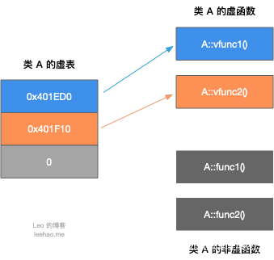
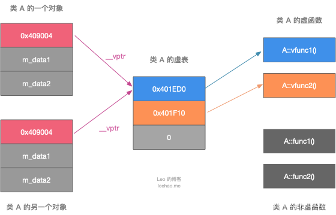

# C++ 虚函数详解

参考1：[C++ 虚函数表解析](https://blog.csdn.net/haoel/article/details/1948051)

参考2：[C++ 虚函数详解](https://blog.csdn.net/TABE_/article/details/122180181)

## 一、概述

C++中的虚函数的作用主要是实现了多态的机制。

关于多态，简而言之就是用父类型别的指针指向其子类的实例，然后通过父类的指针调用实际子类的成员函数。这种技术可以让父类的指针有“多种形态”，这是一种泛型技术。

所谓泛型技术，说白了就是试图使用不变的代码来实现可变的算法。比如：模板技术，RTTI技术，虚函数技术，要么是试图做到在编译时决议，要么试图做到运行时决议。

### 虚函数表和虚函数指针存放在哪个位置

- 虚函数指针一般都是在**类的最前边**（取决于编译器的实现）。
- 虚函数表位于C++内存模型中的**常量区**。
- 虚函数位于代码段（.text），也就是C++内存模型中的**代码区**。

## 二、虚函数表

虚函数（*Virtual Function*）是通过一张虚函数表（*Virtual Table*）来实现的。简称为*V-Table*。在这个表中，主是要一个类的虚函数的地址表，这张表解决了继承、覆盖的问题，保证其容真实反应实际的函数。这样，在有虚函数的类的实例中这个表被分配在了这个实例的内存中，所以，当我们用父类的指针来操作一个子类的时候，这张虚函数表就显得由为重要了，它就像一个地图一样，指明了实际所应该调用的函数。

**每个包含了虚函数的类都包含一个虚表，虚函数表保存的是虚函数的指针，因此虚表的大小是虚函数个数4个字节**。

例如：类 A 包含虚函数vfunc1，vfunc2，由于类 A 包含虚函数，故类 A 拥有一个虚表

```c++
class A {
public:
    virtual void vfunc1();
    virtual void vfunc2();
    void func1();
    void func2();
private:
    int m_data1, m_data2;
}
```

类 A 的虚表如下图所示：



对于虚表，需要注意的是：

- 虚表是一个指针数组，其元素是虚函数的指针，每个元素对应一个虚函数的函数指针。需要指出的是，普通的函数即非虚函数，其调用并不需要经过虚表，所以虚表的元素并不包括普通函数的函数指针。
- 虚表内的条目，即虚函数指针的赋值发生在编译器的编译阶段，也就是说在代码的编译阶段，虚表就可以构造出来了。
- **虚表是属于类的，而不是属于某个具体的对象，一个类只需要一个虚表即可**。同一个类的所有对象都使用同一个虚表。

这里我们着重看一下这张虚函数表。C++的编译器应该是保证虚函数表的指针存在于对象实例中最前面的位置（这是为了保证取到虚函数表的有最高的性能——如果有多层继承或是多重继承的情况下）。这意味着我们通过对象实例的地址得到这张虚函数表，然后就可以遍历其中函数指针，并调用相应的函数。

例如：我们有这样的一个类，可以通过 Base 的实例来得到虚函数表

> 调试源代码的时候需要的问题，靠评论区解决了
>
> 本来以为文章里面的代码是错的，结果发现自己的debug配置的64位的，所以里面的int* 要换成 long long*，好家伙有被自己蠢到

```c++
#include <iostream>

using namespace std;

class Base {
public:
    virtual void f() { cout << "Base::f" << endl; }
    virtual void g() { cout << "Base::g" << endl; }
    virtual void h() { cout << "Base::h" << endl; }
};
typedef void (*Fun)(void);

int main() {
    Base b;
    Fun pFun = NULL;

    cout << "虚函数表地址：" << (long long*)(&b) << endl;                            // 虚函数表地址：0x7fffffffdf78
    cout << "虚函数表 — 第一个函数地址：" << (long long*)*(long long*)(&b) << endl;  // 第一个函数地址：0x555555755d58

    // Invoke the first virtual function
    pFun = (Fun) * ((long long*)*(long long*)(&b));
    pFun();  // Base::f

    pFun = (Fun) * ((long long*)*(long long*)(&b) + 1);
    pFun();  // Base::g

    pFun = (Fun) * ((long long*)*(long long*)(&b) + 2);
    pFun();  // Base::h
}
```

画个图解释一下


注意：在上面这个图中，我在虚函数表的最后多加了一个结点，这是虚函数表的结束结点，就像字符串的结束符“*/0*”一样，其标志了虚函数表的结束。这个结束标志的值在不同的编译器下是不同的。在WinXP+VS2003下，这个值是NULL。而在Ubuntu 7.10 + Linux 2.6.22 + GCC 4.1.3下，这个值是如果1，表示还有下一个虚函数表，如果值是0，表示是最后一个虚函数表。

## 三、虚表指针

为了指定对象的虚表，对象内部包含一个虚表的指针，来指向自己所使用的虚表。为了让每个包含虚表的类的对象都拥有一个虚表指针，在编译阶段，编译器在类中添加了一个指针`*__vptr`，用来指向虚表。这样，当类的对象在创建时便拥有了这个指针，且这个指针的值会自动被设置为指向类的虚表，`*__vptr`一般在对象内存分布的最前面。

**虚表指针的初始化确实发生在构造函数的调用过程中， 但是在执行构造函数体之前，即进入到构造函数的"{“和”}"之前**。 为了更好的理解这一问题， 我们可以把构造函数的调用过程细分为两个阶段，即：

- 进入到构造函数体之前。在这个阶段如果存在虚函数的话，虚表指针被初始化。如果存在构造函数的初始化列表的话，初始化列表也会被执行。
- 进入到构造函数体内。这一阶段是我们通常意义上说的构造函数。



## 四、继承

我们知道，当一个类A继承另一个类B时，类 A 会继承类 B 的函数的调用权。所以如果一个基类包含了虚函数，那么其继承类也可调用这些虚函数，换句话说，一个类继承了包含虚函数的基类，那么这个类也拥有自己的虚表，下面根据继承方式的不同，描述继承类的虚表。

分别说明“无覆盖”和“有覆盖”时的虚函数表的样子。没有覆盖父类的虚函数是毫无意义的。我之所以要讲述没有覆盖的情况，主要目的是为了给一个对比，可以更加清楚地知道其内部的具体实现。

### 1、一般继承（无虚函数覆盖）

假设有如下所示的一个继承关系：


请注意，在这个继承关系中，子类没有重载任何父类的函数。那么，在派生类的实例 Derive d，其虚函数表如下所示


我们可以看到下面几点：

1. 虚函数按照其声明顺序放于表中。
2. 父类的虚函数在子类的虚函数前面。

```c++
#include <iostream>

using namespace std;

class Base {
public:
    virtual void f() { cout << "Base::f" << endl; }
    virtual void g() { cout << "Base::g" << endl; }
    virtual void h() { cout << "Base::h" << endl; }
};

class Derive : public Base {
public:
    virtual void f1() { cout << "Derive::f1" << endl; }
    virtual void g1() { cout << "Derive::g1" << endl; }
    virtual void h1() { cout << "Derive::h1" << endl; }
};

typedef void (*Fun)(void);

int main() {
    Base *b;
    Fun pFun = NULL;

    // 一般继承（无虚函数覆盖）
    b = new Derive();
    pFun = (Fun) * ((long long *)*(long long *)(b));
    pFun();  // Base::f

    pFun = (Fun) * ((long long *)*(long long *)(b) + 1);
    pFun();  // Base::g

    pFun = (Fun) * ((long long *)*(long long *)(b) + 2);
    pFun();  // Base::h

    pFun = (Fun) * ((long long *)*(long long *)(b) + 3);
    pFun();  // Derive::f1

    pFun = (Fun) * ((long long *)*(long long *)(b) + 4);
    pFun();  // Derive::g1

    pFun = (Fun) * ((long long *)*(long long *)(b) + 5);
    pFun();  // Derive::h1
}
```

### 2、一般继承（有虚函数覆盖）

覆盖父类的虚函数是很显然的事情，不然，虚函数就变得毫无意义。下面，我们来看一下，如果子类中有虚函数重载了父类的虚函数，会是一个什么样子？假设，我们有下面这样的一个继承关系。

 

为了让大家看到被继承过后的效果，在这个类的设计中，我只覆盖了父类的一个函数：*f()*。那么，对于派生类的实例，其虚函数表会是下面的一个样子：


我们从表中可以看到下面几点

- 覆盖的*f()*函数被放到了虚表中原来父类虚函数的位置。
- 没有被覆盖的函数依旧。

`b->f();` 由*b*所指的内存中的虚函数表的*f()*的位置已经被*Derive::f()*函数地址所取代，于是在实际调用发生时，是*Derive::f()*被调用了。这就实现了多态。

```c++
#include <iostream>

using namespace std;

class Base {
public:
    virtual void f() { cout << "Base::f" << endl; }
    virtual void g() { cout << "Base::g" << endl; }
    virtual void h() { cout << "Base::h" << endl; }
};

class Derive : public Base {
public:
    virtual void f() { cout << "Derive::f" << endl; }
    virtual void g1() { cout << "Derive::g1" << endl; }
    virtual void h1() { cout << "Derive::h1" << endl; }
};

typedef void (*Fun)(void);

int main() {
    Base *b;
    Fun pFun = NULL;

    // 一般继承（无虚函数覆盖）
    b = new Derive();

    b->f();  // Derive::f

    pFun = (Fun) * ((long long *)*(long long *)(b));
    pFun();  // Derive::f

    pFun = (Fun) * ((long long *)*(long long *)(b) + 1);
    pFun();  // Base::g

    pFun = (Fun) * ((long long *)*(long long *)(b) + 2);
    pFun();  // Base::h

    pFun = (Fun) * ((long long *)*(long long *)(b) + 3);
    pFun();  // Derive::g1

    pFun = (Fun) * ((long long *)*(long long *)(b) + 4);
    pFun();  // Derive::h1
}
```

### 3、多重继承（无虚函数覆盖）

下面，再让我们来看看多重继承中的情况，假设有下面这样一个类的继承关系。注意：子类并没有覆盖父类的函数

 

对于子类实例中的虚函数表，是下面这个样子：


我们可以看到：

1. 每个父类都有自己的虚表。
2. 子类的成员函数被放到了第一个父类的表中。（所谓的第一个父类是按照声明顺序来判断的）

这样做就是为了解决不同的父类类型的指针指向同一个子类实例，而能够调用到实际的函数。

### 4、多重继承（有虚函数覆盖）

下面我们再来看看，如果发生虚函数覆盖的情况。下图中，我们在子类中覆盖了父类的*f()*函数。

 

下面是对于子类实例中的虚函数表的图：

 

我们可以看见，三个父类虚函数表中的*f()*的位置被替换成了子类的函数指针。这样，我们就可以任一静态类型的父类来指向子类，并调用子类的*f()*了。如：

```c++
Derive d;
Base1 *b1 = &d;
Base2 *b2 = &d;
Base3 *b3 = &d;

b1->f();  // Derive::f()
b2->f();  // Derive::f()
b3->f();  // Derive::f()
b1->g();  // Base1::g()
b2->g();  // Base2::g()
b3->g();  // Base3::g()
```

## 五、安全性

每次写*C++*的文章，总免不了要批判一下*C++*。这篇文章也不例外。通过上面的讲述，相信我们对虚函数表有一个比较细致的了解了。水可载舟，亦可覆舟。下面，让我们来看看我们可以用虚函数表来干点什么坏事吧。

### 1、通过父类型的指针访问子类自己的虚函数

我们知道，子类没有重载父类的虚函数是一件毫无意义的事情。因为多态也是要基于函数重载的。虽然在上面的图中我们可以看到*Base1*的虚表中有*Derive*的虚函数，但我们根本不可能使用下面的语句来调用子类的自有虚函数：

```c++
Base1 *b1 = new Derive();
b1->f1(); //*编译出错*
```

任何妄图使用父类指针想调用子类中的**未覆盖父类的成员函数**的行为都会被编译器视为非法，所以，这样的程序根本无法编译通过。但在运行时，我们可以通过指针的方式访问虚函数表来达到违反*C++*语义的行为。（关于这方面的尝试，通过阅读后面附录的代码，相信你可以做到这一点）

### 2、访问non-public的虚函数

另外，如果父类的虚函数是*private*或是*protected*的，但这些非*public*的虚函数同样会存在于虚函数表中，所以，我们同样可以使用访问虚函数表的方式来访问这些non-public的虚函数，这是很容易做到的。

如：

```c++
#include <iostream>

using namespace std;

class Base {
private:
    virtual void f() {
        cout << "Base::f" << endl;
    }
};

class Derive : public Base {
};

typedef void (*Fun)(void);

int main() {
    Derive d;

    Fun pFun = (Fun) * ((long long*)*(long long*)(&d) + 0);

    pFun();  // Base::f
}
```

