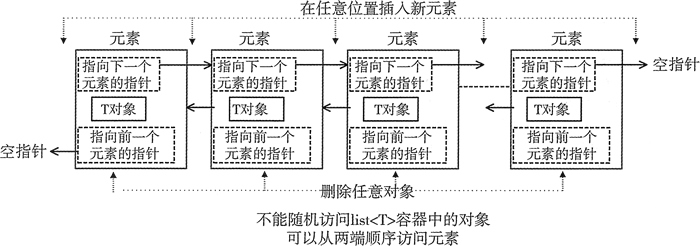

# 双向链表容器 list 

list 容器，又称双向链表容器，即该容器的底层是以双向链表的形式实现的。这意味着，list 容器中的元素可以分散存储在内存空间里，而不是必须存储在一整块连续的内存空间中。



可以看到，list 容器中各个元素的前后顺序是靠[指针](http://c.biancheng.net/c/80/)来维系的，每个元素都配备了 2 个指针，分别指向它的前一个元素和后一个元素。其中第一个元素的前向指针总为 null，因为它前面没有元素；同样，尾部元素的后向指针也总为 null。

list 容器具有一些其它容器（array、vector 和 deque）所不具备的优势，即它可以在序列已知的任何位置快速插入或删除元素（操作的时间复杂度为`O(1)`）。并且在 list 容器中移动元素，也比其它容器的效率高。

**缺点：它不能像 array 和 vector 那样，通过位置直接访问元素**。举个例子，如果要访问 list 容器中的第 6 个元素，它不支持`容器对象名[6]`这种语法格式，正确的做法是从容器中第一个元素或最后一个元素开始遍历容器，直到找到该位置。

> 实际场景中，如何需要对序列进行大量添加或删除元素的操作，而直接访问元素的需求却很少，这种情况建议使用 list 容器存储序列。

## 一、创建

```cpp
#include <iostream>
#include <list>
using namespace std;

void show(list<int> q) {
    for (int i = 0; i < q.size(); i++) {
        cout << q[i] << " ";
    }
    cout << endl;
}

int main() {
    // 创建一个没有任何元素的空 list 容器
    list<int> values1;

    // 创建一个包含 n 个元素的 list 容器，每个元素的值都为相应类型的默认值
    list<int> values2(5);

    // 创建一个包含 n 个元素的 list 容器，并为每个元素指定初始值
    list<int> values3(5, 1);

    // 通过拷贝创建
    list<int> values4(values3);

    return 0;
}
```

## 二、成员函数

| 成员函数        | 功能                                                         |
| --------------- | ------------------------------------------------------------ |
| **begin()**     | **返回指向容器中第一个元素的双向迭代器**                     |
| **end()**       | **返回指向容器中最后一个元素所在位置的下一个位置的双向迭代器** |
| rbegin()        | 返回指向最后一个元素的反向双向迭代器。                       |
| rend()          | 返回指向第一个元素所在位置前一个位置的反向双向迭代器。       |
| cbegin()        | 和 begin() 功能相同，只不过在其基础上，增加了 const 属性，不能用于修改元素。 |
| cend()          | 和 end() 功能相同，只不过在其基础上，增加了 const 属性，不能用于修改元素。 |
| crbegin()       | 和 rbegin() 功能相同，只不过在其基础上，增加了 const 属性，不能用于修改元素。 |
| crend()         | 和 rend() 功能相同，只不过在其基础上，增加了 const 属性，不能用于修改元素。 |
| empty()         | 判断容器中是否有元素，若无元素，则返回 true；反之，返回 false。 |
| size()          | 返回当前容器实际包含的元素个数。                             |
| max_size()      | 返回容器所能包含元素个数的最大值。这通常是一个很大的值，一般是 232-1，所以我们很少会用到这个函数。 |
| front()         | 返回第一个元素的引用。                                       |
| back()          | 返回最后一个元素的引用。                                     |
| assign()        | 用新元素替换容器中原有内容。                                 |
| emplace_front() | 在容器头部生成一个元素。该函数和 push_front() 的功能相同，但效率更高。 |
| push_front()    | 在容器头部插入一个元素。                                     |
| pop_front()     | 删除容器头部的一个元素。                                     |
| emplace_back()  | 在容器尾部直接生成一个元素。该函数和 push_back() 的功能相同，但效率更高。 |
| push_back()     | 在容器尾部插入一个元素。                                     |
| pop_back()      | 删除容器尾部的一个元素。                                     |
| emplace()       | 在容器中的指定位置插入元素。该函数和 insert() 功能相同，但效率更高。 |
| insert()        | 在容器中的指定位置插入元素。                                 |
| erase()         | 删除容器中一个或某区域内的元素。                             |
| swap()          | 交换两个容器中的元素，必须保证这两个容器中存储的元素类型是相同的。 |
| resize()        | 调整容器的大小。                                             |
| clear()         | 删除容器存储的所有元素。                                     |
| splice()        | 将一个 list 容器中的元素插入到另一个容器的指定位置。         |
| remove(val)     | 删除容器中所有等于 val 的元素。                              |
| remove_if()     | 删除容器中满足条件的元素。                                   |
| unique()        | 删除容器中相邻的重复元素，只保留一个。                       |
| merge()         | 合并两个事先已排好序的 list 容器，并且合并之后的 list 容器依然是有序的。 |
| sort()          | 通过更改容器中元素的位置，将它们进行排序。                   |
| reverse()       | 反转容器中元素的顺序。                                       |

## 三、双向迭代器

**只有运用迭代器，才能访问 list 容器中存储的各个元素**

双向迭代器支持使用 ++p1、 p1++、 p1--、 p1++、 *p1、 p1==p2 以及 p1!=p2 运算符，不支持使用 <、 >、 <=、 >= 比较运算符

```cpp
list<char> values{'a', 'b', 'c', 'd'};
// begin() end() 顺序输出
for (auto it = values.begin(); it != values.end(); ++it) {
    cout << *it;
}
cout << endl;  // abcd
// rbegin() rend() 逆序输出
for (auto it = values.rbegin(); it != values.rend(); ++it) {
    cout << *it;
}
cout << endl;  // dcba
```

list 容器在进行插入（insert()）、接合（splice()）等操作时，都不会造成原有的 list 迭代器失效，甚至进行删除操作，而只有指向被删除元素的迭代器失效，其他迭代器不受任何影响。

## 四、访问元素

通过 front() 和 back() 成员函数，可以分别获得 list 容器中第一个元素和最后一个元素的引用形式

```cpp
list<int> values{1, 2, 3, 4};

int &first = values.front();
int &last = values.back();
cout << first << " " << last << endl;  // 1 4

first = 10;
last = 20;
cout << values.front() << " " << values.back() << endl;  // 10 20
```

只能通过迭代器遍历

```cpp
list<int> values{1, 2, 3, 4};

for (auto i = values.begin(); i != values.end(); i++) {
    cout << *i << " ";
}
cout << endl;  // 1 2 3 4

auto first = values.begin();
auto end = values.end();
while (first != end) {
    cout << *first << " ";
    first++;
}  // 1 2 3 4
```

## 五、添加（插入）元素

```cpp
std::list<int> values{1, 2, 3};
values.push_front(0);      //{0,1,2,3}
values.push_back(4);       //{0,1,2,3,4}
values.emplace_front(-1);  //{-1,0,1,2,3,4}
values.emplace_back(5);    //{-1,0,1,2,3,4,5}

// emplace(pos,value),其中 pos 表示指明位置的迭代器，value为要插入的元素值
values.emplace(values.end(), 6);  //{-1,0,1,2,3,4,5,6}
for (auto p = values.begin(); p != values.end(); ++p) {
    cout << *p << " ";
}
```

## 六、删除元素

```cpp
list<int> values{1, 2, 3, 4};

//删除当前容器中首个元素
values.pop_front();  //{2,3,4}

//删除当前容器最后一个元素
values.pop_back();  //{2,3}

//清空容器，删除容器中所有的元素
values.clear();  //{}
```

## 七、forward_list容器

forward_list 是 c++11 新添加的一类容器，其底层实现和 list 容器一样，但 forward_list 使用的是单链表

forward_list 容器具有和 list 容器相同的特性，但存储相同个数的同类型元素，单链表耗用的内存空间更少，空间利用率更高，并且对于实现某些操作单链表的执行效率也更高
