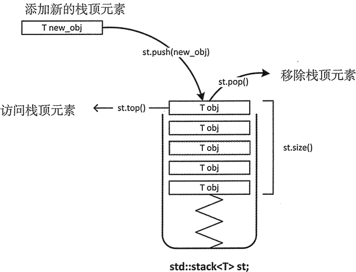

# stack

stack 栈适配器是一种单端开口的容器，实际上该容器模拟的就是栈存储结构，栈中存储的元素满足“后进先出（简称LIFO）”的准则。stack 每次只能访问适配器中位于最顶端的元素，也只有移除 stack 顶部的元素之后，才能访问位于栈中的元素。



## 一、创建

```cpp
#include <iostream>
#include <list>
#include <stack>
using namespace std;

int main() {
    // 1 默认的 deque 基础容器
    stack<int> st1;

    // 2 使用 list 基础容器的 stack 适配器
    list<int> values {1, 2, 3};
    stack<int, list<int> > st2(values);

    // 3 复制
    stack<int> st4 = st3;
    stack<int> st5(st3);
    return 0;
}
```

## 二、成员函数

| 成员方法                       | 功能                                                         |
| ------------------------------ | ------------------------------------------------------------ |
| empty()                        | 当 stack 栈中没有元素时，该成员函数返回 true；反之，返回 false。 |
| size()                         | 返回 stack 栈中存储元素的个数。                              |
| **top()**                      | **返回一个栈顶元素的引用，类型为 T&。如果栈为空，程序会报错** |
| **push(const T& val)**         | **先复制 val，再将 val 副本压入栈顶。这是通过调用底层容器的 push_back() 函数完成的** |
| push(T&& obj)                  | 以移动元素的方式将其压入栈顶。这是通过调用底层容器的有右值引用参数的 push_back() 函数完成的。 |
| **pop()**                      | **弹出栈顶元素**                                             |
| emplace(arg...)                | arg... 可以是一个参数，也可以是多个参数，但它们都只用于构造一个对象，并在栈顶直接生成该对象，作为新的栈顶元素。 |
| `swap(stack<T> & other_stack)` | 将两个 stack 适配器中的元素进行互换，需要注意的是，进行互换的 2 个 stack 适配器中存储的元素类型以及底层采用的基础容器类型，都必须相同。 |

```cpp
#include <iostream>
#include <list>
#include <stack>
using namespace std;

int main() {
    list<int> values{1, 2, 3};
    stack<int, list<int>> st(values);

    cout << st.size() << endl;  // 3

    while (!st.empty()) {
        cout << st.top() << " ";
        st.pop();
    }
    // 3 2 1

    return 0;
}
```

