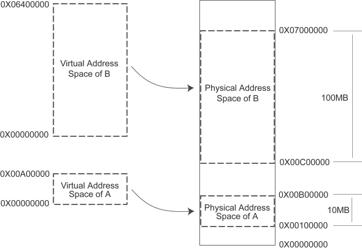
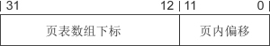

# 内存分页机制，提高内存使用效率

## 一、虚拟地址和物理地址的映射

关于虚拟地址和物理地址的映射有很多思路，我们可以假设以程序为单位，把一段与程序运行所需要的同等大小的虚拟空间映射到某段物理空间。

例如程序A需要 10MB 内存，虚拟地址的范围是从 0X00000000 到 0X00A00000，假设它被映射到一段同等大小的物理内存，地址范围从 0X00100000 到 0X00B00000，即虚拟空间中的每一个字节对应于物理空间中的每一个字节。

程序运行时，它们的对应关系如下图所示：

当程序A需要访问 0X00001000 时，系统会将这个虚拟地址转换成实际的物理地址 0X00101000，访问 0X002E0000 时，转换成 0X003E0000，以此类推。

这种以整个程序为单位的方法很好地解决了不同程序地址不隔离的问题，同时也能够在程序中使用固定的地址。

### 1、地址隔离

如上图所示，程序A和程序B分别被映射到了两块不同的物理内存，它们之间没有任何重叠，如果程序A访问的虚拟地址超出了 0X00A00000 这个范围，系统就会判断这是一个非法的访问，拒绝这个请求，并将这个错误报告给用户，通常的做法就是强制关闭程序。

### 2、程序可以使用固定的内存地址

虚拟内存无论被映射到物理内存的哪一个区域，对于程序员来说都是透明的，我们不需要关心物理地址的变化，只需要按照从地址 0X00000000 到 0X00A00000 来编写程序、放置变量即可，程序不再需要重定位。

### 3、内存使用效率问题

**以程序为单位对虚拟内存进行映射时，如果物理内存不足，被换入换出到磁盘的是整个程序，这样势必会导致大量的磁盘读写操作，严重影响运行速度，**所以这种方法还是显得粗糙，粒度比较大。

「内存分页机制」就是为了解决这个问题。

## 二、内存分页机制

我们知道，当一个程序运行时，在某个时间段内，它只是频繁地用到了一小部分数据，也就是说，程序的很多数据其实在一个时间段内都不会被用到。

以整个程序为单位进行映射，不仅会将暂时用不到的数据从磁盘中读取到内存，也会将过多的数据一次性写入磁盘，这会严重降低程序的运行效率。

**现代计算机都使用分页（Paging）的方式对虚拟地址空间和物理地址空间进行分割和映射，以减小换入换出的粒度，提高程序运行效率**。

分页（Paging）的思想是指把地址空间人为地分成大小相等（并且固定）的若干份，这样的一份称为一页，就像一本书由很多页面组成，每个页面的大小相等。如此，就能够以页为单位对内存进行换入换出：

- 当程序运行时，只需要将必要的数据从磁盘读取到内存，暂时用不到的数据先留在磁盘中，什么时候用到什么时候读取。
- 当物理内存不足时，只需要将原来程序的部分数据写入磁盘，腾出足够的空间即可，不用把整个程序都写入磁盘。

### 1、关于页的大小

页的大小是固定的，由硬件决定，或硬件支持多种大小的页，由操作系统选择决定页的大小。比如 Intel Pentium 系列处理器支持 4KB 或 4MB 的页大小，那么操作系统可以选择每页大小为 4KB，也可以选择每页大小为 4MB，但是在同一时刻只能选择一种大小，所以对整个系统来说，也就是固定大小的。

目前几乎所有PC上的操作系统都是用 4KB 大小的页。假设我们使用的PC机是32位的，那么虚拟地址空间总共有 4GB，按照 4KB 每页分的话，总共有 2^32 / 2^12 = 2^20 = 1M = 1048576 个页；物理内存也是同样的分法。

### 2、根据页进行映射

下面我们通过一个简单的例子来说明虚拟地址是如何根据页来映射到物理地址的，请先看下图：

程序1和程序2的虚拟空间都有8个页，为了方便说明问题，我们假设每页大小为 1KB，那么虚拟地址空间就是 8KB。假设计算机有13条地址线，即拥有 2^13 的物理寻址能力，那么理论上物理空间可以多达 8KB。但是出于种种原因，购买内存的资金不够，只买得起 6KB 的内存，所以物理空间真正有效的只是前 6KB。

当我们把程序的虚拟空间按页分隔后，**把常用的数据和代码页加载到内存中，把不常用的暂时留在磁盘中，**当需要用到的时候再从磁盘中读取。上图中，我们假设有两个程序 Program 1 和 Program 2，它们的部分虚拟页面被映射到物理页面，比如 Program 1 的 VP0、VP1 和 VP7 分别被映射到 PP0、PP2 和 PP3；而有部分却留在磁盘中，比如 VP2、VP3 分别位于磁盘的 DP0、DP1中；另外还有一些页面如 VP4、VP5、VP6 可能尚未被用到或者访问到，它们暂时处于未使用状态。

> 这里，我们把虚拟空间的页叫做虚拟页（VP，Virtual Page），把物理内存中的页叫做物理页（PP，Physical Page），把磁盘中的页叫做磁盘页（DP，Disk Page）。

图中的线表示映射关系，可以看到，**Program 1 和 Program 2 中的有些虚拟页被映射到同一个物理页，这样可以实现内存共享**。

Program 1 的 VP2、VP3 不在内存中，但是当进程需要用到这两个页的时候，硬件会捕获到这个消息，就是所谓的页错误（Page Fault），然后操作系统接管进程，负责将 VP2 和 PV3 从磁盘中读取出来并且装入内存，然后将内存中的这两个页与 VP2、VP3 之间建立映射关系。

## 三、分页机制如何实现的

代操作系统都使用分页机制来管理内存，这使得每个程序都拥有自己的地址空间。每当程序使用虚拟地址进行读写时，都必须转换为实际的物理地址，才能真正在内存条上定位数据。

**内存地址的转换是通过一种叫做页表（Page Table）的机制来完成的**

### 1、直接使用数组转换

最容易想到的映射方案是使用数组：每个数组元素保存一个物理地址，而把虚拟地址作为数组下标，这样就能够很容易地完成映射，并且效率不低。

但是这样的数组有 2^32 个元素，每个元素大小为4个字节，总共占用16GB的内存，显然是不现实的

### 2、使用一级页表

**既然内存是分页的，只要我们能够定位到数据所在的页，以及它在页内的偏移（也就是距离页开头的字节数），就能够转换为物理地址。**例如，一个 int 类型的值保存在第 12 页，页内偏移为 240，那么对应的物理地址就是 2^12 * 12 + 240 = 49392。

> 2^12 为一个页的大小，也就是4K。

虚拟地址空间大小为 4GB，总共包含 2^32 / 2^12 = 2^20 = 1K * 1K  = 1M = 1048576 个页面，我们可以定义一个这样的数组：它包含 2^20 = 1M 个元素，每个元素的值为页面编号（也就是位于第几个页面），长度为4字节，整个数组共占用4MB的内存空间。这样的数组就称为页表（Page Table），它记录了地址空间中所有页的编号。

虚拟地址长度为32位，我们不妨进行一下切割，**将高20位作为页表数组的下标，低12位作为页内偏移。**如下图所示：

为什么要这样切割呢？**因为页表数组共有 2^20 = 1M 个元素，使用虚拟地址的高20位作为下标，正好能够访问数组中的所有元素；并且，一个页面的大小为 2^12 = 4KB，使用虚拟地址的低12位恰好能够表示所有偏移。**

注意，表示页面编号只需要 20 位，而页表数组的每个元素的长度却为 4 字节，即 32 位，多出 32 - 20 = 12 位。这 12 位也有很大的用处，可以用来表示当前页的相关属性，例如是否有读写权限、是否已经分配物理内存、是否被换出到硬盘等。

例如一个虚拟地址 0XA010BA01，它的高20位是 0XA010B，所以需要访问页表数组的第 0XA010B 个元素，才能找到数据所在的物理页面。假设页表数组第 0XA010B 个元素的值为 0X0F70AAA0，它的高20位为 0X0F70A，那么就可以确定数据位于第 0X0F70A 个物理页面。再来看虚拟地址，它的低12位是 0XA01，所以页内偏移也是 0XA01。有了页面索引和页内偏移，就可以算出物理地址了。经过计算，最终的物理地址为 0X0F70A * 2^12 + 0XA01 = 0X0F70A000 + 0XA01 = 0X0F70AA01。

这种思路所形成的映射关系如下图所示：

可以发现，有的页被映射到物理内存，有的被映射到硬盘，不同的映射方式可以由页表数组元素的低12位来控制。

使用这种方案，不管程序占用多大的内存，都要为页表数组分配4M的内存空间（页表数组也必须放在物理内存中），因为虚拟地址空间中的高1G或2G是被系统占用的，必须保证较大的数组下标有效。

现在硬件很便宜了，内存容量大了，很多电脑都配备4G或8G的内存，页表数组占用4M内存或许不觉得多，但在32位系统刚刚发布的时候，内存还是很紧缺的资源，很多电脑才配备100M甚至几十兆的内存，4M内存就显得有点大了，所以还得对上面的方案进行改进，压缩页表数组所占用的内存。

### 3、使用两级页表

上面的页表共有 2^20 = 2^10 * 2^10 个元素，为了压缩页表的存储空间，可以将上面的页表再分拆成 2^10 = 1K = 1024 个小的页表，这样每个页表只包含 2^10 = 1K = 1024 个元素，占用 2^10 * 4 = 4KB 的内存，也即一个页面的大小。这 1024 个小的页表，可以存储在不同的物理页，它们之间可以是不连续的。

那么问题来了，既然这些小的页表分散存储，位于不同的物理页，该如何定位它们呢？也就是如何记录它们的编号（也即在物理内存中位于第几个页面）。

1024 个页表有 1024 个索引，所以不能用一个指针指向它们，必须将这些索引再保存到一个额外的数组中。这个额外的数组有1024个元素，每个元素记录一个页表所在物理页的编号，长度为4个字节，总共占用4KB的内存。我们将这个额外的数组称为页目录（Page Directory），因为它的每一个元素对应一个页表。

**如此，只要使用一个指针来记住页目录的地址即可，等到进行地址转换时，可以根据这个指针找到页目录，再根据页目录找到页表，最后找到物理地址，前后共经过3次间接转换。**

那么，如何根据虚拟地址找到页目录和页表中相应的元素呢？我们不妨将虚拟地址分割为三分部，高10位作为页目录中元素的下标，中间10位作为页表中元素的下标，最后12位作为页内偏移，如下图所示：

前面我们说过，知道了物理页的索引和页内偏移就可以转换为物理地址了，在这种方案中，页内偏移可以从虚拟地址的低12位得到，但是物理页索引却保存在 1024 个分散的小页表中，所以就必须先根据页目录找到对应的页表，再根据页表找到物理页索引。

例如一个虚拟地址 0011000101  1010001100  111100001010，它的高10位为 0011000101，对应页目录中的第 0011000101 个元素，假设该元素的高20位为 0XF012A，也即对应的页表在物理内存中的编号为 0XF012A，这样就找到了页表。虚拟地址中间10位为 1010001100，它对应页表中的第 1010001100 个元素，假设该元素的高20位为 0X00D20，也即物理页的索引为 0X00D20。通过计算，最终的物理地址为 0X00D20 * 2^12 + 111100001010 = 0X00D20F0A。

这种思路所形成的映射关系如下图所示：

> 图中的点状虚线说明了最终的映射关系。图中没有考虑映射到硬盘的情况。

采用这样的两级页表的一个明显优点是，如果程序占用的内存较少，分散的小页表的个数就会远远少于1024个，只会占用很少的一部分存储空间（远远小于4M）。

在极少数的情况下，程序占用的内存非常大，布满了4G的虚拟地址空间，这样小页表的数量可能接近甚至等于1024，再加上页目录占用的存储空间，总共是 4MB+4KB，比上面使用一级页表的方案仅仅多出4KB的内存。这是可以容忍的，因为很少出现如此极端的情况。

也就是说，使用两级页表后，页表占用的内存空间不固定，它和程序本身占用的内存空间成正比，从整体上来看，会比使用一级页表占用的内存少得多。

### 4、使用多级页表

对于64位环境，虚拟地址空间达到 256TB，使用二级页表占用的存储空间依然不小，所以会更加细化，从而使用三级页表甚至多级页表，这样就会有多个页目录，虚拟地址也会被分割成多个部分，思路和上面是一样的，不再赘述。