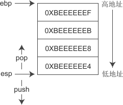
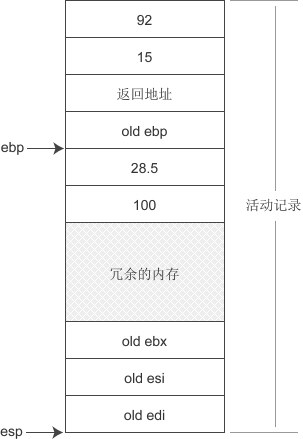

# 栈

**栈（Stack）可以存放函数参数、局部变量、局部数组等作用范围在函数内部的数据，它的用途就是完成函数的调用**。

栈内存由系统自动分配和释放：发生函数调用时就为函数运行时用到的数据分配内存，函数调用结束后就将之前分配的内存全部销毁。所以局部变量、参数只在当前函数中有效，不能传递到函数外部。

栈也经常被称为堆栈，而堆依然称为堆，所以堆栈这个概念并不包含堆

## 一、栈

在计算机中，栈可以理解为一个特殊的容器，用户可以将数据依次放入栈中，然后再将数据按照相反的顺序从栈中取出。也就是说，先放入的数据最后才能取出，而最后放入的数据必须先取出。这称为先进后出（First In Last Out）原则。

放入数据常称为入栈或压栈（Push），取出数据常称为出栈或弹出（Pop）。如下图所示：


可以发现，栈底始终不动，出栈入栈只是在移动栈顶，当栈中没有数据时，栈顶和栈底重合。

**从本质上来讲，栈是一段连续的内存，需要同时记录栈底和栈顶，才能对当前的栈进行定位。在现代计算机中，通常使用`ebp`寄存器指向栈底，而使用`esp`寄存器指向栈顶。随着数据的进栈出栈，esp 的值会不断变化，进栈时 esp 的值减小，出栈时 esp 的值增大**。

> ebp 和 esp 都是CPU中的寄存器：ebp 是 Extend Base Pointer 的缩写，通常用来指向栈底；esp 是 Extend Stack Pointer 的缩写，通常用来指向栈顶。

如下图所示是一个栈的实例：



## 二、栈的大小以及栈溢出

对每个程序来说，**栈能使用的内存是有限的，**一般是 1M~8M，这在编译时就已经决定了，程序运行期间不能再改变。**如果程序使用的栈内存超出最大值，就会发生栈溢出（Stack Overflow）错误。**

> 一个程序可以包含多个线程，每个线程都有自己的栈，严格来说，栈的最大值是针对线程来说的，而不是针对程序。

栈内存的大小和编译器有关，编译器会为栈内存指定一个最大值，在 VC/VS 下，默认是 1M，在 C-Free 下，默认是 2M，在 Linux GCC 下，默认是 8M。

可以修改栈内存的大小

## 三、一个函数在栈上是怎样的

函数的调用和栈是分不开的，没有栈就没有函数调用

### 1、栈帧/活动记录

**当发生函数调用时，会将函数运行需要的信息全部压入栈中，这常常被称为栈帧（Stack Frame）或活动记录（Activate Record）。**活动记录一般包括以下几个方面的内容：

1) 函数的返回地址，也就是函数执行完成后从那里开始继续执行后面的代码。例如：

```c
int a, b, c;
func(1, 2);
c = a + b;
```

站在C语言的角度看，func() 函数执行完成后，会继续执行`c=a+b;`语句，那么返回地址就是该语句在内存中的位置。

> 注意：C语言代码最终会被编译为机器指令，确切地说，返回地址应该是下一条指令的地址，这里之所以说是下一条C语言语句的地址，仅仅是为了更加直观地说明问题。

2) 参数和局部变量。有些编译器，或者编译器在开启优化选项的情况下，会通过寄存器来传递参数，而不是将参数压入栈中，我们暂时不考虑这种情况。

3) 编译器自动生成的临时数据。例如，当函数返回值的长度较大（比如占用40个字节）时，会先将返回值压入栈中，然后再交给函数调用者。

> 当返回值的长度较小（char、int、long 等）时，不会被压入栈中，而是先将返回值放入寄存器，再传递给函数调用者。

4) 一些需要保存的寄存器，例如 ebp、ebx、esi、edi 等。之所以要保存寄存器的值，是为了在函数退出时能够恢复到函数调用之前的场景，继续执行上层函数。

下图是一个函数调用的实例：


上图是在Windows下使用VS2010 Debug模式编译时一个函数所使用的栈内存，可以发现，理论上 ebp 寄存器应该指向栈底，但在实际应用中，它却指向了old ebp。

> 在寄存器名字前面添加“old”，表示函数调用之前该寄存器的值。

当发生函数调用时：

- 实参、返回地址、ebp 寄存器首先入栈；
- 然后再分配一块内存供局部变量、返回值等使用，这块内存一般比较大，足以容纳所有数据，并且会有冗余；
- 最后将其他寄存器的值压入栈中。

> 需要注意的是，不同编译器在不同编译模式下所产生的函数栈并不完全相同，例如在VS2010下选择Release模式，编译器会进行大量优化，函数栈的样貌荡然无存，不具有教学意义，所以本教程以VS2010 Debug模式为例进行分析。

### 2、关于数据的定位

由于 esp 的值会随着数据的入栈而不断变化，要想根据 esp 找到参数、局部变量等数据是比较困难的，所以在实现上是根据 ebp 来定位栈内数据的。ebp 的值是固定的，数据相对 ebp 的偏移也是固定的，**ebp 的值加上偏移量就是数据的地址。**

例如一个函数的定义如下：

```c
void func(int a, int b){
    float f = 28.5;
    int n = 100;
    //TODO:
}
```

调用形式为：

```c
func(15, 92);
```

那么函数的活动记录如下图所示：



这里我们假设两个局部变量挨着，并且第一个变量和 old ebp 也挨着（实际上它们之间有4个字节的空白），如此，第一个参数的地址是 ebp+12，第二个参数的地址是 ebp+8，第一个局部变量的地址是 ebp-4，第二个局部变量的地址是 ebp-8。

## 四、函数调用惯例(Calling Convention)

一个C程序由若干个函数组成，C程序的执行实际上就是函数之间的相互调用。请看下面的代码：

```c
#include <stdio.h>
void funcA(int m, int n){
    printf("funcA被调用\n");
}
void funcB(float a, float b){
    funcA(100, 200);
    printf("funcB被调用\n");
}
int main(){
    funcB(19.9, 28.5);
    printf("main被调用\n");
    return 0;
}
```

main() 调用了 funcB()，funcB() 又调用了 funcA()。对于main() 调用 funcB()，我们称 main() 是调用方，funcB() 是被调用方；同理，对于 funcB() 调用 funcA()，funcB() 是调用方，funcA() 是被调用方。

函数的参数（实参）由调用方压入栈中供被调用方使用，它们之间要有一致的约定。例如，参数是从左到右入栈还是从右到左入栈，如果双方理解不一致，被调用方使用参数时就会出错。

以 funcB() 为例，假设 main() 函数先将 19.9 入栈，后将 28.5 入栈，但是 funcB() 在使用这些实参时却认为 28.5 先入栈，19.9 后入栈，那么就一定会产生混乱，误以为19.9 是传递给 b、28.5 是传递给 a 的。

所以，**函数调用方和被调用方必须遵守同样的约定，理解要一致，这称为调用惯例（Calling Convention）**

一个调用惯例一般规定以下两方面的内容：

1) 「函数参数的传递方式」是通过栈传递还是通过寄存器传递（这里我们只讲解通过栈传递的情况）。

2) 「函数参数的传递顺序」是从左到右入栈还是从右到左入栈。

3) 「参数弹出方式」。函数调用结束后需要将压入栈中的参数全部弹出，以使得栈在函数调用前后保持一致。这个弹出的工作可以由调用方来完成，也可以由被调用方来完成。

4) 「函数名修饰方式」。函数名在编译时会被修改，调用惯例可以决定如何修改函数名。

在C语言中，存在多种调用惯例，可以在函数声明或函数定义时指定，例如：

```c
#include <stdio.h>
int __cdecl max(int m, int n);
int main(){
    int a = max(10, 20);
    printf("a = %d\n", a);
    return 0;
}
int __cdecl max(int m, int n){
    int max = m>n ? m : n;
    return max;
}
```

函数调用惯例在函数声明和函数定义时都可以指定，语法格式为：

```
返回值类型  调用惯例  函数名(函数参数)
```

在函数声明处是为调用方指定调用惯例，而在函数定义处是为被调用方（也就是函数本身）指定调用惯例。

`__cdecl`是C语言默认的调用惯例，在平时编程中，我们其实很少去指定调用惯例，这个时候就使用默认的 __cdecl。

> 注意：__cdecl 并不是标准关键字，上面的写法在 VC/VS 下有效，但是在 GCC 下，要使用 __attribute__((cdecl))。

除了 cdecl，还有其他调用惯例，请看下表：

| 调用惯例 | 参数传递方式                                            | 参数出栈方式          | 名字修饰                                                     |
| -------- | ------------------------------------------------------- | --------------------- | ------------------------------------------------------------ |
| cdecl    | 按照从右到左的顺序入栈                                  | 调用方                | 下划线+函数名， 如函数 max() 的修饰名为 _max                 |
| stdcall  | 按照从右到左的顺序入栈                                  | 函数本身 （被调用方） | 下划线+函数名+@+参数的字节数， 如函数 int max(int m, int n) 的修饰名为 _max_@8 |
| fastcall | 将部分参数放入寄存器， 剩下的参数按照从右到左的顺序入栈 | 函数本身 （被调用方） | @+函数名+@+参数的字节数                                      |
| pascal   | 按照从左到右的顺序入栈                                  | 函数本身 （被调用方） | 较为复杂，这里不再展开讨论                                   |

## 五、实例-深入剖析函数进栈出栈的过程

请看下面的代码：

```c
void func(int a, int b){
    int p =12, q = 345;
}
int main(){
    func(90, 26);
    return 0;
}
```

函数使用默认的调用惯例 cdecl，即参数从右到左入栈，由调用方负责将参数出栈。函数的进栈出栈过程如下图所示：


### 1、函数进栈

步骤①到⑥是函数进栈过程：
\1) main() 是主函数，也需要进栈，如步骤①所示。

\2) 在步骤②中，执行语句`func(90, 26);`，先将实参 90、26 压入栈中，再将返回地址压入栈中，这些工作都由 main() 函数（调用方）完成。这个时候 ebp 的值并没有变，仅仅是改变 esp 的指向。

\3) 到了步骤③，就开始执行 func() 的函数体了。首先将原来 ebp 寄存器的值压入栈中（也即图中的 old ebp），并将 esp 的值赋给 ebp，这样 ebp 就从 main() 函数的栈底指向了 func() 函数的栈底，完成了函数栈的切换。由于此时 esp 和ebp 的值相等，所以它们也就指向了同一个位置。

\4) 为局部变量、返回值等预留足够的内存，如步骤④所示。由于栈内存在函数调用之前就已经分配好了，所以这里并不是真的分配内存，而是将 esp 的值减去一个整数，例如 esp - 0XC0，就是预留 0XC0 字节的内存。

\5) 将 ebp、esi、edi 寄存器的值依次压入栈中。

\6) 将局部变量的值放入预留好的内存中。注意，第一个变量和 old ebp 之间有4个字节的空白，变量之间也有若干字节的空白。

为什么要留出这么多的空白，岂不是浪费内存吗？这是因为我们使用Debug模式生成程序，留出多余的内存，方便加入调试信息；以Release模式生成程序时，内存将会变得更加紧凑，空白也被消除。

至此，func() 函数的活动记录就构造完成了。可以发现，在函数的实际调用过程中，形参是不存在的，不会占用内存空间，内存中只有实参，而且是在执行函数体代码之前、由调用方压入栈中的。

**未初始化的局部变量的值为什么是垃圾值**

为局部变量分配内存时，仅仅是将 esp 的值减去一个整数，预留出足够的空白内存，不同的编译器在不同的模式下会对这片空白内存进行不同的处理，可能会初始化为一个固定的值，也可能不进行初始化。

### 2、函数出栈

步骤⑦到⑨是函数 func() 出栈过程：
\7) 函数 func() 执行完成后开始出栈，首先将 edi、esi、ebx 寄存器的值出栈。

\8) 将局部变量、返回值等数据出栈时，直接将 ebp 的值赋给 esp，这样 ebp 和 esp 就指向了同一个位置。

\9) 接下来将 old ebp 出栈，并赋值给现在的 ebp，此时 ebp 就指向了 func() 调用之前的位置，即 main() 活动记录的 old ebp 位置，如步骤⑨所示。

这一步很关键，保证了还原到函数调用之前的情况，这也是每次调用函数时都必须将 old ebp 压入栈中的原因。

最后根据返回地址找到下一条指令的位置，并将返回地址和实参都出栈，此时 esp 就指向了 main() 活动记录的栈顶， 这意味着 func() 完全出栈了，栈被还原到了 func() 被调用之前的情况。

**遗留的错误认知**

经过上面的分析可以发现，函数出栈只是在增加 esp 寄存器的值，使它指向上一个数据，并没有销毁之前的数据。前面我们讲局部变量在函数运行结束后立即被销毁其实是错误的，这只是为了让大家更容易理解，对局部变量的作用范围有一个清晰的认识。

栈上的数据只有在后续函数继续入栈时才能被覆盖掉，这就意味着，只要时机合适，在函数外部依然能够取得局部变量的值。


