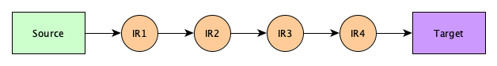
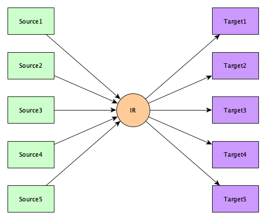
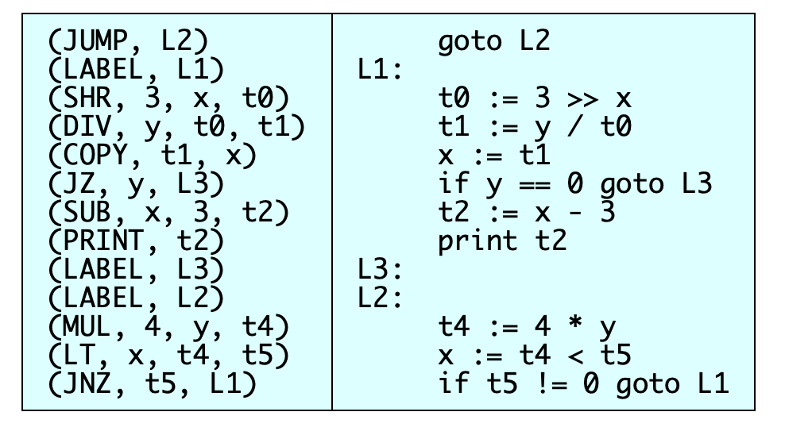
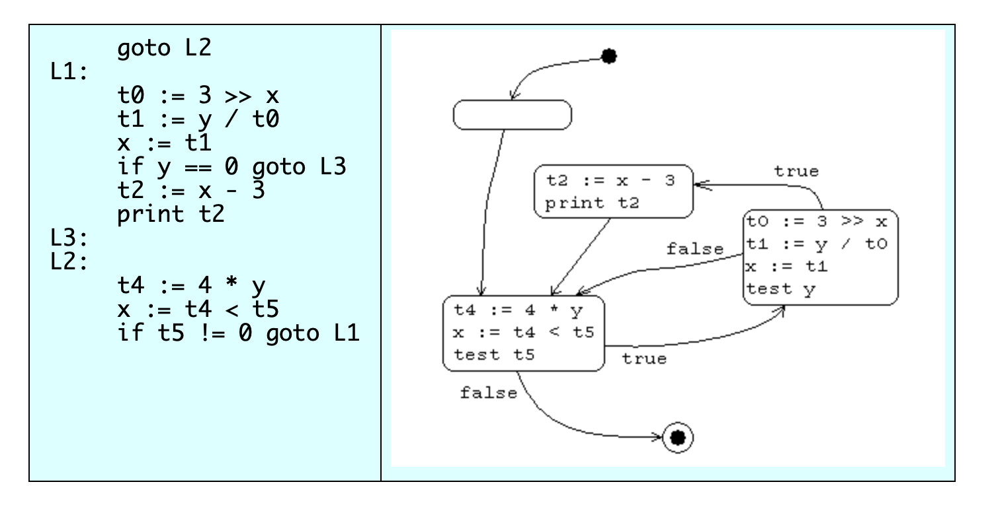

# Intermediate Representations

来源：https://cs.lmu.edu/~ray/notes/ir/

*You can’t really write a translator, or even an interpreter, for a complex language, without using an intermediate representation.*

## What is an IR?

An intermediate representation is any representation of a program “between” the source and target languages.

In a real compiler, you might see *several* intermediate representations!



Sometimes people have designed IRs to be fairly independent of the source and target languages, and yet very general, so that it can be used to build a whole family of compilers.



## Why use an IR?

We use intermediate representations for at least four reasons:

1. Because translation appears to *inherently* require analysis and synthesis. Word-for-word translation does not work.
2. To break the difficult problem of translation into two simpler, more manageable pieces.
3. To build retargetable compilers:
   - We can build new back ends for an existing front end (making the source language *more portable across machines)*.
   - We can build a new front-end for an existing back end (so a new machine can quickly get a set of compilers for different source languages).
   - We only have to write 2𝑛2n half-compilers instead of 𝑛(𝑛−1)n(n−1) full compilers. (Though this might be a bit of an exaggeration in practice!)
4. To perform *machine independent* optimizations.

## Types of Intermediate Representations

Intermediate representations come in many flavors:

- Structured (graph or tree-based), something like a AST decorated a bit, and maybe simplified or desugared a bit, perhaps slightly restructured to make certain control or data flows explicit and easier to manipulate
- Flat, tuple-based, generally *three-address code* (quadruples)
- Flat, stack-based

We’ll use a running example code fragment to illustrate various options.

```
while (x < 4 * y) {
    x = y / 3 >> x;
    if (y) print x - 3;
}
```

### Semantic Graph

Generally the “first” IR we make is just an abstract syntax tree, semantically analzyed and type checked and annotated and transformed into a graph. Generally this graph is still close enough to the source code so that the source program can be reconstructed.

Trivial example:


### Tuples

Tuples are stored as on the left column, but usually rendered as on the right.



### Stack Code

This is surprisingly common. Here’s how our running example might look:

```
    goto L2
L1:
    load y
    load_constant 3
    load x
    shr
    div
    store x
    load y
    jump_if_zero L3
    load x
    load_constant 3
    sub
    print
L3:
L2:
    load x
    load_constant 4
    load y
    mul
    less_than
    jump_if_not_zero L1
```

## Levels of Intermediate Representations

Generally we recognize three levels sophistication:

- High-level

  Looks a lot like the source language, with structured objects like arrays and structs.

- Medium-level

  There are no structured objects, but still target language independent

- Low-level

  Extremely close to target language

## Tuples

Here is a running C++ example to illustrate various tuple formulations:

```
double a[20][10];
.
.
.
for (int i = 0; i < n; i += di)
    a[i][j+2] = j;
```

### High-Level Tuples

Staying close to the source language, tuple operands can be huge structures and operations can be crazy powerful.

- Keeps structure of source language program explicit
- Source program can be reconstructed from it
- Operands are semantic objects, including arrays and structs
- No breaking down of array indexing computations
- No thought of registers
- No concern for runtime systems

Example:

```
(COPY, 0, i)                        i := 0
(LABEL, L1)                    L1:
(JGE, i, n, L2)                     if i >= n goto L2
(INDEX, a, i, t0)                   t0 := a[i]
(ADD, j, 2, t1)                     t1 := j + 2
(INDEX, t0, t1, t2)                 t2 := t0[t1]
(COPY_TO_DEREF, j, t2)              *t2 := j
(INCJUMP, i, di, L1)                i += di, goto L1
(LABEL, L2)                    L2:
```

### Medium-Level

Now we get break things down a little.

- Can be source or target oriented
- Language and machine independent
- Break down data structure references to deal only with simple ints and floats
- Great for architecture-independent optimizations

When constructing a medium level IR, the IR generator must be told about the sizes of source language datatypes. Assume for the following example that doubles require 8 bytes and ints require 4 bytes:

```
(COPY, 0, i)                        i := 0
(LABEL, L1)                    L1:
(JGE, i, n, L2)                     if i >= n goto L2
(MUL, i, 80, t0)                    t0 := i * 80
(ADD, a, t0, t1)                    t1 := a + t0
(ADD, j, 2, t2)                     t2 := j + 2
(MUL, t2, 8, t3)                    t3 := t2 * 8
(ADD, t1, t3, t4)                   t4 := t1 + t3
(COPY_TO_DEREF, j, t4)              *t4 := j
(ADD, i, di, i)                     i := i + di
(JUMP, L1)                          goto L1
(LABEL, L2)                    L2:
```

Some languages will require bounds checking on arrays and a different treatment of for-loops.

### Low-Level

Now we think about real machines.

- Extremely close to machine architecture
- Architecture dependent
- Deviates from target language only in its inclusion of pseudo-operations and symbolic (virtual) registers
- Intimiately concerned with run-time storage management issues like stack frames and paramater passing mechanisms
- For architecture dependent optimizations

Example time! Suppose in our example we know the target is a RISC processor with no memory operations. Variable 𝑗j can go in `r1` and 𝑛n in `r2` and 𝑑𝑖di in `r3`. They’re not changed in this loop, so we needn’t save them at the end. We might get something like:

```
(LDC, 0, r0)                        r0 := 0
(LOAD, j, r1)                       r1 := j
(LOAD, n, r2)                       r2 := n
(LOAD, di, r3)                      r3 := di
(LOAD, a, r4)                       r4 := a
(LABEL, L1)                    L1:
(JGE, r0, r2, L2)                   if r0 >= r2 goto L2
(MUL, r0, 80, r5)                   r5 := r0 * 80
(ADD, r4, r5, r6)                   r6 := r4 + r5
(ADD, r1, 2, r7)                    r7 := r1 + 2
(MUL, r7, 8, r8)                    r8 := r7 * 8
(ADD, r6, r8, r9)                   r9 := r6 + r8
(TOFLOAT, r1, f0)                   f0 := tofloat r1
(STOREIND, f0, r9)                  *r9 := f0
(ADD, r0, r3, r0)                   r0 := r0 + r3
(JUMP, L1)                          goto L1
(LABEL, L2)                    L2:
```

## Structures

Some structures generally associated with IRs include:

- CFG: control flow graph
- PDG: program dependence graph
- SSA: single static assignment

## Control Flow Graphs

### Definition

A **control flow graph** is a graph whose nodes are basic blocks and whose edges are transitions between blocks.

### Basic Blocks

A **basic block** is a:

- maximal-length sequence of instructions that will execute in its entirety
- maximal-length straight-line code block
- maximal-length code block with only one entry and one exit

... in the abscence of hardware faults, interrupts, crashes, threading problems, etc.

To locate basic blocks in flattened code:

- **Starts with**: (1) target of a branch (label) or (2) the instruction after a conditional branch
- **Ends with**: (1) a branch or (2) the instruction before the target of a branch.

### Example Control Flow Graph



## Single Static Assignment

No notes here yet, for now, see [Wikipedia](https://en.wikipedia.org/wiki/Static_single_assignment_form).

## Example IRs

Here are a few things that qualify as intermediate representations, or, at least, things a compiler front-end may output:

- [GNU RTL](http://gcc.gnu.org/onlinedocs/gccint/RTL.html)

  The intermediate language for the many source and target languages of the [GNU Compiler Collection](http://gcc.gnu.org/).

- Diana

  Descriptive Intermediate Attributed Notation for Ada. No longer used by major Ada compilers.

- [PCODE](http://en.wikipedia.org/wiki/P-Code_machine)

  The intermediate language of early Pascal compilers. Stack based. Responsible for wide adoption of Pascal in the 1970s.

- [Java Virtual Machine](https://en.wikipedia.org/wiki/Java_virtual_machine)

  Another virtual machine specification. Almost all Java compilers use this format. So do nearly all Scala, Ceylon, Kotlin, and Groovy compilers. Hundreds of other languages use it as well. JVM code can be interpreted, run on specialized hardware, or [jitted](http://en.wikipedia.org/wiki/Just-in-time).

- [Squid](https://cs.lmu.edu/~ray/notes/squid)

  One I made up myself.

- Rust Intermediate Languages

  The compiler Rustc transforms source first in to a [High-Level Intermediate Language (HIR)](https://rustc-dev-guide.rust-lang.org/hir.html), then into the Mid-Level Intermediate Language (MIR), then into LLVM. The MIR was introduced in [this blog post](https://blog.rust-lang.org/2016/04/19/MIR.html). You can read more in the [original request for it](https://github.com/rust-lang/rfcs/blob/master/text/1211-mir.md) and in the [Rustc book](https://rustc-dev-guide.rust-lang.org/mir/index.html).

- [CIL](http://en.wikipedia.org/wiki/Common_Intermediate_Language)

  Common Intermediate Language. Languages in Microsoft’s .NET framework (such as C+, VB.NET, etc.) compile to CIL, which is then assembled into bytecode.

- [C](https://en.wikipedia.org/wiki/C_(programming_language))

  Why not? It’s widely available and the whole back end is already done within the C compiler.

- [C--](https://en.wikipedia.org/wiki/C--)

  Kind of like using C, but C-- is designed explicitly to be an intermediate language, and even includes a run-time interface to make it easier to do garbage collection and exception handling. Seems to be defunct.

- [LLVM](http://llvm.org/)

  The new hotness. Much more than just a VM.

- SIL

  The Swift Intermediate Language. [Here is a nice presentation on SIL](http://llvm.org/devmtg/2015-10/slides/GroffLattner-SILHighLevelIR.pdf).

- [asm.js](http://asmjs.org/)

  A low-level subset of JavaScript.

- [Web Assembly](http://webassembly.org/)

  An efficient and fast stack-based virtual machine.

### A JVM Example

TODO

### An LLVM Example

TODO

### An SIL Example

TODO

### A Web Assembly Example

A C++ function:

```
unsigned gcd(unsigned x, unsigned y) {
  while (x > 0) {
    unsigned temp = x;
    x = y % x;
    y = temp;
  }
  return y;
}
```

Compiled to Web Assembly:

```
(module
  (type $type0 (func (param i32 i32) (result i32)))
  (table 0 anyfunc)
  (memory 1)
  (export "memory" memory)
  (export "_Z3gcdjj" $func0)
  (func $func0 (param $var0 i32) (param $var1 i32) (result i32)
    (local $var2 i32)
    block $label0
      get_local $var0
      i32.eqz
      br_if $label0
      loop $label1
        get_local $var1
        get_local $var0
        tee_local $var2
        i32.rem_u
        set_local $var0
        get_local $var2
        set_local $var1
        get_local $var0
        br_if $label1
      end $label1
      get_local $var2
      return
    end $label0
    get_local $var1
  )
)
```

## Case Study: An IR for C

Let’s design our own tuple-based IR for C. Why? C is such a simple language, an IR is fairly easy to design. Why is C so simple?

- Only base types are several varieties of ints and floats.
- No true arrays — `e1[e2]` just abbreviates `*(e1+e2)`; *all* indicies start at zero, there’s no bounds checking.
- All parameters passed by value, and in order.
- Block structure is very restricted: all functions on same level (no nesting); variables are either truly global or local to a top-level function; implementation drastically simplified because no static links are ever needed and functions can be easily passed as parameters without scoping trouble.
- Structure copy is bitwise.
- Arrays aren’t copied element by element: array assignment is just an assignment of the starting address.
- Language is small; nearly everything interesting (like I/O) is in a library. So we only need tuples for the core language.

Thus, the following tuples are sufficient:

```
  x ← y                               (COPY, y, x)
  x ← &y                              (COPY_FROM_REF, y, x)
  x ← *y                              (COPY_FROM_DEREF, y, x)
  *x ← y                              (COPY_TO_DEREF, y, x)
  x ← unaryop y                       (uop, y, x)
  x ← y binaryop z                    (binop, y, z, x)
  x ← y[i]                            (COPY_FROM_ARRAY_ELEM, y, i, x)
  x[i] ← y                            (COPY_TO_ARRAY_ELEM, y, x, i)
  goto L                              (JUMP, L)
  if x relop y goto L                 (Jop, x, y, L)
  param x                             (PARAM, x)
  call p, n                           (CALL, p, n)
```

where:

- `unaryop` is one of: +, -, !, ~, ...
- `binaryop` is one of: +, -, *, /, %, &, |, ^, **.**, &&, ||, ...
- `relop` is one of ==, !=, <, <=, >, >=
- `x[i]` means memory location x + i
- `call p,n` means call p with n bytes of arguments
