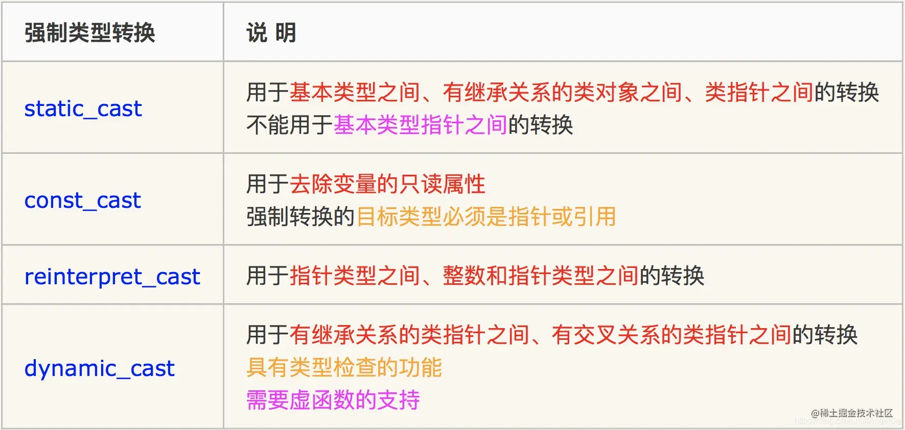

# C/C++：详解强制类型转换

来源：https://juejin.cn/post/7025799594030137357

参考：https://blog.csdn.net/komtao520/article/details/79025562

## C 强制转换

C语言中的强制转换主要用于普通数据类型、指针的强制转换，没有类型检查，转换不安全，语法为：

```c
(type-id)expression //转换格式1
type-id(expression) //转换格式2（基本已经不用了）
```

## C++ 强制转换

C++除了能使用c语言的强制类型转换外，还新增了四种强制类型转换：

- **static_cast**
- **dynamic_cast**
- **const_cast**
- **reinterpret_cast**

**主要运用于继承关系类间的强制转化**，语法为：

```cpp
//静态转换
static_cast<new_type>      (expression)
//动态转换
dynamic_cast<new_type>     (expression) 
//常量转换
const_cast<new_type>       (expression) 
//重新解释转换
reinterpret_cast<new_type> (expression)
```

其中new type为转换后的新类型，expression为旧类型

### static_cast 静态转换（编译时检查）

**用法：** `static_cast <类型说明符> （变量或表达式）`

static_cast静态转换相当于C语言中的强制转换，但不能实现普通指针数据（空指针除外）的强制转换，**一般用于父类和子类指针、引用间的相互转换。**

1. 用于类层次结构中基类（父类）和派生类（子类）之间 **指针** 或 **引用** 的转换。不管是否发生多态，父子之间互转时，编译器都不会报错。
   1. 进行 **上行转换** （把派生类的指针或引用转换成基类表示）是 **安全** 的；
   2. 进行 **下行转换** （把基类指针或引用转换成派生类表示）时，由于没有动态类型检查，所以是 **不安全** 的，但是编译器不会报错。
2. **用于基本数据类型之间的转换**，如把int转换成char，把int转换成enum。这种转换的安全性也要开发人员来保证。
3. **把空指针转换成目标类型的空指针。**
4. **把任何指针类型转换成空指针类型。**

注意：static_cast不能转换掉expression的const、volatile、或者__unaligned属性

如果涉及到类的话，**static_cast只能在有相互联系的类型中进行相互转换**,不一定包含虚函数。

---

在C++语言中static_cast用于数据类型的强制转换，强制将一种数据类型转换为另一种数据类型。例如将整型数据转换为浮点型数据。

[例1]C语言所采用的类型转换方式：

```c
#include <iostream>
using namespace std;

int main() {
	int a = 10;
	int b = 3;
	double result = (double)a / (double)b;

	cout << result << endl;	// 3.33333

	return 0;
}
```

例1中将整型变量a和b转换为双精度浮点型，然后相除。在C++语言中，我们可以采用static_cast关键字来进行强制类型转换，如下所示。

[例2]static_cast关键字的使用：

```cpp
#include <iostream>
using namespace std;

int main() {
	int a = 10;
	int b = 3;
	double result = static_cast<double> (a) / static_cast<double> (b);
	//其实写一个 static_cast<double> 就行
	
	cout << result << endl;	// 3.33333

	return 0;
}
```

在本例中同样是将整型变量a转换为双精度浮点型。采用static_cast进行强制数据类型转换时，将想要转换成的数据类型放到尖括号中，将待转换的变量或表达式放在元括号中。

### const_cast 常量转换

在C语言中，const限定符通常被用来限定变量，用于表示该变量的值不能被修改。

上边的 static_cast 不能将 const int* 转成 int*，const_cast 就可以，

**用法：** `const_cast<type-i> (expression)`

const_cast，用于修改类型的const或volatile属性，只能对是 **引用** 或者 **指针** 的变量添加或移除const。（除了const 或volatile修饰之外， type_id和expression的类型是一样的。）

const_cast则正是用于强制去掉这种不能被修改的常数特性，但需要特别注意的是const_cast不是用于去除变量的常量性，而是去除 **指向常数对象的指针或引用** 的常量性，其**去除常量性的对象必须为指针或引用**。

**常量指针被转化成非常量指针，并且仍然指向原来的对象；**

**常量引用被转换成非常量引用，并且仍然指向原来的对象；常量对象被转换成非常量对象。**

```cpp
int main()
{
    const int a = 10;
    const int* p = &a;
    int* q = const_cast<int*>(p);
    *q = 20;    //fine

    cout << "a=" << a << " " << "&a = " << &a << endl;
    cout << "*p=" << *p << " " << "p = " << p << endl;
    cout << "*q=" << *q << " " << "q = " << q << endl;

    return 0;
}

//a = 10 & a = 012FFC10
//* p = 20 p = 012FFC10
//* q = 20 q = 012FFC10
```

```cpp
int main() {
    int c = 11;
    const int a = c;
    const int* p = &a;
    int* q = const_cast<int*>(p);
    *q = 20;    //fine

    cout << "a=" << a << " " << "&a = " << &a << endl;
    cout << "*p=" << *p << " " << "p = " << p << endl;
    cout << "*q=" << *q << " " << "q = " << q << endl;

    return 0;
}

//a = 20 &a = 007BFD64
//* p = 20 p = 007BFD64
//* q = 20 q = 007BFD64
```

```cpp
int main() {
    const int c = 11;
    const int a = c;
    const int* p = &a;
    int* q = const_cast<int*>(p);
    *q = 20;    //fine

    cout << "a=" << a << " " << "&a = " << &a << endl;
    cout << "*p=" << *p << " " << "p = " << p << endl;
    cout << "*q=" << *q << " " << "q = " << q << endl;

    return 0;
}

//a = 11 & a = 00EFFB44
//* p = 20 p = 00EFFB44
//* q = 20 q = 00EFFB44
```

查看运行结果，问题来了，指针p和指针q都是指向a变量的，指向地址相同，而且经过调试发现012FFC10地址内的值确实由10被修改成了20，这是怎么一回事呢？为什么a的值打印出来还是10呢？

其实这是一件好事，我们要庆幸a变量最终的值没有变成20！变量a一开始就被声明为一个常量变量，不管后面的程序怎么处理，它就是一个常量，就是不会变化的。试想一下如果这个变量a最终变成了20会有什么后果呢？对于这些简短的程序而言，如果最后a变成了20，我们会一眼看出是q指针修改了，但是一旦一个项目工程非常庞大的时候，在程序某个地方出现了一个q这样的指针，它可以修改常量a，这是一件很可怕的事情的，可以说是一个程序的漏洞，毕竟将变量a声明为常量就是不希望修改它，如果后面能修改，这就太恐怖了。

我们称“*q=20”语句为未定义行为语句，所谓的未定义行为是指在标准的C++规范中并没有明确规定这种语句的具体行为，该语句的具体行为由编译器来自行决定如何处理。对于这种未定义行为的语句我们应该尽量予以避免！

### reinterpret_cast 重新解释转换

在C++语言中，reinterpret_cast 主要有三种强制转换用途：

1. **改变指针或引用的类型**
2. **将指针或引用转换为一个足够长度的整形**
3. **将整型转换为指针或引用类型**

**用法：** `reinterpret_cast<type_id> (expression)`

type-id必须是一个**指针、引用、算术类型、函数指针或者成员指针。**

它可以把一个指针转换成一个整数，也可以把一个整数转换成一个指针（先把一个指针转换成一个整数，在把该整数转换成原类型的指针，还可以得到原先的指针值）。

我们映射到的类型仅仅是为了故弄玄虚和其他目的，这是所有映射中最危险的。(这句话是C++编程思想中的原话)。因此, 你需要谨慎使用 reinterpret_cast。

```cpp
int *a = new int;
double *d = reinterpret_cast<double *>(a);
```

在上面代码中，将整型指针通过reinterpret_cast强制转换成了双精度浮点型指针。

reinterpret_cast可以将指针或引用转换为一个足够长度的整形，此中的足够长度具体长度需要多少则取决于操作系统，如果是32位的操作系统，就需要4个字节及以上的整型，如果是64位的操作系统则需要8个字节及以上的整型。

```cpp
typedef void (* FUNC)();
int DoSomething (int i)
{
    cout<< "DoSomething" <<endl;
	return 0; 
}

void Test () {
	// reinterpret_cast可以编译器以FUNC的定义方式去看待DoSomething函数
	// 所以非常的BUG，下面转换函数指针的代码是不可移植的，所以不建议这样用
	// C++不保证所有的函数指针都被一样的使用，所以这样用有时会产生不确定的结果 
	FUNC f = reinterpret_cast<FUNC>(DoSomething);
	f();
}
```

### dynamic_cast 动态转换（运行时检查）

**主要用于类层次结构中基类（父类）和派生类（子类）之间指针或引用的转换**（只能用于类间转换，支持类间交叉转换，不能操作普通数据。）

1. 在类的转换时，在类层次间进行上行转换时，dynamic_cast和static_cast的效果是一样的。在进行下行转换时，dynamic_cast具有类型检查的功能，比static_cast更安全。
   1. 向上转换，即为子类指针指向父类指针（一般不会出问题）；向下转换，即将父类指针转化子类指针。
   2. 向下转换的成功与否还与将要转换的类型有关，即要转换的指针指向的对象的实际类型与转换以后的对象类型一定要相同，否则转换失败。
   3. 在C++中，编译期的类型转换有可能会在运行时出现错误，特别是涉及到类对象的指针或引用操作时，更容易产生错误。Dynamic_cast操作符则可以在运行期对可能产生问题的类型转换进行测试。
2. 发生多态时，允许互相转换。
3. 无继承关系的类之间也可以相互转换，类之间的交叉转换。
4. 如果dynamic_cast语句的转换目标是**指针类型**并且失败了，则结果为0。如果转换目标是**引用类型**并且失败了，则dynamic_cast运算符将抛出一个std::bad_cast异常
5. 使用 dynamic_cast 进行转换的，**基类中一定要有虚函数**，否则编译不通过（类中存在虚函数，就说明它有想要让基类指针或引用指向派生类对象的情况，此时转换才有意义）。这是由于运行时类型检查需要**运行时类型信息**，而这个信息存储在类的**虚函数表中**，只有定义了虚函数的类才有虚函数表。

```cpp
class base {
public:
    void print1() { cout << "in class base" << endl; }
};

class derived : public base {
public:
    void print2() { cout << "in class derived" << endl; }
};

int main() {
    derived* p, * q;
    // p = new base;	//  Compilr Error: 无法从 "base * " 转换为 "derived * "

    // Compile Error: Cannot cast from 'base*' to 'derived*' via dynamic_cast: expression type is not polymorphic(多态的)
    // p = dynamic_cast<derived *>(new base);

    q = static_cast<derived*>(new base);	// ok, but not recommended(推荐)

    q->print1();	// in class base
    q->print2();	// in class derived
    
    return 0;
}
```

从上边的代码可以看出**用一个派生类的指针是不能直接指向一个基类的对象的**，会出现编译错误。用 dynamic_cast 的话也会编译错误，提示我们基类不是多态的，也就是基类中没有虚函数。可以看到 static_cast 是可以编译通过的，且输出结果看起来都是对的

static_cast 强制类型转换时并不具有保证类型安全的功能，而 C++ 提供的 dynamic_cast 却能解决这一问题，dynamic_cast 可以在程序运行时检测类型转换是否类型安全。当然 dynamic_cast 使用起来也是有条件的，它要求所转换的 expression 必须包含多态类类型（即至少包含一个虚函数的类）。

## 要点总结

**static_cast**：在功能上基本上与C风格的类型转换一样强大，含义也一样。它有功能上的限制。例如，你不能用static_cast像用C风格转换一样把struct转换成int类型或者把double类型转换成指针类型。另外，static_cast不能从表达式中去除const属性，因为另一个新的类型转换符const_cast有这样的功能。可以静态决议出类型的转换可能性，即使是在继承体系中，即使包括了多重继承和虚继承，只要可以进行静态决议就可以转换成功

**const_cast**：用于类型转换掉表达式的const或volatile属性。通过使用const_cast，你向人们和编译器强调你通过类型转换想做的只是改变一些东西的constness或者volatieness属性。这个含义被编译器所约束。如果你试图使用const_cast来完成修改constness或者volatileness属性之外的事情，你的类型转换将被拒绝。

**reinterpret_cast**：使用这个操作符的类型转换，其转换结果几乎都是执行期定义。因此，使用reinterpret_cast的代码很难移植。reinterpret_casts的最普通的用途就是在函数指针类型之间进行转换。

**dynamic_cast**：它被用于安全地沿着类的继承关系向下进行类型转换。这就是说，你能用dynamic_cast把指向基类的指针或引用转换成指向其派生类或其兄弟类的指针或引用，而且你能知道转换是否成功。失败的转换将返回空指针（当对指针进行类型转换时）或者抛出异常（当对引用进行类型转换时）。



**RTTI(Run-time Type identification)** ：

通过运行时类型信息程序能够使用 **基类的指针或引用** 来检查这些指针或引用所指的对象的实际派生类型。（运行时类型识别）

1. typeid操作符，返回指针和引用所指的实际类型：

可以判断变量的类型，可以判断两个变量的类型是否相同，可以打印变量的类型(name())

**比如：** `typeid(a).name()`就能知道变量a是什么类型

2. dynamic_cast操作符，将基类类型的指针或引用安全地转换为派生类型的指针或引用：

利用RTTI技术进行识别的父子类指针间转化。会阻止原生的父类指针转换为子类指针。阻止的方式是扔出一个bad_cast异常，且表达式的值变为NULL。