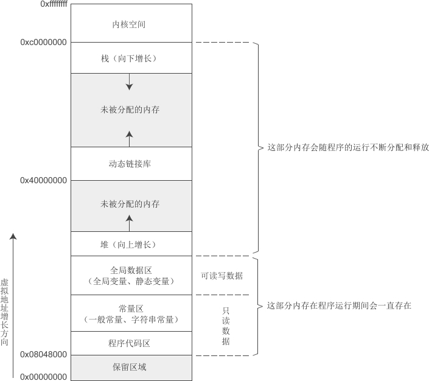

# 内存模型

**程序内存在地址空间中的分布情况称为内存模型（Memory Model）**

内存模型由操作系统构建，在Linux和Windows下有所差异，并且会受到编译模式的影响，本节为Linux下32位环境和64位环境的内存模型。

## 一、内核空间和用户空间

对于32位环境，理论上程序可以拥有 4GB 的虚拟地址空间，我们在C语言中使用到的变量、函数、字符串等都会对应内存中的一块区域。

在这 4GB 的地址空间中，**要拿出一部分给操作系统内核使用，应用程序无法直接访问这一段内存，这一部分内存地址被称为「内核空间」（Kernel Space）**。Windows 在默认情况下会将高地址的 2GB 空间分配给内核（也可以配置为1GB），而 Linux 默认情况下会将高地址的 1GB 空间分配给内核

也就是说，**应用程序只能使用剩下的 2GB 或 3GB 的地址空间，称为用户空间（User Space）**

## 二、Linux下32位环境的用户空间内存分布情况

我们暂时不关心内核空间的内存分布情况，下图是Linux下32位环境的一种经典内存模型：



| 内存分区                 | 说明                                                         |
| ------------------------ | ------------------------------------------------------------ |
| 程序代码区 (code)        | 存放函数体的二进制代码。一个C语言程序由多个函数构成，C语言程序的执行就是函数之间的相互调用。 |
| 常量区 (constant)        | 存放一般的常量、字符串常量等。这块内存只有读取权限，没有写入权限，因此它们的值在程序运行期间不能改变。 |
| 全局数据区 (global data) | 存放全局变量、静态变量等。这块内存有读写权限，因此它们的值在程序运行期间可以任意改变。 |
| 堆区 (heap)              | **一般由程序员分配和释放，**若程序员不释放，程序运行结束时由操作系统回收。[malloc()](http://c.biancheng.net/cpp/html/137.html)、[calloc()](http://c.biancheng.net/cpp/html/134.html)、[free()](http://c.biancheng.net/cpp/html/135.html) 等函数操作的就是这块内存，这也是本章要讲解的重点。  注意：这里所说的堆区与数据结构中的堆不是一个概念，**堆区的分配方式倒是类似于链表** |
| 动态链接库               | 用于在程序运行期间加载和卸载动态链接库。                     |
| 栈区 (stack)             | 存放函数的参数值、局部变量的值等，**其操作方式类似于数据结构中的栈。** |

在这些内存分区中（暂时不讨论动态链接库），**程序代码区用来保存指令，常量区、全局数据区、堆、栈都用来保存数据。**对内存的研究，重点是对数据分区的研究。

**「程序代码区、常量区、全局数据区」在程序加载到内存后就分配好了，并且在程序运行期间一直存在，不能销毁也不能增加（大小已被固定），只能等到程序运行结束后由操作系统收回，所以全局变量、字符串常量等在程序的任何地方都能访问，因为它们的内存一直都在。**

> 常量区和全局数据区有时也被合称为静态数据区，意思是这段内存专门用来保存数据，在程序运行期间一直存在。

**函数被调用时，会将参数、局部变量、返回地址等与函数相关的信息压入「栈」中，函数执行结束后，这些信息都将被销毁。所以局部变量、参数只在当前函数中有效，不能传递到函数外部，因为它们的内存不在了。**

**常量区、全局数据区、栈上的内存由系统自动分配和释放，不能由程序员控制。程序员唯一能控制的内存区域就是「堆」（Heap）：它是一块巨大的内存空间，常常占据整个虚拟空间的绝大部分，在这片空间中，程序可以申请一块内存，并自由地使用（放入任何数据）。堆内存在程序主动释放之前会一直存在，不随函数的结束而失效。在函数内部产生的数据只要放到堆中，就可以在函数外部使用。**

## 三、实例

```c
#include <stdio.h>
char *str1 = "c.biancheng.net";  //字符串在常量区，str1在全局数据区
int n;  //全局数据区
char* func(){
    char *str = "C语言中文网";  //字符串在常量区，str在栈区
    return str;
}
int main(){
    int a;  //栈区
    char *str2 = "01234";  //字符串在常量区，str2在栈区
    char  arr[20] = "56789";  //字符串和arr都在栈区
    char *pstr = func();  //栈区
    int b;  //栈区
    printf("str1: %#X\npstr: %#X\nstr2: %#X\n", str1, pstr, str2);
    puts("--------------");
    printf("&str1: %#X\n   &n: %#X\n", &str1, &n);
    puts("--------------");
    printf("  &a: %#X\n arr: %#X\n  &b: %#X\n", &a, arr, &b);
    puts("--------------");
    printf("n: %d\na :%d\nb: %d\n", n, a, b);
    puts("--------------");
    printf("%s\n", pstr);
    return 0;
}
```

运行结果：

```
str1: 0X400710
pstr: 0X400720
str2: 0X400731
--------------
&str1: 0X601040
   &n: 0X60104C
--------------
 &a: 0X19D0728C
arr: 0X19D07270
 &b: 0X19D0726C
--------------
n: 0
a: -858993460
b: -858993460
--------------
C语言中文网
```

 对代码的说明：
\1) 全局变量的内存在编译时就已经分配好了，它的默认初始值是 0（它所占用的每一个字节都是0值），局部变量的内存在函数调用时分配，它默认初始值是不确定的，由编译器决定，一般是垃圾值，这在《[用一个实例来深入剖析函数进栈出栈的过程](http://c.biancheng.net/view/vip_2103.html)》中会详细讲解。

\2) 函数 func() 中的局部字符串常量`"C语言中文网"`也被存储到常量区，不会随着 func() 的运行结束而销毁，所以最后依然能够输出。

\3) 字符数组 arr[20] 在栈区分配内存，字符串`"56789"`就保存在这块内存中，而不是在常量区，大家要注意区分。

## 四、Linux下64位环境的用户空间内存分布情况

在64位环境下，虚拟地址空间大小为 256TB，Linux 将高 128TB 的空间分配给内核使用，

而将低 128TB 的空间分配给用户程序使用。如下图所示：


《[虚拟地址空间以及编译模式](http://c.biancheng.net/view/vip_2092.html)》一节中讲到，在64位环境下，虚拟地址虽然占用64位，但只有最低48位有效。这里需要补充的一点是，任何虚拟地址的48位至63位必须与47位一致。

上图中，用户空间地址的47位是0，所以高16位也是0，换算成十六进制形式，最高的四个数都是0；内核空间地址的47位是1，所以高16位也是1，换算成十六进制形式，最高的四个数都是1。这样中间的一部分地址正好空出来，也就是图中的“未定义区域”，这部分内存无论如何也访问不到。