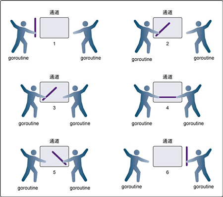

# go & chan

参考：[Go语言并发](http://c.biancheng.net/golang/concurrent/)

goroutine 是 Go语言中的轻量级线程实现，由 Go 运行时（runtime）管理。Go 程序会智能地将 goroutine 中的任务合理地分配给每个 CPU。

Go 程序从 main 包的 main() 函数开始，在程序启动时，Go 程序就会为 main() 函数创建一个默认的 goroutine。

## 一、协程 go

### 1、使用普通函数创建 goroutine

Go 程序中使用 **go** 关键字为一个函数创建一个 goroutine。一个函数可以被创建多个 goroutine，一个 goroutine 必定对应一个函数。

```go
go 函数名( 参数列表 )
```

使用 go 关键字创建 goroutine 时，被调用函数的返回值会被忽略。

如果需要在 goroutine 中返回数据，请使用后面介绍的通道（channel）特性，通过通道把数据从 goroutine 中作为返回值传出。

```go
package main

import (
	"fmt"
	"time"
)

func running() {
	var times int
	for { // 构建一个无限循环
		times++ // 延时1秒
		fmt.Println("tick", times)
		time.Sleep(time.Second)
	}
}
func main() {
	// 并发执行程序
	go running()
	// 接受命令行输入, 不做任何事情
	var input string
	fmt.Scanln(&input)
}
```

### 2、使用匿名函数创建goroutine

go 关键字后也可以为匿名函数或闭包启动 goroutine

使用匿名函数或闭包创建 goroutine 时，除了将函数定义部分写在 go 的后面之外，还需要加上匿名函数的调用参数，格式如下：

```go
go func( 参数列表 ){
    函数体
}( 调用参数列表 )
```

```go
package main

import (
	"fmt"
	"time"
)

func main() {
	go func() {
		var times int
		for {
			times++
			fmt.Println("tick", times)
			time.Sleep(time.Second)
		}
	}()
	var input string
	fmt.Scanln(&input)
}
```

### 3、GOMAXPROCS

在 Go语言程序运行时（runtime）实现了一个小型的任务调度器。这套调度器的工作原理类似于操作系统调度线程，Go 程序调度器可以高效地将 CPU 资源分配给每一个任务。传统逻辑中，开发者需要维护线程池中线程与 CPU 核心数量的对应关系。同样的，Go 地中也可以通过 runtime.GOMAXPROCS() 函数做到，格式为：

```go
runtime.GOMAXPROCS(逻辑CPU数量)
```

这里的逻辑CPU数量可以有如下几种数值：

- <1：不修改任何数值
- =1：单核心执行
- \>1：多核并发执行

一般情况下，可以使用 runtime.NumCPU() 查询 CPU 数量，并使用 runtime.GOMAXPROCS() 函数进行设置，例如：

```go
runtime.GOMAXPROCS(runtime.NumCPU())
```

GOMAXPROCS 同时也是一个环境变量，在应用程序启动前设置环境变量也可以起到相同的作用。

### 4、WaitGroup

用途：使用等待组进行多个任务的同步，等待组可以保证在并发环境中完成指定数量的任务

在 sync.WaitGroup（等待组）类型中，每个 sync.WaitGroup 值在内部维护着一个计数，此计数的初始默认值为零。

| 方法名                          | 功能                                  |
| ------------------------------- | ------------------------------------- |
| (wg * WaitGroup) Add(delta int) | 等待组的计数器 +1                     |
| (wg * WaitGroup) Done()         | 等待组的计数器 -1                     |
| (wg * WaitGroup) Wait()         | 当等待组计数器不等于 0 时阻塞直到变 0 |

对于一个可寻址的 sync.WaitGroup 值 wg：

- 我们可以使用方法调用 wg.Add(delta) 来改变值 wg 维护的计数。
- 方法调用 wg.Done() 和 wg.Add(-1) 是完全等价的。
- 如果一个 wg.Add(delta) 或者 wg.Done() 调用将 wg 维护的计数更改成一个负数，一个恐慌将产生。
- 当一个协程调用了 wg.Wait() 时，
  - 如果此时 wg 维护的计数为零，则此 wg.Wait() 此操作为一个空操作（noop）；
  - 否则（计数为一个正整数），此协程将进入阻塞状态。当以后其它某个协程将此计数更改至 0 时（一般通过调用 wg.Done()），此协程将重新进入运行状态（即 wg.Wait() 将返回）。

#### 1）示例

多个子task并发完成一部分任务，主task等待他们最后结束

下面的例子中 `wg.Add(2)` 等待协程数设定为 2，1 2 3 都会同时开始，但是直等到 1 2 结束，就继续 main 的逻辑了

```go
package main

import (
	"fmt"
	"sync"
	"time"
)

func main() {

	var wg sync.WaitGroup
	wg.Add(2)

	go func(n int) {
		fmt.Println("n:", n)
		t := time.Duration(n) * time.Second
		time.Sleep(t)
		fmt.Println("end n:", n)

		wg.Done()
	}(1)
	go func(n int) {
		fmt.Println("n:", n)
		t := time.Duration(n) * time.Second
		time.Sleep(t)
		fmt.Println("end n:", n)

		wg.Done()
	}(2)
	go func(n int) {
		fmt.Println("n:", n)
		t := time.Duration(n) * time.Second
		time.Sleep(t)
		fmt.Println("end n:", n)

		wg.Done()
	}(3)

	wg.Wait()

	fmt.Println("main exit...")
}

// n: 3
// n: 2
// n: 1
// end n: 1
// end n: 2
// main exit...
```

### 5、多核并行化

```go
package main

import (
	"fmt"
	"sync"
	"time"
)

func main() {
	var wg sync.WaitGroup
	// wg.Add(5) // 或者在一开始就设置为5

	for i := 0; i < 5; i++ {
		wg.Add(1) // 每一个任务开始时, 将等待组增加1
		go AsyncFunc(i, &wg)
	}

	wg.Wait()
	fmt.Println("over")
}

func AsyncFunc(index int, wg *sync.WaitGroup) {
	defer wg.Done() // 使用defer, 函数完成时将等待组值减1
	sum := 0
	for i := 0; i < 10; i++ {
		sum += 1
		fmt.Printf("协程%d, sum为:%d\n", index, sum)
		time.Sleep(1 * time.Second)
	}
	// wg.Done() // 在函数尾部，加上也行
}
```

## 二、通道 chan

如果说 goroutine 是 Go语言程序的并发体的话，那么 channels 就是它们之间的通信机制。一个 channels 是一个通信机制，它可以让一个 goroutine 通过它给另一个 goroutine 发送值信息。每个 channel 都有一个特殊的类型，也就是 channels 可发送数据的类型。一个可以发送 int 类型数据的 channel 一般写为 chan int。

Go语言提倡使用通信的方法代替共享内存，当一个资源需要在 goroutine 之间共享时，通道在 goroutine 之间架起了一个管道，并提供了确保同步交换数据的机制。声明通道时，需要指定将要被共享的数据的类型。可以通过通道共享内置类型、命名类型、结构类型和引用类型的值或者指针。

- Go语言中的通道（channel）是一种特殊的类型。在任何时候，同时只能有一个 goroutine 访问通道进行发送和获取数据。goroutine 间通过通道就可以通信。
- 通道像一个传送带或者队列，总是遵循先入先出（First In First Out）的规则，保证收发数据的顺序。

### 1、声明通道类型

通道本身需要一个类型进行修饰，就像切片类型需要标识元素类型。通道的元素类型就是在其内部传输的数据类型，声明如下：

```go
var 通道变量 chan 通道类型
```

- 通道类型：通道内的数据类型。
- 通道变量：保存通道的变量。

chan 类型的空值是 nil，声明后需要配合 make 后才能使用。

### 2、创建通道（常用）

通道是引用类型，需要使用 make 进行创建，格式如下：

```go
通道实例 := make(chan 数据类型)
```

- 数据类型：通道内传输的元素类型。
- 通道实例：通过make创建的通道句柄。

```go
ch1 := make(chan int)                 // 创建一个整型类型的通道
ch2 := make(chan interface{})         // 创建一个空接口类型的通道, 可以存放任意格式
type Equip struct{ /* 一些字段 */ }
ch2 := make(chan *Equip)             // 创建Equip指针类型的通道, 可以存放*Equip
```

### 3、使用通道发送数据

通道发送数据的格式

```go
通道变量 <- 值
```

- 通道变量：通过make创建好的通道实例。
- 值：可以是变量、常量、表达式或者函数返回值等。值的类型必须与ch通道的元素类型一致。

```go
// 创建一个空接口通道
ch := make(chan interface{})
// 将0放入通道中
ch <- 0
// 将hello字符串放入通道中
ch <- "hello"
```

把数据往通道中发送时，如果接收方一直都没有接收，那么发送操作将持续阻塞。Go 程序运行时能智能地发现一些永远无法发送成功的语句并做出提示

### 4、使用通道接收数据

通道接收同样使用`<-`操作符，通道接收有如下特性：

- **通道的收发操作在不同的两个 goroutine 间进行**，由于通道的数据在没有接收方处理时，数据发送方会持续阻塞，因此通道的接收必定在另外一个 goroutine 中进行
- **接收将持续阻塞直到发送方发送数据**，如果接收方接收时，通道中没有发送方发送数据，接收方也会发生阻塞，直到发送方发送数据为止。
- **每次接收一个元素**，通道一次只能接收一个数据元素。

通道的数据接收一共有以下 4 种写法：

#### 1）阻塞接收数据

阻塞模式接收数据时，将接收变量作为`<-`操作符的左值，格式如下：

```go
data := <-ch
```

执行该语句时将会阻塞，直到接收到数据并赋值给 data 变量。

#### 2）非阻塞接收数据

使用非阻塞方式从通道接收数据时，语句不会发生阻塞，格式如下：

```go
data, ok := <-ch
```

- data：表示接收到的数据。未接收到数据时，data 为通道类型的零值。
- ok：表示是否接收到数据。


非阻塞的通道接收方法可能造成高的 CPU 占用，因此使用非常少。如果需要实现接收超时检测，可以配合 select 和计时器 channel 进行，可以参见后面的内容。

#### 3）接收任意数据，忽略接收的数据

阻塞接收数据后，忽略从通道返回的数据，格式如下：

```go
<-ch
```

执行该语句时将会发生阻塞，直到接收到数据，但接收到的数据会被忽略。这个方式实际上只是通过通道在 goroutine 间阻塞收发实现并发同步。

```go
package main

import (
	"fmt"
)

func main() {

	ch := make(chan int) // 构建一个通道

	go func() { // 开启一个并发匿名函数
		fmt.Println("start goroutine")

		ch <- 0 // 通过通道通知main的goroutine
		fmt.Println("exit goroutine")
	}()

	fmt.Println("wait goroutine")
	<-ch // 等待匿名goroutine

	fmt.Println("all done")
}

// wait goroutine
// start goroutine
// exit goroutine
// all done
```

#### 4）循环接收

通道的数据接收可以借用 for range 语句进行多个元素的接收操作，格式如下：

```go
for data := range ch {
}
```

通道 ch 是可以进行遍历的，遍历的结果就是接收到的数据。数据类型就是通道的数据类型。通过 for 遍历获得的变量只有一个，即上面例子中的 data。

```go
package main

import (
	"fmt"
	"time"
)

func main() {

	ch := make(chan int) // 构建一个通道

	go func() { // 开启一个并发匿名函数
		for i := 3; i >= 0; i-- { // 从3循环到0
			ch <- i                 // 发送3到0之间的数值
			time.Sleep(time.Second) // 每次发送完时等待
		}
	}()

	for data := range ch { // 遍历接收通道数据
		fmt.Println(data) // 打印通道数据
		if data == 0 {    // 当遇到数据0时, 退出接收循环
			break
		}
	}
}

// 3
// 2
// 1
// 0
```

### 5、使用通道发送和接收

本例的[设计模式](http://c.biancheng.net/design_pattern/)就是典型的生产者和消费者。生产者是 main 中的循环，而消费者是 printer() 函数。整个例子使用了两个 goroutine，一个是 main()，一个是通过第 35 行 printer() 函数创建的 goroutine。两个 goroutine 通过 `c := make(chan int)` 创建的通道进行通信。这个通道有下面两重功能。

- 数据传送：`c <- i` 发送数据和 `data := <-c` 接收数据。
- 控制指令：类似于信号量的功能。同步 goroutine 的操作。功能简单描述为：
  - `c <- 0`：“没数据啦！”
  - `c <- 0`：“我搞定了！”
  - `<-c`：“搞定喊我！”

```go
package main

import (
	"fmt"
	"time"
)

func printer(c chan int) {
	for { // 开始无限循环等待数据
		data := <-c    // 从channel中获取一个数据
		if data == 0 { // 将0视为数据结束
			break
		}
		fmt.Println(data) // 打印数据
	}
	c <- 0 // 通知main已经结束循环(我搞定了!)
}

func main() {

	c := make(chan int) // 创建一个channel

	go printer(c) // 并发执行printer, 传入channel

	for i := 1; i <= 10; i++ {
		c <- i                  // 将数据通过channel投送给printer
		time.Sleep(time.Second) // 每次发送完时等待
	}

	c <- 0 // 通知并发的printer结束循环(没数据啦!)
	<-c    // 等待printer结束(搞定喊我!)
}
```

### 6、单向通道

Go语言的类型系统提供了单方向的 channel 类型，顾名思义，单向 channel 就是只能用于写入或者只能用于读取数据。

假如一个 channel 真的只能读取数据，那么它肯定只会是空的，因为你没机会往里面写数据。同理，如果一个 channel 只允许写入数据，即使写进去了，也没有丝毫意义，因为没有办法读取到里面的数据。所谓的单向 channel 概念，其实只是对 channel 的一种使用限制。

只能写入数据的通道类型为`chan<-`，只能读取数据的通道类型为`<-chan`，

```co
package main

func main() {

	ch := make(chan int)

	var chSendOnly chan<- int = ch // 声明一个只能写入数据的通道类型, 并赋值为ch
	var chRecvOnly <-chan int = ch // 声明一个只能读取数据的通道类型, 并赋值为ch
}
```

#### 1）只读、只写通道

本质上还是用的同一个 channel，但是将这个 channel 在使用时设定为只读或只写

```go
package main

import "fmt"

func setch(writech chan<- int) {
	for i := 0; i < 5; i++ {
		writech <- i
	}
}
func getch(readch <-chan int) {
	for i := 0; i < 5; i++ {
		fmt.Printf("get: %v\n", <-readch)
	}
}

func main() {

	ch := make(chan int)
	var writech chan<- int = ch
	var readch <-chan int = ch

	go setch(writech)
	getch(readch)
}
```

#### 2）time 包中的单向通道

time包中的单向通道，time 包中的计时器会返回一个 timer 实例，代码如下：

```go
timer := time.NewTimer(time.Second)
```

timer的Timer类型定义如下：

```go
type Timer struct {
    C <-chan Time
    r runtimeTimer
}
```

第 2 行中 C 通道的类型就是一种只能读取的单向通道。如果此处不进行通道方向约束，一旦外部向通道写入数据，将会造成其他使用到计时器的地方逻辑产生混乱。

**因此，单向通道有利于代码接口的严谨性**

### 7、关闭通道

直接使用Go语言内置的 close() 函数即可：

```go
close(ch)
```

如何判断一个 channel 是否已经被关闭？在读取的时候使用多重返回值的方式，看第二个 bool 返回值即可，如果返回值是 false 则表示 ch 已经被关闭。

```go
x, ok := <-ch
```

例子：

```go
package main

import "fmt"

func main() {

	c1 := make(chan int, 5)

	var readc <-chan int = c1
	var wirtec chan<- int = c1

	wirtec <- 1
	wirtec <- 2
	wirtec <- 3
	close(c1) // 关闭 channel 不让往channel里存，但是可以取
	// wirtec <- 4 会报错
	for v := range readc { // 循环取前面必须要加 close()
		fmt.Println(v)
	}
}
```

### 8、无缓冲通道

无缓冲的通道（unbuffered channel）是指在接收前**没有能力保存任何值的通道**。这种类型的通道要求发送 goroutine 和接收 goroutine **同时准备好，才能完成发送和接收操作**。

如果两个 goroutine 没有同时准备好，通道会导致先执行发送或接收操作的 goroutine 阻塞等待。这种对通道进行发送和接收的交互行为本身就是同步的。其中任意一个操作都无法离开另一个操作单独存在。

- 阻塞指的是由于某种原因数据没有到达，当前协程（线程）持续处于等待状态，直到条件满足才解除阻塞。
- 同步指的是在两个或多个协程（线程）之间，保持数据内容一致性的机制。



在第 1 步，两个 goroutine 都到达通道，但哪个都没有开始执行发送或者接收。

在第 2 步，左侧的 goroutine 将它的手伸进了通道，这模拟了向通道发送数据的行为。这时，这个 goroutine 会在通道中被锁住，直到交换完成。

在第 3 步，右侧的 goroutine 将它的手放入通道，这模拟了从通道里接收数据。这个 goroutine 一样也会在通道中被锁住，直到交换完成。

在第 4 步和第 5 步，进行交换

最终在第 6 步，两个 goroutine 都将它们的手从通道里拿出来，这模拟了被锁住的 goroutine 得到释放。两个 goroutine 现在都可以去做别的事情了。

#### 1）示例1：两个人打网球

在网球比赛中，两位选手会把球在两个人之间来回传递。选手总是处在以下两种状态之一，要么在等待接球，要么将球打向对方。可以使用两个 goroutine 来模拟网球比赛，并使用无缓冲的通道来模拟球的来回

```go
package main

import (
	"fmt"
	"math/rand"
	"sync"
	"time"
)

var wg sync.WaitGroup // wg 用来等待程序结束

func init() {
	rand.Seed(time.Now().UnixNano())
}

func main() { // main 是所有Go 程序的入口

	court := make(chan int) // 创建一个无缓冲的通道

	wg.Add(2) // 计数加 2，表示要等待两个goroutine
	// 启动两个选手
	go player("Nadal", court)
	go player("Djokovic", court)

	court <- 1 // 发球
	wg.Wait() // 等待游戏结束
}

// player 模拟一个选手在打网球
func player(name string, court chan int) {

	defer wg.Done() // 在函数退出时调用Done 来通知main 函数工作已经完成
	for {
		ball, ok := <-court // 等待球被击打过来
		if !ok {            // 如果通道被关闭，我们就赢了
			fmt.Printf("Player %s Won\n", name)
			return
		}

		n := rand.Intn(100) // 选随机数，然后用这个数来判断我们是否丢球
		if n%13 == 0 {
			fmt.Printf("Player %s Missed\n", name)

			close(court) // 关闭通道，表示我们输了
			return
		}

		fmt.Printf("Player %s Hit %d\n", name, ball) // 显示击球数
		ball++                                       // 将击球数加1
		court <- ball                                // 将球打向对手
	}
}
```

#### 2）示例2：接力棒

用不同的模式，使用无缓冲的通道，在 goroutine 之间同步数据，来模拟接力比赛。在接力比赛里，4 个跑步者围绕赛道轮流跑。第二个、第三个和第四个跑步者要接到前一位跑步者的接力棒后才能起跑。比赛中最重要的部分是要传递接力棒，要求同步传递。**在同步接力棒的时候，参与接力的两个跑步者必须在同一时刻准备好交接**。

```go
package main

import (
	"fmt"
	"sync"
	"time"
)

var wg sync.WaitGroup // wg 用来等待程序结束

func main() { // main 是所有Go 程序的入口

	baton := make(chan int) // 创建一个无缓冲的通道
	wg.Add(1)               // 为最后一位跑步者将计数加1

	go Runner(baton) // 第一位跑步者持有接力棒

	baton <- 1 // 开始比赛
	wg.Wait()  // 等待比赛结束
}

func Runner(baton chan int) { // Runner 模拟接力比赛中的一位跑步者
	var newRunner int

	runner := <-baton // 等待接力棒

	fmt.Printf("Runner %d Running With Baton\n", runner) // 开始绕着跑道跑步

	if runner != 4 { // 创建下一位跑步者
		newRunner = runner + 1
		fmt.Printf("Runner %d To The Line\n", newRunner)
		go Runner(baton)
	}

	time.Sleep(1 * time.Second) // 围绕跑道跑

	if runner == 4 { // 比赛结束了吗？
		fmt.Printf("Runner %d Finished, Race Over\n", runner)
		wg.Done()
		return
	}

	fmt.Printf("Runner %d Exchange With Runner %d\n",
		runner,
		newRunner)
	baton <- newRunner // 将接力棒交给下一位跑步者
}
```

### 9、缓冲通道

有缓冲的通道（buffered channel）是一种在被接收前能存储一个或者多个值的通道。这种类型的通道并不强制要求 goroutine 之间必须同时完成发送和接收。在无缓冲通道的基础上，**为通道增加一个有限大小的存储空间形成带缓冲通道**

缓冲通道在发送时

- 无需等待接收方接收即可完成发送过程，且不会发生阻塞
- 只有当存储空间满时才会发生阻塞

缓冲通道在接收时

- 如果缓冲通道中有数据，接收时将不会发生阻塞
- 直到通道中没有数据可读时，通道将会再度阻塞

无缓冲通道和缓冲通道不同：

- 无缓冲的通道保证进行发送和接收的 goroutine 会在同一时间进行数据交换
- 有缓冲的通道没有这种保证

创建带缓冲的通道

```go
通道实例 := make(chan 通道类型, 缓冲大小)
```

```go
package main

import "fmt"

func main() {

	ch := make(chan int, 3) // 创建一个3个元素缓冲大小的整型通道

	fmt.Println(len(ch)) // 查看当前通道的大小
	// 发送3个整型元素到通道
	ch <- 1
	ch <- 2
	ch <- 3

	fmt.Println(len(ch)) // 查看当前通道的大小
}
```

### 10、通道内顺序

无缓冲区 `c1 := make(chan int)` 执行顺序：先取发现没有，然后存，再取，往复

有缓冲区执行顺序 顺序的，现存先取，例如缓冲区只有5个，先是放到c1里面5个，然后取出一个，发现有空余1个容量了又放入一个，再取出一个，往复

```go
package main

import (
	"fmt"
)

func main() {

	c1 := make(chan int, 5)
	go func() {
		for i := 0; i < 10; i++ {
			c1 <- i
		}

	}()

	for i := 0; i < 10; i++ {
		fmt.Println(<-c1)
	}
}
// 0 1 2 3 4 5 6 7 8 9 
```

### 11、与 select case 结合使用

与 switch 语句相比，select 有比较多的限制，其中最大的一条限制就是每个 case 语句里必须是一个 IO 操作

```go
select {
    case <-chan1:
    // 如果chan1成功读到数据，则进行该case处理语句
    case chan2 <- 1:
    // 如果成功向chan2写入数据，则进行该case处理语句
    default:
    // 如果上面都没有成功，则进入default处理流程
}
```

在一个 select 语句中，Go语言会按顺序从头至尾评估每一个发送和接收的语句。

如果其中的任意一语句可以继续执行（即没有被阻塞），那么就从那些可以执行的语句中任意选择一条来使用。

如果没有任意一条语句可以执行（即所有的通道都被阻塞），那么有如下两种可能的情况：

- 如果给出了 default 语句，那么就会执行 default 语句，同时程序的执行会从 select 语句后的语句中恢复；
- 如果没有 default 语句，那么 select 语句将被阻塞，直到至少有一个通信可以进行下去。

```go
package main

import "fmt"

func main() {

	c1 := make(chan int, 1)
	c2 := make(chan int, 1)
	c3 := make(chan int, 1)

	c2 <- 1
	c3 <- 2
	// c1 取不到也不会报错
	// c2 c3 随机去取，
	select {
	case <-c1:
		fmt.Println("c1")
	case <-c2:
		fmt.Println("c2")
	case <-c3:
		fmt.Println("c3")
	default:
		fmt.Println("nono")
	}
}
```

#### 1）实现通道超时机制 

Go语言没有提供直接的超时处理机制，可以使用 select 来设置超时。

```go
package main

import (
	"fmt"
	"time"
)

func main() {
	ch := make(chan int)
	quit := make(chan bool)

	go func() { //新开一个协程
		for {
			select {
			case num := <-ch:
				fmt.Println("num = ", num)
			case <-time.After(3 * time.Second): // 到了duration时间后，自动塞一个当前时间进去
				fmt.Println("超时")
				quit <- true
			}
		}
	}() //别忘了()
	for i := 0; i < 5; i++ {
		ch <- i
		time.Sleep(time.Second)
	}
	<-quit
	fmt.Println("程序结束")
}
```