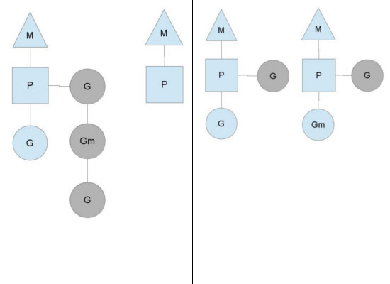

# Go runtime的调度器

来源：[Golang 的 goroutine 是如何实现的？](https://www.zhihu.com/question/20862617)

## 一、为什么需要 scheduler

在了解Go的运行时的scheduler之前，需要先了解为什么需要它，因为我们可能会想，OS内核不是已经有一个线程scheduler了嘛？

熟悉POSIX API的人都知道，POSIX的方案在很大程度上是对Unix process进场模型的一个逻辑描述和扩展，两者有很多相似的地方。 Thread有自己的[信号掩码](https://www.zhihu.com/search?q=信号掩码&search_source=Entity&hybrid_search_source=Entity&hybrid_search_extra={"sourceType"%3A"answer"%2C"sourceId"%3A27964865})，CPU affinity等。但是很多特征对于Go程序来说都是累赘。 尤其是context上下文切换的耗时。另一个原因是Go的垃圾回收需要所有的goroutine停止，使得内存在一个一致的状态。垃圾回收的时间点是不确定的，如果依靠OS自身的scheduler来调度，那么会有大量的线程需要停止工作。 

单独的开发一个Go的调度器，可以是其知道在什么时候内存状态是一致的，也就是说，当开始垃圾回收时，运行时只需要为当时正在CPU核上运行的那个线程等待即可，而不是等待所有的线程。

用户空间线程和[内核空间线程](https://www.zhihu.com/search?q=内核空间线程&search_source=Entity&hybrid_search_source=Entity&hybrid_search_extra={"sourceType"%3A"answer"%2C"sourceId"%3A27964865})之间的映射关系有：N:1,1:1和M:N

- N:1：多个（N）用户线程始终在一个内核线程上跑，context上下文切换确实很快，但是无法真正的利用多核
- 1：1：一个用户线程就只在一个内核线程上跑，这时可以利用多核，但是上下文switch很慢。
- M:N：多个goroutine在多个内核线程上跑，这个看似可以集齐上面两者的优势，但是无疑增加了调度的难度。

## 二、调度器结构

Go语言是原生支持语言级并发的，这个并发的最小逻辑单元就是goroutine。goroutine就是Go语言提供的一种[用户态线程](https://www.zhihu.com/search?q=用户态线程&search_source=Entity&hybrid_search_source=Entity&hybrid_search_extra={"sourceType"%3A"answer"%2C"sourceId"%3A131341519})，当然这种用户态线程是跑在[内核级线程](https://www.zhihu.com/search?q=内核级线程&search_source=Entity&hybrid_search_source=Entity&hybrid_search_extra={"sourceType"%3A"answer"%2C"sourceId"%3A131341519})之上的。当我们创建了很多的goroutine，并且它们都是跑在同一个[内核线程](https://www.zhihu.com/search?q=内核线程&search_source=Entity&hybrid_search_source=Entity&hybrid_search_extra={"sourceType"%3A"answer"%2C"sourceId"%3A131341519})之上的时候，就需要一个调度器来维护这些goroutine，确保所有的goroutine都使用cpu，并且是尽可能公平的使用cpu资源。

这个调度器的原理以及实现值得我们去深入研究一下。支撑整个调度器的主要有4个重要结构，分别是M、G、P、Sched，前三个定义在runtime.h中，Sched定义在proc.c中。

- Sched结构就是调度器，它维护有存储M和G的队列以及调度器的一些状态信息等。
- M代表内核级线程，一个M就是一个线程，代表真正的内核[OS线程](https://www.zhihu.com/search?q=OS线程&search_source=Entity&hybrid_search_source=Entity&hybrid_search_extra={"sourceType"%3A"answer"%2C"sourceId"%3A27964865})，goroutine就是跑在M之上的；M是一个很大的结构，里面维护小对象内存cache（mcache）、当前执行的goroutine、[随机数发生器](https://www.zhihu.com/search?q=随机数发生器&search_source=Entity&hybrid_search_source=Entity&hybrid_search_extra={"sourceType"%3A"answer"%2C"sourceId"%3A131341519})等等非常多的信息。
- P全称是Processor，处理器，它的主要用途就是用来执行goroutine的，所以它也维护了一个[goroutine队列](https://www.zhihu.com/search?q=goroutine队列&search_source=Entity&hybrid_search_source=Entity&hybrid_search_extra={"sourceType"%3A"answer"%2C"sourceId"%3A131341519})，里面存储了所有需要它来执行的goroutine。代表调度的上下文，可以把它看做一个局部的调度器，使go代码在一个线程上跑，它是实现从N:1到N:M映射的关键
- G：代表一个goroutine，它有自己的栈，instruction pointer和其他信息（正在等待的channel等等），用于调度。是goroutine实现的核心结构了，G维护了goroutine需要的栈、[程序计数器](https://www.zhihu.com/search?q=程序计数器&search_source=Entity&hybrid_search_source=Entity&hybrid_search_extra={"sourceType"%3A"answer"%2C"sourceId"%3A131341519})以及它所在的M等信息。

### 三、如何调度的

图中看，有2个物理线程M，每一个M都拥有一个context（P），每一个也都有一个正在运行的goroutine。
P的数量可以通过GOMAXPROCS()来设置，它其实也就代表了真正的并发度，即有多少个goroutine可以同时运行。
图中灰色的那些goroutine并没有运行，而是出于ready的就绪态，正在等待被调度。P维护着这个队列（称之为runqueue），
Go语言里，启动一个goroutine很容易：go function 就行，所以每有一个go语句被执行，[runqueue队列](https://www.zhihu.com/search?q=runqueue队列&search_source=Entity&hybrid_search_source=Entity&hybrid_search_extra={"sourceType"%3A"answer"%2C"sourceId"%3A27964865})就在其末尾加入一个
goroutine，在下一个调度点，就从runqueue中取出（如何决定取哪个goroutine？）一个goroutine执行。

为何要维护多个上下文P？因为当一个OS线程被阻塞时，P可以转而投奔另一个OS线程！

图中看到，当一个OS线程M0陷入阻塞时，P转而在OS线程M1上运行。调度器保证有足够的线程来运行所以的context P。

图中的M1可能是被创建，或者从[线程缓存](https://www.zhihu.com/search?q=线程缓存&search_source=Entity&hybrid_search_source=Entity&hybrid_search_extra={"sourceType"%3A"answer"%2C"sourceId"%3A27964865})中取出。

当MO返回时，它必须尝试取得一个context P来运行goroutine，一般情况下，它会从其他的OS线程那里steal偷一个context过来，

如果没有偷到的话，它就把goroutine放在一个global runqueue里，然后自己就去睡大觉了（放入线程缓存里）。Contexts们也会周期性的检查[global runqueue](https://www.zhihu.com/search?q=global+runqueue&search_source=Entity&hybrid_search_source=Entity&hybrid_search_extra={"sourceType"%3A"answer"%2C"sourceId"%3A27964865})，否则global runqueue上的goroutine永远无法执行。

另一种情况是P所分配的任务G很快就执行完了（分配不均），这就导致了一个上下文P闲着没事儿干而系统却任然忙碌。但是如果global runqueue没有任务G了，那么P就不得不从其他的上下文P那里拿一些G来执行。一般来说，如果上下文P从其他的上下文P那里要偷一个任务的话，一般就‘偷’run queue的一半，这就确保了每个OS线程都能充分的使用。

