# Golang GC

参考一：[Go GC](https://blog.csdn.net/weixin_40242845/article/details/114744783)

参考二：[[典藏版]Golang三色标记、混合写屏障GC模式图文全分析](https://www.jianshu.com/p/4c5a303af470)

参考三：[【重要】Go GC 20 问](https://mp.weixin.qq.com/s/o2oMMh0PF5ZSoYD0XOBY2Q)

参考四：[GoGC整理](https://www.jianshu.com/p/4a972dc959ca)

## 一、Garbage Collection

GC，全称 GarbageCollection，即垃圾回收，是一种自动内存管理的机制。

**当程序向操作系统申请的内存不再需要时，垃圾回收主动将其回收并供其他代码进行内存申请时候复用，或者将其归还给操作系统，这种针对内存级别资源的自动回收过程，即为垃圾回收**。而负责垃圾回收的程序组件，即为垃圾回收器。

垃圾回收其实一个完美的 “Simplicity is Complicated” 的例子。一方面，程序员受益于 GC，无需操心、也不再需要对内存进行手动的申请和释放操作，GC 在程序运行时自动释放残留的内存。另一方面，GC 对程序员几乎不可见，仅在程序需要进行特殊优化时，通过提供可调控的 API，对 GC 的运行时机、运行开销进行把控的时候才得以现身。

通常，垃圾回收器的执行过程被划分为两个半独立的组件：

- 赋值器（Mutator）：这一名称本质上是在指代用户态的代码。因为对垃圾回收器而言，用户态的代码仅仅只是在修改对象之间的引用关系，也就是在对象图（对象之间引用关系的一个有向图）上进行操作。
- 回收器（Collector）：负责执行垃圾回收的代码。

从原理上而言，所有的语言都能够自行实现 GC。从语言诞生之初就提供 GC 的语言，例如：Python、JavaScript、Java、Objective-C、Swift

而不以 GC 为目标，被直接设计为手动管理内存、但可以自行实现 GC 的语言有：C、C++

也有一些语言可以在编译期，依靠编译器插入清理代码的方式，实现精准的清理，例如：Rust

**GC 的优势**：垃圾回收使程序员无需手动处理内存释放，从而能够消除一些需要手动管理内存才会出现的运行时错误：

- 在仍然有指向内存区块的指针的情况下释放这块内存时，会产生悬挂指针，从而后续可能错误的访问已经用于他用的内存区域。
- 多重释放同一块申请的内存区域可能导致不可知的内存损坏。

当然，垃圾回收也会伴随一些缺陷，这也就造就了**没有 GC 的一些优势**：

- 没有额外的性能开销
- 精准的手动内存管理，极致的利用机器的性能

### 1、垃圾回收器组件

垃圾回收器分为两个半独立的组件

- 赋值器 Mutator：对用户态对象图进行操作(上色)
- 回收器 Collector：负责执行垃圾回收(回收)

用户程序Mutator通过内存分配器Allocator在堆Heap上申请内存，垃圾回收器Collector会定时清理堆上的内存。

### 2、垃圾回收器的目标

- 无内存泄漏：垃圾回收器最基本的目标就是减少防止程序员未及时释放导致的内存泄漏，垃圾回收器会识别并清理内存中的垃圾
- 自动回收无用内存：垃圾回收器作为独立的子任务，不需要程序员显式调用即可自动清理内存垃圾
- 内存整理：如果只是简单回收无用内存，那么堆上的内存空间会存在较多碎片而无法满足分配较大对象的需求，因此垃圾回收器需要重整内存空间，提高内存利用率

### 3、根对象

根对象在垃圾回收的术语中又叫做根集合，它是垃圾回收器在标记过程时最先检查的对象，包括：

1. 全局变量：程序在编译期就能确定的那些存在于程序整个生命周期的变量。
2. 执行栈：每个 goroutine 都包含自己的执行栈，这些执行栈上包含栈上的变量及指向分配的堆内存区块的指针。
3. 寄存器：寄存器的值可能表示一个指针，参与计算的这些指针可能指向某些赋值器分配的堆内存区块。

### 4、常见的GC问题

1. 对停顿敏感，GC导致用户只需代码滞后
2. 对资源消耗敏感，频繁分配内存应用，导致频繁垃圾回收，影响用户代码CPU利用

#### 解决示例

1. 合理化内存分配的速度、提高赋值器的 CPU 利用率，例如合理创建routine
2. 降低并复用已经申请的内存
3. 调整GOGC值：如果我们在遇到海量请求的时，为了避免 GC 频繁触发，可以通过将 GOGC 的值设置得更大，让 GC 触发的时间变得更晚，从而减少其触发频率

### 5、触发机制

- 主动触发：runtime GC，阻塞式等待当前GC调用完成
- 被动触发：
  - 系统监控，超过2分钟没有引用就强制GC
  - 步调(Pacing算法)，控制内存增长的比例

### 6、STW

`STW` 是 `StoptheWorld` 的缩写，即万物静止，是指在垃圾回收过程中为了保证实现的正确性、防止无止境的内存增长等问题而不可避免的需要停止赋值器进一步操作对象图的一段过程。

在这个过程中整个用户代码被停止或者放缓执行， `STW` 越长，对用户代码造成的影响（例如延迟）就越大，早期 Go 对垃圾回收器的实现中 `STW` 长达几百毫秒，对时间敏感的实时通信等应用程序会造成巨大的影响。我们来看一个例子：

```go
package main

import (
	"runtime"
	"time"
)

func main() {
	go func() {
		for {
		}
	}()

	time.Sleep(time.Millisecond)
	runtime.GC()
	println("OK")
}
```

上面的这个程序在 Go 1.14 以前永远都不会输出 `OK`，其罪魁祸首是 STW 无限制的被延长。

尽管 STW 如今已经优化到了半毫秒级别以下，但这个程序被卡死原因在于仍然是 STW 导致的。原因在于，GC 在进入 STW 时，需要等待让所有的用户态代码停止，但是 `for{}` 所在的 goroutine 永远都不会被中断，从而停留在 STW 阶段。实际实践中也是如此，当程序的某个 goroutine 长时间得不到停止，强行拖慢 STW，这种情况下造成的影响（卡死）是非常可怕的。好在自 Go 1.14 之后，这类 goroutine 能够被异步地抢占，从而使得 STW 的时间如同普通程序那样，不会超过半个毫秒，程序也不会因为仅仅等待一个 goroutine 的停止而停顿在 STW 阶段。


## 二、常见 GC 算法

常见GC分为两大类：

- 追踪法(tracing)：从根对象出发，根据对象之间的引用信息，扫描，直到确定要保留的对象，回收无引用对象。一般是GO，JAVA，V8等
- 引用计数法：每个对象自身包含一个计数器，当计数器归零的自动回收。一般是Python，object-C等

### 1、追踪法

#### 1）标记清扫

标记-清除算法将垃圾回收分为两个阶段：标记阶段和清除阶段。

一种可行的实现是，在标记阶段，首先通过根节点，标记所有从根节点开始的可达对象。因此，未被标记的对象就是未被引用的垃圾对象。然后，在清除阶段，清除所有未被标记的对象。**这也是GO的GC算法的基础**


优点：

- 以解决循环调用问题

缺点：

- 效率较慢，因为在标记和清除时都要遍历所有的对象，并且在每次GC开始的时候都要STW
- 因为内存分配时的碎片化，导致在回收之后也会有不同程度的碎片化，导致内存利用率不高

#### 2）标记压缩

它在标记-清除算法的基础上做了一些优化。和标记-清除算法一样，标记-压缩算法也首先需要从根节点开始，对所有可达对象做一次标记。但之后，它并不简单的清理未标记的对象，而是将所有的存活对象压缩到内存的一端。之后，清理边界外所有的空间。


优点：

- 标记-压缩算法适合用于存活对象较多的场合，如老年代
- 降低堆内存碎片化问题

缺点：

- 效率相较标记清扫更低了

#### 3）标记复制

将原有的内存空间分为两块，每次只使用其中一块，在垃圾回收时，将正在使用的内存中的存活对象复制到未使用的内存块中，之后，清除正在使用的内存块中的所有对象，交换两个内存的角色，完成垃圾回收。


优点：

- 与标记-清除算法相比，复制算法是一种相对高效的回收方法（默认应用于青年代）
- 效率较高

缺点：

- 浪费空间
- 对可达对象存活周期长的效率不高

#### 4）分代式

对于一个大型的系统，当创建的对象和方法变量比较多时，堆内存中的对象也会比较多，如果逐一分析对象是否该回收，那么势必造成效率低下。

分代收集算法是基于这样一个事实：不同的对象的生命周期(存活情况)是不一样的，而不同生命周期的对象位于堆中不同的区域，因此对堆内存不同区域采用不同的策略进行回收可以提高 JVM 的执行效率。当代商用虚拟机使用的都是分代收集算法：新生代对象存活率低，就采用复制算法；老年代存活率高，就用标记清除算法或者标记整理算法。Java堆内存一般可以分为新生代、老年代和永久代三个模块。

根据不同对象的存活周期分为不同的几块

- 老年代：标记清扫 或 标记整理
- 青年代：标记复制
  

### 2、引用计数法

**引用计数 Reference counting 会为每个对象维护一个计数器，当该对象被其他对象引用时加一，引用失效时减一，当引用次数归零后即可回收对象**。

使用这类GC方法的语言包括python、php、objective-C和C++标准库中的std::shared_ptr等。

以python为例，python中的每个对象都包含如下结构：

```
typedef struct_object {
    int ob_refcnt;
    struct_typeobject *ob_type;
}PyObject;
```

其中ob_refcnt为引用计数器，当一个对象有新的引用时计数器增一，当引用它的对象被删除时计数器减一。

引用计数法优点包括：

- 原理和实现都比较简单
- 回收的即时性：当对象的引用计数为0时立即回收，不像其他GC机制需要等待特定时机再回收，提高了内存的利用率
- 不需要暂停应用即可完成回收

缺点包括：

- 无法解决循环引用的回收问题：当ObjA引用了ObjB，ObjB也引用ObjA时，这两个对象的引用次数使用大于0，从而占用的内存无法被回收
- 时间和空间成本较高：一方面是因为每个对象需要额外的空间存储引用计数器变量，另一方面是在栈上的赋值时修改引用次数时间成本较高（原本只需要修改寄存器中的值，现在计数器需要不断更新因此不是只读的，需要额外的原子操作来保证线程安全）
- 引用计数是一种摊销算法，会将内存的回收分摊到整个程序的运行过程，但是当销毁一个很大的树形结构时无法保证响应时间

## 三、Go 的 GC 算法

**无分代、不整理、并发的三色标记法**

对象整理目的：

- 是解决内存碎片问题，但是Go给予tcmalloc分配算法，基本没有碎片问题。另外顺序内存分配器在多线程并不适用，整理内存队tcmalloc分配没有实质提升
- 分代GC目标主要是针对新创建对象，不会频繁检查所有对象。但是Go会通过逃逸分析将大部分“新生”对象存储在栈上，需要长期保存的对象存在于堆中。栈会被回收，不需要GC。**Go的GC更专注于如何让GC和用户代码并发执行**

```go
Go 1：串行三色标记清扫
Go 1.3：并行清扫，标记过程需要 STW，停顿时间在约几百毫秒
Go 1.5：并发标记清扫，停顿时间在一百毫秒以内
Go 1.6：使用 bitmap 来记录回收内存的位置，大幅优化垃圾回收器自身消耗的内存，停顿时间在十毫秒以内
Go 1.7：停顿时间控制在两毫秒以内
Go 1.8：混合写屏障，停顿时间在半个毫秒左右
Go 1.9：彻底移除了栈的重扫描过程
Go 1.12：整合了两个阶段的 Mark Termination，但引入了一个严重的 GC Bug 至今未修（见问题 20），尚无该 Bug 对 GC 性能影响的报告
Go 1.13：着手解决向操作系统归还内存的，提出了新的 Scavenger
Go 1.14：替代了仅存活了一个版本的 scavenger，全新的页分配器，优化分配内存过程的速率与现有的扩展性问题，并引入了异步抢占，解决了由于
```

### 1、Go 1.3 mark and sweep

mark and sweep分为2个步骤

- 暂停业务逻辑（需要STW，Stop The World），找到不可达对象并标记
- 回收标记好的对象

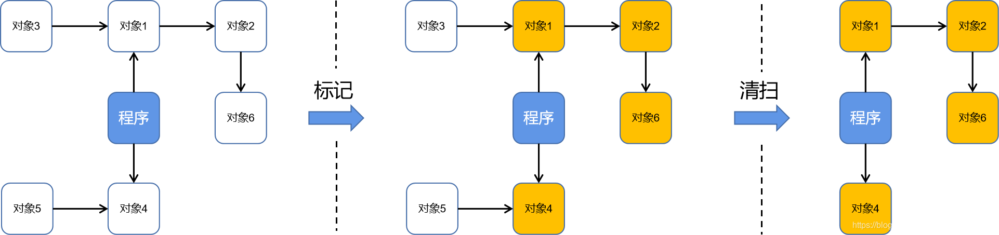


可以看到一次GC里面需要一次STW，在没有优化之前，STW的时间是比较久的。只有到清扫完成之后才停止STW，因此GO 1.3进行了一个优化，就是讲停止STW改到清扫之前。

### 2、Go 1.5 三色并发标记法

- 白色对象：程序生成的对象都是白色对象，GC结束后还是白色的会被回收
- 灰色对象：可达对象，在GC遍历时遍历到的对象，GC结束后不会回收，正常是变为黑色
- 黑色对象：保留对象，在灰色遍历完之后，或者无接下去可达对象的灰色对象，最后都变为灰色对象

#### 1）步骤

1. 将程序以根节点展开
2. 所有对象放入白色集合
3. 根节点开始遍历，遍历到的标为灰色
4. 遍历灰色，将遍历到的放入灰色，原本灰色的放入黑色
5. 重复上一步直到无灰色对象
6. 回收白色对象

#### 2）实现

基于标记清扫的例子，看一下三色并发标记法是如何实现的，**记住GC开始时还是需要STW**

步骤一：将程序以根节点展开

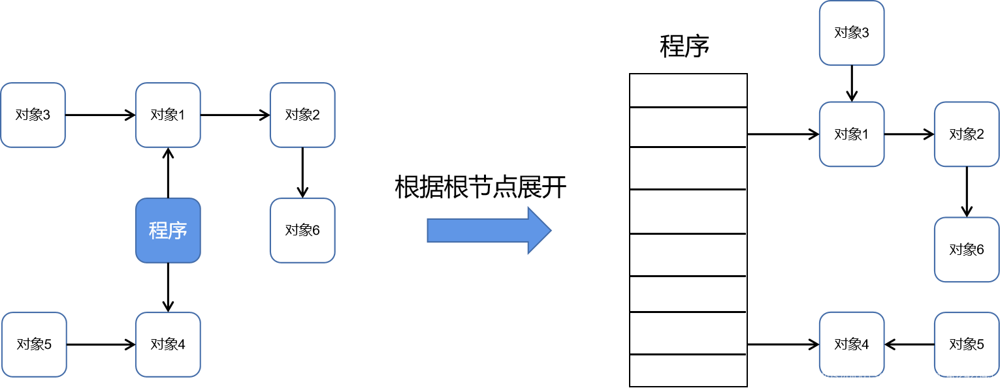

步骤二：我们会建立白色对象，灰色对象和黑色对象集合。首先的是将所有对象先放到白色对象。

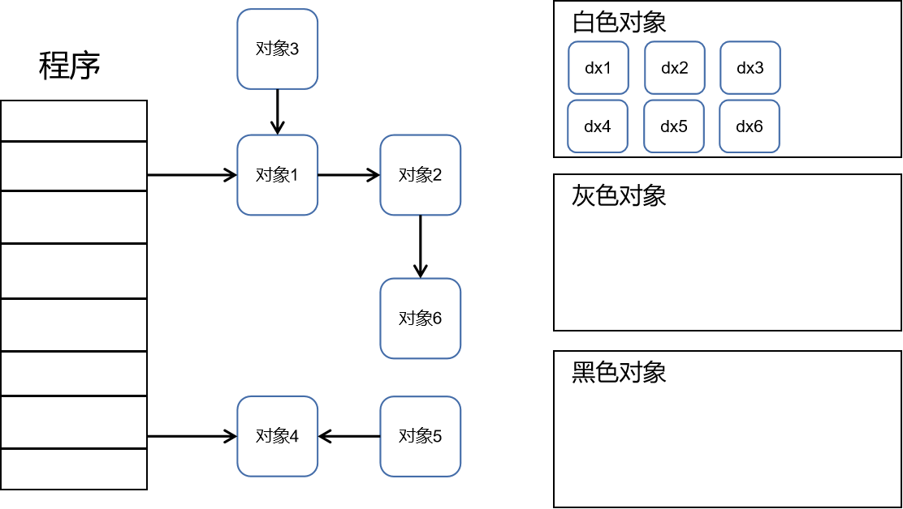

步骤三：遍历白色对象内的根对象，也就是对象1(dx1)和对象4。将遍历到的对象，由白色标记为灰色。

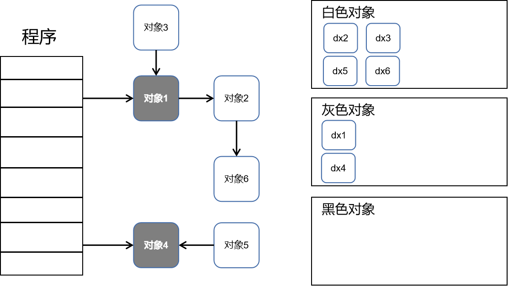

步骤四：遍历灰色，将遍历到的放入灰色，原本灰色的放入黑色。

以对象1为例，对象2会从白色标机为灰色，而对象1会被标记为黑色。

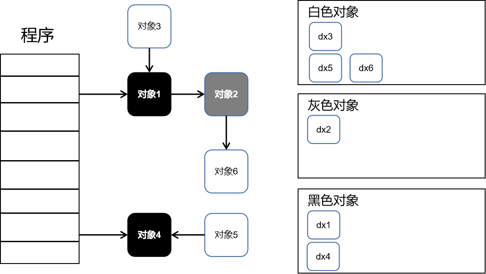

步骤五：循环第四步，直到没有灰色对象为止。

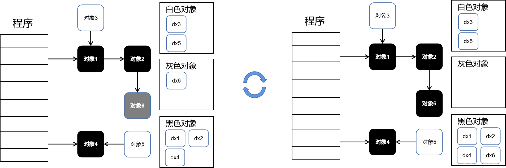

步骤六，当没有灰色对象后，回收白色对象

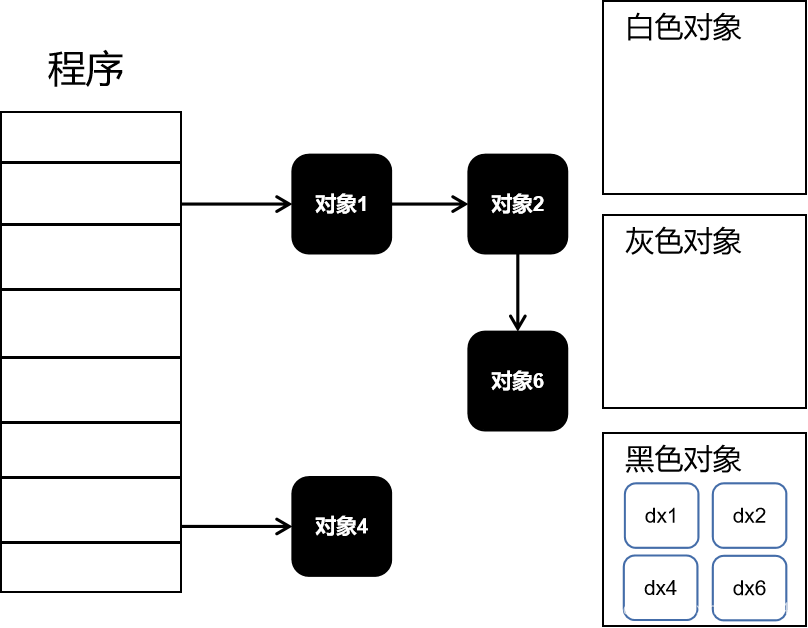

#### 3）为何在GC一开始需要STW

看下图，要扫描对象2的时候。对象2删除对对象6的引用，同时，对象4创建指针指向对象6。此时继续标记，因为对象4不会再被扫描，所以，对象6会被当做回收对象。到最后就是，对象4指向的对象6会被清扫。因此，在没有STW的时候会发生如下两种情况：

- 白对象被黑引用
- 灰对象与可达对象失去关系

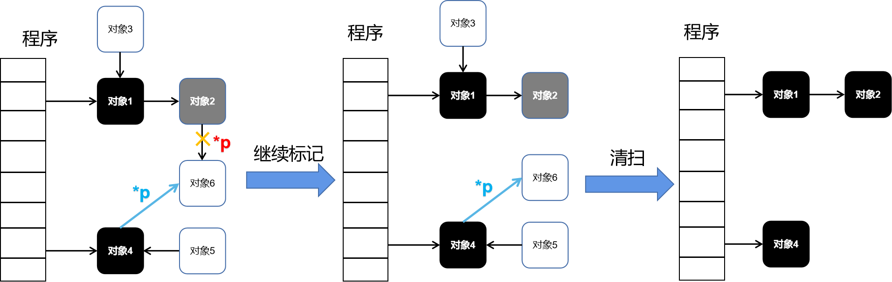

**可见，其实STW是为了保护在程序执行过程中，由于额外的新增或删除导致不可控的对象丢失的一个做法**。

因为STW是需要暂定整个程序，所以STW的时间成为了一个指标，也上升为GC算法的一个指标，也是后面GC算法优化的一个点。

因此提出2个概念用于防止上述情况发生：

- 强三色不变式：不允许黑色对象引用白色对象
- 弱三色不变式：所有黑色对象引用的白色对象都必须在灰色对象保护链下

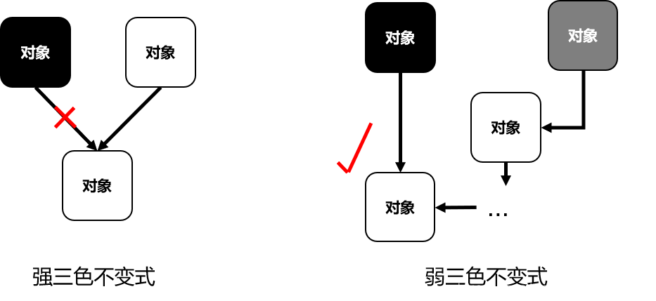

#### 4）插入屏障-强三色不变式

**插入屏障-强三色不变式：黑色引用白色对象后，白色对象变为灰色对象**

如下图例子，遍历完对象1和对象4之后，分别引用对象7和对象8。根据插入屏障强三式，此时对象8会标记为灰色，再下个循环标记的时候，对象8可以标记为黑色保留下来。


可以看到对象7其实是没有像对象8一样，立马被标记为灰色。

这是因为，**栈容量小，反应速度要求高，不能用插入屏障的机制**。

因此，在堆对象扫描完之后，会对栈对象STW，然后通过三色并发标记清扫，完成GC。即，此例中的对象7得以保留。

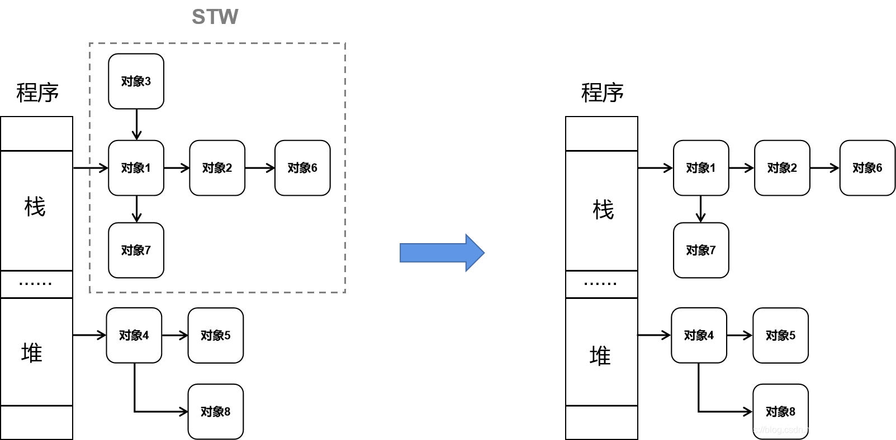

#### 5）删除屏障-弱三色不变式

**删除屏障-弱三色不变式：被删除对象为灰色或白色，则标记为灰色对象**

如下，为了保证对象没有被误扫除，在扫描对象1和对象4时，对象1删除对对象2的指向后。根据删除屏障弱三式，对象2会被标记为灰色。按照三色并发标记，最终GC如下右侧图。不过可以看到，虽然在一定程度上降低了对象被误扫除的机率，但同时降低了GC的精度。

例如对象2和对线6就需要在下次GC的时候才会销毁。

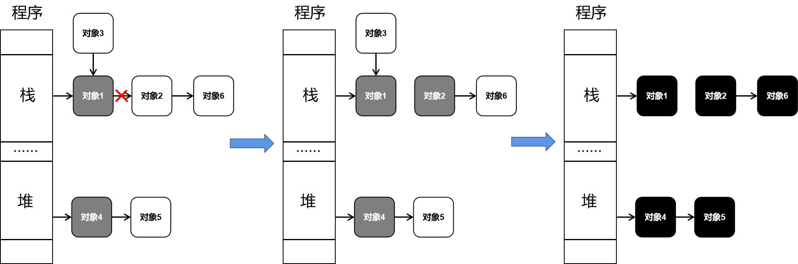

### 3、Go 1.8 混合写屏障

可以看到之前的插入屏障和删除屏障有明显的自身缺陷：

- 插入屏障：需要对栈对象重新STW遍历
- 删除屏障：回收精度低

混合写屏障，就是结合两者优势，又中和两者的劣势。混合写屏障减少STW，并且减少了扫描栈对象的时间。混合写屏障会做如下操作：

- GC开始时，将栈全部标记为黑色
- GC期间，任何创建在栈上的对象都标记为黑色
- 被删除的对象标记为灰色
- 被添加的对象标记为灰色

**情况一：栈对象引用堆对象**

遍历对象4时，删除对对象5的引用，对象1创建对对象5的引用，对象5被标记为灰色。

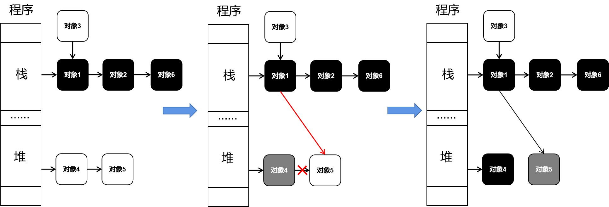

**情况二：某个栈对象引用另一个栈对象的引用**

在栈上创建对象7，对象7会被标记为黑色。同时，对象7创建对对象6的引用，对象2删除对对象6的引用。由于都在栈上操作，因此没有标记色动作。

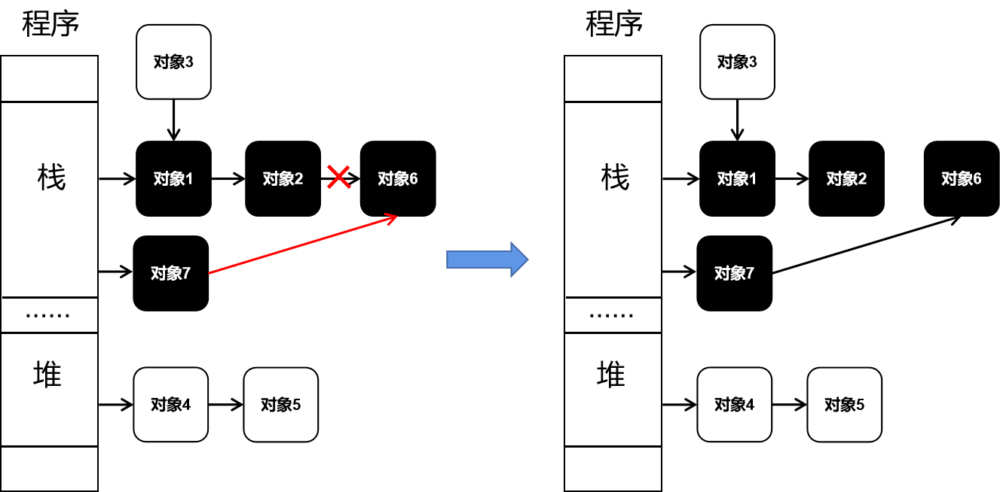

**情况三：某个堆对象引用另一个堆对象的引用**

遍历对象4时，删除对对象5的引用。同时，对象7创建对对象5的引用。对象5被标记为灰色，避免被错误回收。

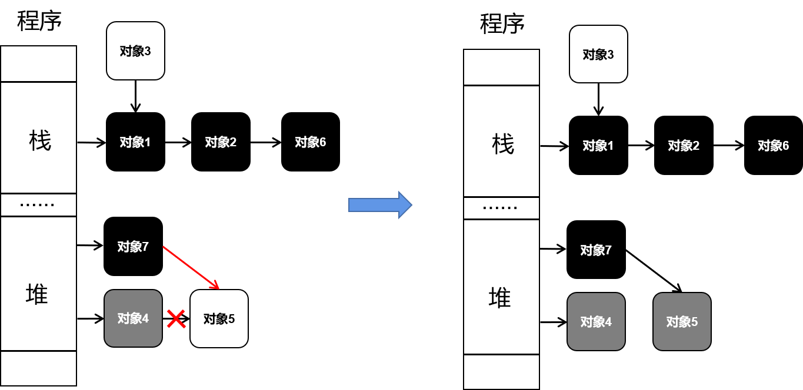

**情况四：堆对象引用栈对象**

遍历对象4时，删除对对象5的引用。同时，对象4创建对对象2的引用。对象5会被标记为灰色，为了保证下游对象不被误回收。

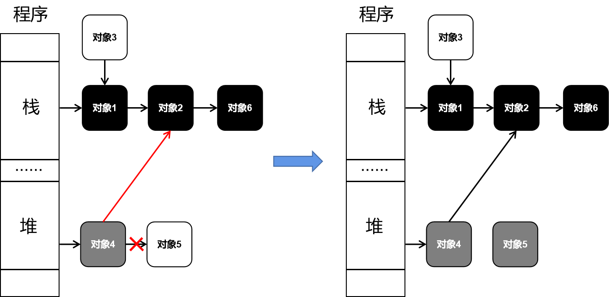

### 4、总结 Go GC 流程

Go GC对应5个流程分别是：

**GC Mark Prepare**

标记准备阶段，为并发标记做准备工作，包括开启写屏障(write barrier)和辅助GC(mutator assist)，统计root对象的任务数量等 --> STW

**GC Mark**

扫描标记阶段，扫描所有root对象，包括全局指针和goroutine(G)栈上的指针（扫描对应G栈时需停止该G)，将其加入标记队列(灰色队列)，并循环处理灰色队列的对象，直到灰色队列为空 --> 后台并发

**GC Mark Termination**

标记终止阶段，保证一个周期内标记任务完成，停止写屏障。同时由于Mark和用户代码是并发执行，所以需要重新扫描(re-scan)全局指针和栈。 --> STW

**GC Off SWEEP**

内存清扫阶段，将需要回收的内存归还到堆中，写屏障关闭 --> 后台并发

**GC off**

内存归还阶段，将过多的内存归还给操作系统，写屏障关闭 --> 后台并发

### 5、Go GC API

- runtime.GC：手动触发GC
- runtime.ReadMemStats：读取内存相关的统计信息，其中包含部分GC相关的统计信息
- debug.FreeOSMemory：手动将内存归还给操作系统
- debug.ReadGCStats：读取关于GC的相关统计信息
- debug.SetGCPercent：设置GOGC调步变量
- debug.SetMaxHeap：设置GO程序堆的上限值

## 四、观察 GC

### 1、开启打印gc信息：GODEBUG=gctrace=1

代码：

```go
package main

func allocate() {
	_ = make([]byte, 1<<20)
}

func main() {
	for n := 1; n < 100; n++ {
		allocate()
	}
}
```

命令：[https://pkg.go.dev/runtime](https://pkg.go.dev/runtime)

```shell
GODEBUG=gctrace=1 ./main
```

执行后结果如下:

```shell
gc 1 @0.000s 4%: 0.012+0.26+0.003 ms clock, 0.10+0.075/0.14/0.041+0.029 ms cpu, 4->5->1 MB, 5 MB goal, 8 P
gc 2 @0.002s 2%: 0.032+0.72+0.004 ms clock, 0.25+0.11/0.029/0.20+0.035 ms cpu, 4->5->1 MB, 5 MB goal, 8 P
gc 3 @0.005s 3%: 0.094+1.2+0.010 ms clock, 0.75+0.19/0.039/0.32+0.082 ms cpu, 4->5->1 MB, 5 MB goal, 8 P
gc 4 @0.008s 3%: 0.062+0.55+0.002 ms clock, 0.49+0.21/0.044/0+0.023 ms cpu, 4->5->1 MB, 5 MB goal, 8 P
gc 5 @0.009s 4%: 0.048+0.62+0.003 ms clock, 0.38+0.19/0.18/0.057+0.031 ms cpu, 4->5->1 MB, 5 MB goal, 8 P
gc 6 @0.011s 4%: 0.057+0.31+0.003 ms clock, 0.46+0.10/0.096/0.052+0.030 ms cpu, 4->5->1 MB, 5 MB goal, 8 P
gc 7 @0.012s 5%: 0.11+0.38+0.012 ms clock, 0.91+0.10/0.064/0.063+0.097 ms cpu, 4->5->1 MB, 5 MB goal, 8 P
gc 8 @0.014s 5%: 0.063+0.35+0.003 ms clock, 0.50+0.072/0.096/0.044+0.026 ms cpu, 4->5->1 MB, 5 MB goal, 8 P
gc 9 @0.015s 5%: 0.095+1.0+0.006 ms clock, 0.76+0.36/0.16/0.091+0.048 ms cpu, 4->6->2 MB, 5 MB goal, 8 P
gc 10 @0.017s 5%: 0.034+0.33+0.003 ms clock, 0.27+0.082/0.091/0.036+0.025 ms cpu, 4->5->1 MB, 5 MB goal, 8 P
gc 11 @0.017s 5%: 0.038+0.26+0.004 ms clock, 0.30+0.060/0.050/0.065+0.032 ms cpu, 4->5->1 MB, 5 MB goal, 8 P
gc 12 @0.018s 7%: 0.40+0.90+0.002 ms clock, 3.2+0.13/0.14/0.037+0.023 ms cpu, 4->6->2 MB, 5 MB goal, 8 P
gc 13 @0.020s 7%: 0.068+0.33+0.003 ms clock, 0.54+0.066/0.047/0+0.026 ms cpu, 4->5->1 MB, 5 MB goal, 8 P
gc 14 @0.021s 7%: 0.034+0.33+0.002 ms clock, 0.27+0.059/0.090/0.040+0.023 ms cpu, 4->5->1 MB, 5 MB goal, 8 P
gc 15 @0.023s 7%: 0.17+0.59+0.004 ms clock, 1.4+0.11/0.005/0.24+0.033 ms cpu, 4->6->2 MB, 5 MB goal, 8 P
gc 16 @0.025s 9%: 0.73+0.98+0.005 ms clock, 5.8+0.36/0.44/0.056+0.045 ms cpu, 4->5->1 MB, 5 MB goal, 8 P
gc 17 @0.027s 9%: 0.046+0.46+0.015 ms clock, 0.37+0.11/0.16/0.079+0.12 ms cpu, 4->5->1 MB, 5 MB goal, 8 P
gc 18 @0.029s 10%: 0.22+0.54+0.088 ms clock, 1.7+0.15/0/0+0.71 ms cpu, 4->5->1 MB, 5 MB goal, 8 P
gc 19 @0.030s 10%: 0.028+0.30+0.002 ms clock, 0.22+0.059/0.20/0.099+0.020 ms cpu, 4->5->1 MB, 5 MB goal, 8 P
gc 20 @0.031s 10%: 0.14+1.0+0.004 ms clock, 1.1+0.13/0.86/0.004+0.033 ms cpu, 4->5->1 MB, 5 MB goal, 8 P
gc 21 @0.033s 10%: 0.22+0.79+0.006 ms clock, 1.7+0.25/0.082/0.062+0.050 ms cpu, 4->5->1 MB, 5 MB goal, 8 P
gc 22 @0.036s 10%: 0.12+0.57+0.004 ms clock, 0.98+0.12/0.18/0.044+0.034 ms cpu, 4->5->1 MB, 5 MB goal, 8 P
gc 23 @0.037s 10%: 0.073+0.49+0.015 ms clock, 0.59+0.19/0.28/0.16+0.12 ms cpu, 4->5->1 MB, 5 MB goal, 8 P
gc 24 @0.038s 10%: 0.039+0.41+0.002 ms clock, 0.31+0.14/0.12/0.001+0.022 ms cpu, 4->5->1 MB, 5 MB goal, 8 P
```

解释此条数据

```shell
gc 2 @0.002s 2%: 0.032+0.72+0.004 ms clock, 0.25+0.11/0.029/0.20+0.035 ms cpu, 4->5->1 MB, 5 MB goal, 8 P
```

```
	gc # @#s #%: #+#+# ms clock, #+#/#/#+# ms cpu, #->#-># MB, # MB goal, # P
where the fields are as follows:
	gc #        the GC number, incremented at each GC
	@#s         time in seconds since program start
	#%          percentage of time spent in GC since program start
	#+...+#     wall-clock/CPU times for the phases of the GC
	#->#-># MB  heap size at GC start, at GC end, and live heap
	# MB goal   goal heap size
	# P         number of processors used
```

| 字段  | 含义                                           |
| ----- | ---------------------------------------------- |
| gc 2  | 第二个 GC 周期                                 |
| 0.002 | 程序开始后的 0.002 秒                          |
| 2%    | 该 GC 周期中 CPU 的使用率                      |
| 0.032 | 标记开始时， STW 所花费的时间（wall clock）    |
| 0.72  | 标记过程中，并发标记所花费的时间（wall clock） |
| 0.004 | 标记终止时， STW 所花费的时间（wall clock）    |
| 0.25  | 标记开始时， STW 所花费的时间（cpu time）      |
| 0.11  | 标记过程中，标记辅助所花费的时间（cpu time）   |
| 0.029 | 标记过程中，并发标记所花费的时间（cpu time）   |
| 0.20  | 标记过程中，GC 空闲的时间（cpu time）          |
| 0.035 | 标记终止时， STW 所花费的时间（cpu time）      |
| 4     | 标记开始时，堆的大小的实际值                   |
| 5     | 标记结束时，堆的大小的实际值                   |
| 1     | 标记结束时，标记为存活的对象大小               |
| 5     | 标记结束时，堆的大小的预测值                   |
| 8     | P 的数量                                       |

可以这么理解，本次GC为「第二次」GC周期，占用了「2%」的CPU来执行这次GC。本次GC所花的STW扫描时间，STW并发标记时间，即STW清扫的总时间为「0.032+0.72+0.004 ms」wall clock。然后，本次GC占用的CPU时间为「0.25+0.11/0.029/0.20+0.035 ms」。标记前实际堆大小为「4 MB」，结束时为「5 MB」，清扫存活下来的为「1MB」。此GC基于「8核」CPU

wall clock 是指开始执行到完成所经历的实际时间，包括其他程序和本程序所消耗的时间；

cpu time 是指特定程序使用 CPU 的时间；他们存在以下关系：

- wall clock < cpu time: 充分利用多核
- wall clock ≈ cpu time: 未并行执行
- wall clock > cpu time: 多核优势不明显

### 2、性能追踪 go tool trace trace.out

将上述代码块改为如下代码

```go
package main

import (
	"os"
	"runtime/trace"
)

func main() {
	f, _ := os.Create("trace.out")
	defer f.Close()
	trace.Start(f)
	defer trace.Stop()

	for n := 1; n < 1000; n++ {
		allocate()
	}
}

func allocate() {
	_ = make([]byte, 1<<20)
}

```

执行 go run main.go，生成 trace.out

再执行 go tool trace trace.out，会启动一个web server

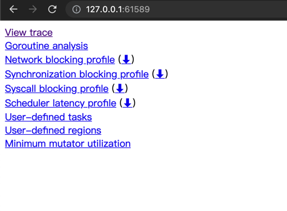

页面上的内容如下：

- View trace：查看跟踪
- Goroutine analysis：Goroutine 分析
- Network blocking profile：网络阻塞概况
- Synchronization blocking profile：同步阻塞概况
- Syscall blocking profile：系统调用阻塞概况
- Scheduler latency profile：调度延迟概况
- User defined tasks：用户自定义任务
- User defined regions：用户自定义区域
- Minimum mutator utilization：最低 Mutator 利用率


点击第一个链接view trace

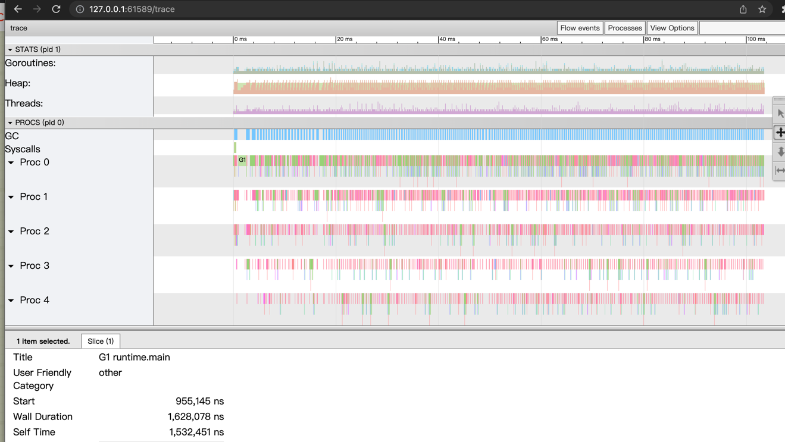

蓝色区域就是背景GC在执行的时间

堆就是我们通过allocate分配的内存

绿色为用户代码运行在系统线程上

### 3、debug.ReadGCStats

此方式可以通过代码的方式来直接实现对感兴趣指标的监控，例如我们希望每隔一秒钟监控一次 GC 的状态：

```go
package main

import (
	"fmt"
	"runtime/debug"
	"time"
)

type GCStats struct {
	LastGC         time.Time       // 上次一次收集时间
	NumGC          int64           // gc总次数
	PauseTotal     time.Duration   // 总共gc暂停的时间
	Pause          []time.Duration // 暂停的时间切片，每次暂停的花费时间，倒叙
	PauseEnd       []time.Time     // 暂停结束的时间点，倒叙
	PauseQuantiles []time.Duration
}

func main() {
	go printGCStats()
	for n := 1; n < 10; n++ {
		allocate()
	}
	select {}
}

func printGCStats() {
	t := time.NewTicker(time.Second)
	s := debug.GCStats{}
	for {
		select {
		case <-t.C:
			debug.ReadGCStats(&s)
			fmt.Printf("gc %d last@%v, PauseTotal %v\n", s.NumGC, s.LastGC, s.PauseTotal)
		}
	}
}

func allocate() {
	_ = make([]byte, 1<<20)
}

```

执行 go run main.go 

```go
gc 2 last@2022-03-11 23:17:15.454572 +0800 CST, PauseTotal 63.362µs
gc 2 last@2022-03-11 23:17:15.454572 +0800 CST, PauseTotal 63.362µs
gc 2 last@2022-03-11 23:17:15.454572 +0800 CST, PauseTotal 63.362µs
gc 2 last@2022-03-11 23:17:15.454572 +0800 CST, PauseTotal 63.362µs
gc 2 last@2022-03-11 23:17:15.454572 +0800 CST, PauseTotal 63.362µs
gc 2 last@2022-03-11 23:17:15.454572 +0800 CST, PauseTotal 63.362µs
gc 2 last@2022-03-11 23:17:15.454572 +0800 CST, PauseTotal 63.362µs
gc 2 last@2022-03-11 23:17:15.454572 +0800 CST, PauseTotal 63.362µs
gc 2 last@2022-03-11 23:17:15.454572 +0800 CST, PauseTotal 63.362µs
gc 2 last@2022-03-11 23:17:15.454572 +0800 CST, PauseTotal 63.362µs
gc 2 last@2022-03-11 23:17:15.454572 +0800 CST, PauseTotal 63.362µs
gc 2 last@2022-03-11 23:17:15.454572 +0800 CST, PauseTotal 63.362µs
```

### 4、runtime.ReadMemStats

除了使用 debug 包提供的方法外，还可以直接通过运行时的内存相关的 API 进行监控：

```go
package main

import (
	"fmt"
	"runtime"
	"time"
)

func main() {
	go printMemStats()
	for n := 1; n < 10; n++ {
		allocate()
	}
	select {}
}

func printMemStats() {
	t := time.NewTicker(time.Second)
	s := runtime.MemStats{}

	for {
		select {
		case <-t.C:
			runtime.ReadMemStats(&s)
			fmt.Printf("gc %d last@%v, next_heap_size@%vMB\n", s.NumGC, time.Unix(int64(time.Duration(s.LastGC).Seconds()), 0), s.NextGC/(1<<20))
		}
	}
}

func allocate() {
	_ = make([]byte, 1<<20)
}
```

```shell
gc 2 last@2022-03-12 23:00:05 +0800 CST, next_heap_size@4MB
gc 2 last@2022-03-12 23:00:05 +0800 CST, next_heap_size@4MB
gc 2 last@2022-03-12 23:00:05 +0800 CST, next_heap_size@4MB
gc 2 last@2022-03-12 23:00:05 +0800 CST, next_heap_size@4MB
gc 2 last@2022-03-12 23:00:05 +0800 CST, next_heap_size@4MB
gc 2 last@2022-03-12 23:00:05 +0800 CST, next_heap_size@4MB
```

当然，后两种方式能够监控的指标很多，读者可以自行查看 `debug.GCStats` 和`runtime.MemStats` 的字段，这里不再赘述。


## 五、内存泄漏

在一个具有 GC 的语言中，我们常说的内存泄漏，用严谨的话来说应该是：**预期的能很快被释放的内存由于附着在了长期存活的内存上、或生命期意外地被延长，导致预计能够立即回收的内存而长时间得不到回收**

在 Go 中，由于 goroutine 的存在，所谓的内存泄漏除了附着在长期对象上之外，还存在多种不同的形式。

#### 形式1：预期能被快速释放的内存因被根对象引用而没有得到迅速释放

当有一个全局对象时，可能不经意间将某个变量附着在其上，且忽略的将其进行释放，则该内存永远不会得到释放。例如：

```go
var cache = map[interface{}]interface{}{}

func keepalloc() {
	for i := 0; i < 10000; i++ {
		m := make([]byte, 1<<10)
		cache[i] = m
	}
}
```

#### 形式2：goroutine 泄漏

Goroutine 作为一种逻辑上理解的轻量级线程，需要维护执行用户代码的上下文信息。在运行过程中也需要消耗一定的内存来保存这类信息，而这些内存在目前版本的 Go 中是不会被释放的。因此，如果一个程序持续不断地产生新的 goroutine、且不结束已经创建的 goroutine 并复用这部分内存，就会造成内存泄漏的现象，例如：

```go
func keepalloc2() {
	for i := 0; i < 100000; i++ {
		go func() {
			select {}
		}()
	}
}
```

#### 验证

```go
package main

import (
	"os"
	"runtime/trace"
)

var cache = map[interface{}]interface{}{}

func keepalloc() {
	for i := 0; i < 10000; i++ {
		m := make([]byte, 1<<10)
		cache[i] = m
	}
}

func keepalloc2() {
	for i := 0; i < 100000; i++ {
		go func() {
			select {}
		}()
	}
}

func main() {
	f, _ := os.Create("trace.out")
	defer f.Close()
	trace.Start(f)
	defer trace.Stop()
	keepalloc()
	keepalloc2()
}
```

```shell
go run main.go

go tool trace trace.out
```

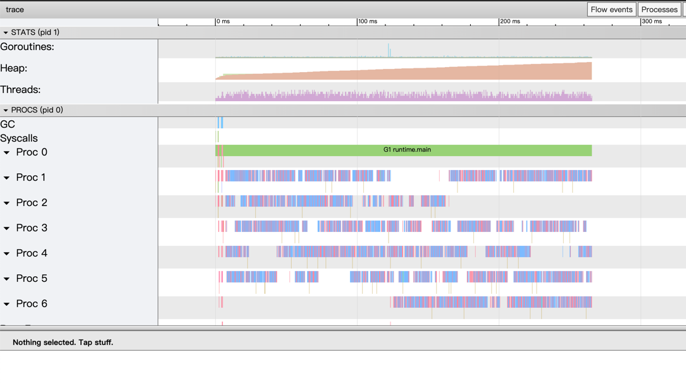可以看到，途中的 Heap 在持续增长，没有内存被回收，产生了内存泄漏的现象。

值得一提的是，这种形式的 goroutine 泄漏还可能由 channel 泄漏导致。而 channel 的泄漏本质上与 goroutine 泄漏存在直接联系。Channel 作为一种同步原语，会连接两个不同的 goroutine，如果一个 goroutine 尝试向一个没有接收方的无缓冲 channel 发送消息，则该 goroutine 会被永久的休眠，整个 goroutine 及其执行栈都得不到释放，例如：

```go
var ch = make(chan struct{})

func keepalloc3() {
	for i := 0; i < 100000; i++ {
		// 没有接收方，goroutine 会一直阻塞
		go func() { ch <- struct{}{} }()
	}
}
```

## 六、GC 调优

### 1、GC 关注指标

Go 的 GC 被设计为成比例触发、大部分工作与赋值器并发、不分代、无内存移动且会主动向操作系统归还申请的内存。

因此最主要关注的、能够影响赋值器的性能指标有：

- CPU 利用率：回收算法会在多大程度上拖慢程序？有时候，这个是通过回收占用的 CPU 时间与其它 CPU 时间的百分比来描述的。
- GC 停顿时间：回收器会造成多长时间的停顿？目前的 GC 中需要考虑 STW 和 Mark Assist 两个部分可能造成的停顿。
- GC 停顿频率：回收器造成的停顿频率是怎样的？目前的 GC 中需要考虑 STW 和 Mark Assist 两个部分可能造成的停顿。
- GC 可扩展性：当堆内存变大时，垃圾回收器的性能如何？但大部分的程序可能并不一定关心这个问题。

### 2、GC 调优方式

Go 的 GC 被设计为极致简洁，与较为成熟的 Java GC 的数十个可控参数相比，严格意义上来讲，Go 可供用户调整的参数只有 GOGC 环境变量。**当我们谈论 GC 调优时，通常是指减少用户代码对 GC 产生的压力**

- 这一方面包含了减少用户代码分配内存的数量（即对程序的代码行为进行调优）
- 另一方面包含了最小化 Go 的 GC 对 CPU 的使用率（即调整 GOGC）

GC 的调优是在特定场景下产生的，并非所有程序都需要针对 GC 进行调优。**只有那些对执行延迟非常敏感、当 GC 的开销成为程序性能瓶颈的程序，才需要针对 GC 进行性能调优**，几乎不存在于实际开发中 99% 的情况。除此之外，Go 的 GC 也仍然有一定的可改进的空间，也有部分 GC 造成的问题，目前仍属于 Open Problem。

总的来说，我们可以在现在的开发中处理的有以下几种情况：

1. 对停顿敏感：GC 过程中产生的长时间停顿、或由于需要执行 GC 而没有执行用户代码，导致需要立即执行的用户代码执行滞后。
2. 对资源消耗敏感：对于频繁分配内存的应用而言，频繁分配内存增加 GC 的工作量，原本可以充分利用 CPU 的应用不得不频繁地执行垃圾回收，影响用户代码对 CPU 的利用率，进而影响用户代码的执行效率。

从这两点来看，所谓 GC 调优的核心思想也就是充分的围绕上面的两点来展开：优化内存的申请速度，尽可能的少申请内存，复用已申请的内存。或者简单来说，不外乎这三个关键字：**控制、减少、复用**。

我们将通过三个实际例子介绍如何定位 GC 的存在的问题，并一步一步进行性能调优。当然，在实际情况中问题远比这些例子要复杂，这里也只是讨论调优的核心思想，更多的时候也只能具体问题具体分析。

#### **例1：合理化内存分配的速度、提高赋值器的 CPU 利用率**

我们来看这样一个例子。在这个例子中， `concat` 函数负责拼接一些长度不确定的字符串。并且为了快速完成任务，出于某种原因，在两个嵌套的 for 循环中一口气创建了 800 个 goroutine。在 main 函数中，启动了一个 goroutine 并在程序结束前不断的触发 GC，并尝试输出 GC 的平均执行时间：

```go
package main

import (
	"fmt"
	"os"
	"runtime"
	"runtime/trace"
	"sync/atomic"
	"time"
)

var (
	stop  int32
	count int64
	sum   time.Duration
)

func concat() {
	for n := 0; n < 100; n++ {
		for i := 0; i < 8; i++ {
			go func() {
				s := "Go GC"
				s += " " + "Hello"
				s += " " + "World"
				_ = s
			}()
		}
	}
}

func main() {
	f, _ := os.Create("trace.out")
	defer f.Close()
	trace.Start(f)
	defer trace.Stop()

	go func() {
		var t time.Time
		for atomic.LoadInt32(&stop) == 0 {
			t = time.Now()
			runtime.GC()
			sum += time.Since(t)
			count++
		}
		fmt.Printf("GC spend avg: %v\n", time.Duration(int64(sum)/count))
	}()

	concat()
	atomic.StoreInt32(&stop, 1)
}

```

这个程序的执行结果是：

```shell
go build -o main
./main
GC spend avg: 2.583421ms
```

GC 平均执行一次需要长达 2ms 的时间，我们再进一步观察 trace 的结果：

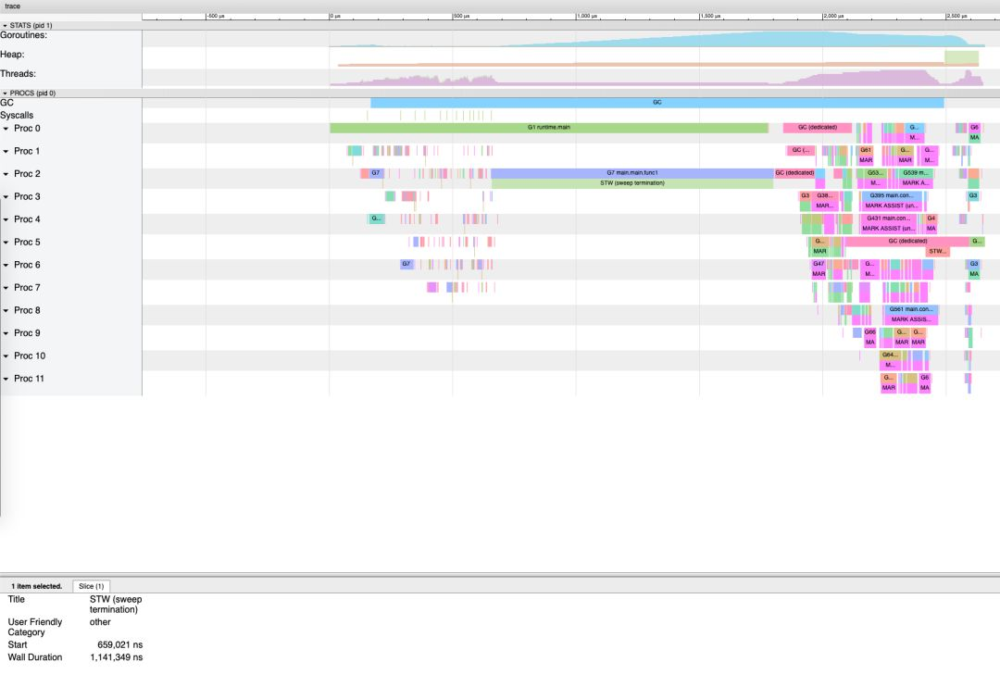

程序的整个执行过程中仅执行了一次 GC，而且仅 Sweep STW 就耗费了超过 1 ms，非常反常。甚至查看赋值器 mutator 的 CPU 利用率，在整个 trace 尺度下连 40% 都不到：


主要原因是什么呢？我们不妨查看 goroutine 的分析：

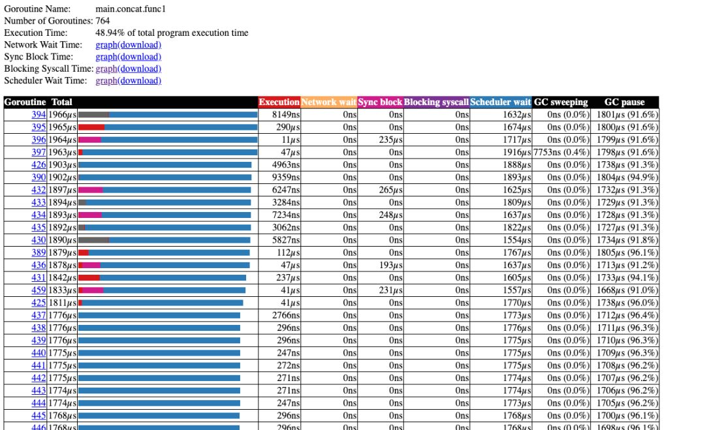

在这个榜单中我们不难发现，goroutine 的执行时间占其生命周期总时间非常短的一部分，但大部分时间都花费在调度器的等待上了（蓝色的部分），说明同时创建大量 goroutine 对调度器产生的压力确实不小，我们不妨将这一产生速率减慢，一批一批地创建 goroutine：

```go
func concat() {
	wg := sync.WaitGroup{}
	for n := 0; n < 100; n++ {
		wg.Add(8)
		for i := 0; i < 8; i++ {
			go func() {
				s := "Go GC"
				s += " " + "Hello"
				s += " " + "World"
				_ = s
				wg.Done()
			}()
		}
		wg.Wait()
	}
}
```

这时候我们再来看：

```shell
go build -o main
./main

GC spend avg: 328.54µs
```

GC 的平均时间就降到 300 微秒了。这时的赋值器 CPU 使用率也提高到了 60%，相对来说就很可观了：

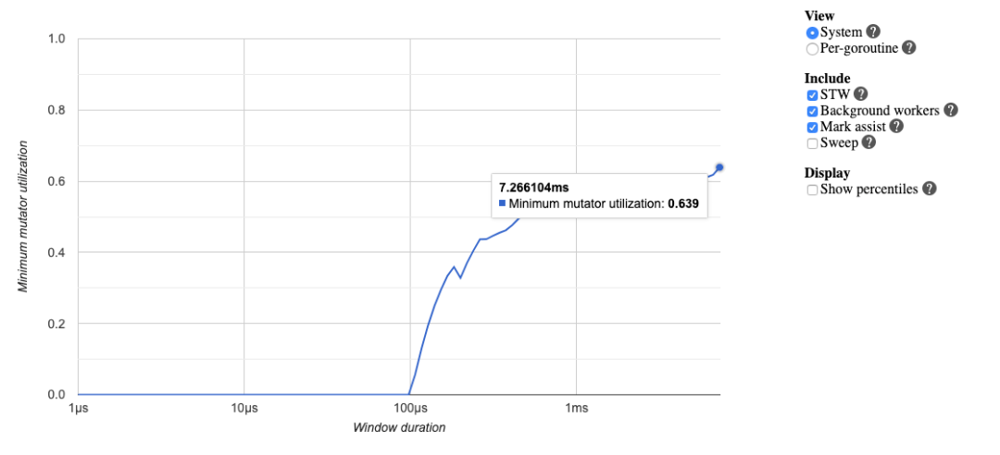

#### 例2：降低并复用已经申请的内存

我们通过一个非常简单的 Web 程序来说明复用内存的重要性。

在这个程序中，每当产生一个 `/example2`的请求时，都会创建一段内存，并用于进行一些后续的工作。

```go
package main

import (
	"fmt"
	"net/http"
	_ "net/http/pprof"
)

func newBuf() []byte {
	return make([]byte, 10<<20)
}

func main() {
	go func() {
		http.ListenAndServe("localhost:6060", nil)
	}()

	http.HandleFunc("/example2", func(w http.ResponseWriter, r *http.Request) {
		b := newBuf()

		// 模拟执行一些工作
		for idx := range b {
			b[idx] = 1
		}

		fmt.Fprintf(w, "done, %v", r.URL.Path[1:])
	})
	http.ListenAndServe(":8080", nil)
}

```

为了进行性能分析，我们还额外创建了一个监听 6060 端口的 goroutine，用于使用 pprof 进行分析。我们先让服务器跑起来：

```shell
go build -o main
./main
```

我们这次使用 pprof 的 trace 来查看 GC 在此服务器中面对大量请求时候的状态，要使用 trace 可以通过访问 `/debug/pprof/trace` 路由来进行，其中 `seconds` 参数设置为 20s，并将 trace 的结果保存为 `trace.out`：

```shell
$ wget http://127.0.0.1:6060/debug/pprof/trace\?seconds\=20 -O trace.out
--2020-01-01 22:13:34--  http://127.0.0.1:6060/debug/pprof/trace?seconds=20
Connecting to 127.0.0.1:6060... connected.
HTTP request sent, awaiting response...
```

这时候我们使用一个压测工具 `ab`，来同时产生 500 个请求（ `-n` 一共 500 个请求， `-c` 一个时刻执行请求的数量，每次 100 个并发请求）：

```shell
$ ab -n 500 -c 100 http://127.0.0.1:8080/example2
This is ApacheBench, Version 2.3 <$Revision: 1843412 $>
Copyright 1996 Adam Twiss, Zeus Technology Ltd, http://www.zeustech.net/
Licensed to The Apache Software Foundation, http://www.apache.org/

Benchmarking 127.0.0.1 (be patient)
Completed 100 requests
Completed 200 requests
Completed 300 requests
Completed 400 requests
Completed 500 requests
Finished 500 requests


Server Software:        
Server Hostname:        127.0.0.1
Server Port:            8080

Document Path:          /example2
Document Length:        14 bytes

Concurrency Level:      100
Time taken for tests:   0.987 seconds
Complete requests:      500
Failed requests:        0
Total transferred:      65500 bytes
HTML transferred:       7000 bytes
Requests per second:    506.63 [#/sec] (mean)
Time per request:       197.382 [ms] (mean)
Time per request:       1.974 [ms] (mean, across all concurrent requests)
Transfer rate:          64.81 [Kbytes/sec] received

Connection Times (ms)
              min  mean[+/-sd] median   max
Connect:        0    1   1.1      0       7
Processing:    13  179  77.5    170     456
Waiting:       10  168  78.8    162     455
Total:         14  180  77.3    171     458

Percentage of the requests served within a certain time (ms)
  50%    171
  66%    203
  75%    222
  80%    239
  90%    281
  95%    335
  98%    365
  99%    400
 100%    458 (longest request)
```

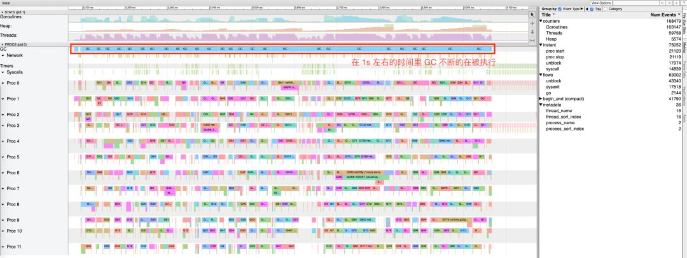

GC 反复被触发，一个显而易见的原因就是内存分配过多。我们可以通过 `go tool pprof`来查看究竟是谁分配了大量内存（使用 web 指令来使用浏览器打开统计信息的可视化图形）：

```shell
$ go tool pprof http://127.0.0.1:6060/debug/pprof/heap
Fetching profile over HTTP from http://localhost:6060/debug/pprof/heap
Saved profile in /Users/changkun/pprof/pprof.alloc_objects.alloc_space.inuse_o
bjects.inuse_space.003.pb.gz
Type: inuse_space
Time: Jan 1, 2020 at 11:15pm (CET)
Entering interactive mode (type "help" for commands, "o" for options)
(pprof) web
(pprof)
```

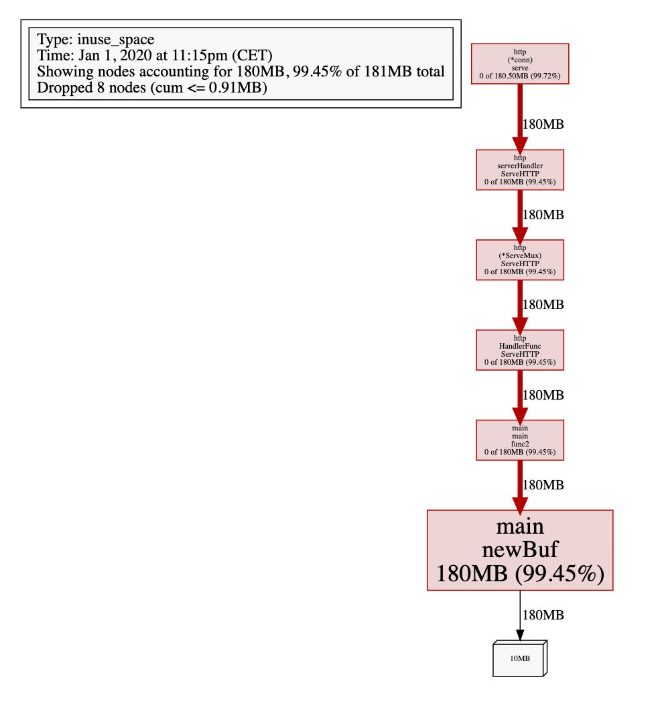

可见 `newBuf` 产生的申请的内存过多，现在我们使用 sync.Pool 来复用 `newBuf` 所产生的对象：

```go
package main

import (
	"fmt"
	"net/http"
	_ "net/http/pprof"
	"sync"
)

// 使用 sync.Pool 复用需要的 buf
var bufPool = sync.Pool{
	New: func() interface{} {
		return make([]byte, 10<<20)
	},
}

func main() {
	go func() {
		http.ListenAndServe("localhost:6060", nil)
	}()
	http.HandleFunc("/example2", func(w http.ResponseWriter, r *http.Request) {
		b := bufPool.Get().([]byte)
		for idx := range b {
			b[idx] = 0
		}
		fmt.Fprintf(w, "done, %v", r.URL.Path[1:])
		bufPool.Put(b)
	})
	http.ListenAndServe(":8080", nil)
}

```

其中 ab 输出的统计结果为：

```shell
$ ab -n 500 -c 100 http://127.0.0.1:8080/example2
This is ApacheBench, Version 2.3 <$Revision: 1843412 $>
Copyright 1996 Adam Twiss, Zeus Technology Ltd, http://www.zeustech.net/
Licensed to The Apache Software Foundation, http://www.apache.org/

Benchmarking 127.0.0.1 (be patient)
Completed 100 requests
Completed 200 requests
Completed 300 requests
Completed 400 requests
Completed 500 requests
Finished 500 requests


Server Software:        
Server Hostname:        127.0.0.1
Server Port:            8080

Document Path:          /example2
Document Length:        14 bytes

Concurrency Level:      100
Time taken for tests:   0.427 seconds
Complete requests:      500
Failed requests:        0
Total transferred:      65500 bytes
HTML transferred:       7000 bytes
Requests per second:    1171.32 [#/sec] (mean)
Time per request:       85.374 [ms] (mean)
Time per request:       0.854 [ms] (mean, across all concurrent requests)
Transfer rate:          149.85 [Kbytes/sec] received

Connection Times (ms)
              min  mean[+/-sd] median   max
Connect:        0    1   1.4      1       9
Processing:     5   75  48.2     66     211
Waiting:        5   72  46.8     63     207
Total:          5   77  48.2     67     211

Percentage of the requests served within a certain time (ms)
  50%     67
  66%     89
  75%    107
  80%    122
  90%    148
  95%    167
  98%    196
  99%    204
 100%    211 (longest request)
```

但从 `Requestsper second` 每秒请求数来看，从原来的 506.63 变为 1171.32 得到了近乎一倍的提升。从 trace 的结果来看，GC 也没有频繁的被触发从而长期消耗 CPU 使用率：

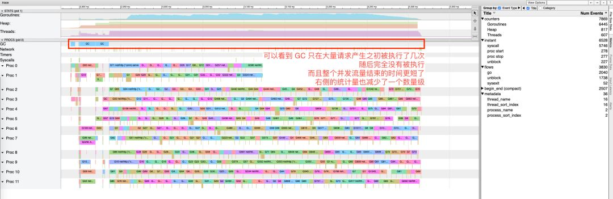

sync.Pool 是内存复用的一个最为显著的例子，从语言层面上还有很多类似的例子，例如在例 1 中， `concat` 函数可以预先分配一定长度的缓存，而后再通过 append 的方式将字符串存储到缓存中：

```go

func concat() {
	wg := sync.WaitGroup{}
	for n := 0; n < 100; n++ {
		wg.Add(8)
		for i := 0; i < 8; i++ {
			go func() {
				s := make([]byte, 0, 20)
				s = append(s, "Go GC"...)
				s = append(s, ' ')
				s = append(s, "Hello"...)
				s = append(s, ' ')
				s = append(s, "World"...)
				_ = string(s)
				wg.Done()
			}()
		}
		wg.Wait()
	}
}
```

原因在于 `+` 运算符会随着字符串长度的增加而申请更多的内存，并将内容从原来的内存位置拷贝到新的内存位置，造成大量不必要的内存分配，先提前分配好足够的内存，再慢慢地填充，也是一种减少内存分配、复用内存形式的一种表现。

#### 例3：调整 GOGC

我们已经知道了 GC 的触发原则是由步调算法来控制的，其关键在于估计下一次需要触发 GC 时，堆的大小。可想而知，如果我们在遇到海量请求的时，为了避免 GC 频繁触发，是否可以通过将 GOGC 的值设置得更大，让 GC 触发的时间变得更晚，从而减少其触发频率，进而增加用户代码对机器的使用率呢？答案是肯定的。

我们可以非常简单粗暴的将 GOGC 调整为 1000，来执行上一个例子中未复用对象之前的程序：

```shell
$ GOGC=1000 ./main
```

这时我们再重新执行压测：

```shell
$ ab -n 500 -c 100 http://127.0.0.1:8080/example2
This is ApacheBench, Version 2.3 <$Revision: 1843412 $>
Copyright 1996 Adam Twiss, Zeus Technology Ltd, http://www.zeustech.net/
Licensed to The Apache Software Foundation, http://www.apache.org/

Benchmarking 127.0.0.1 (be patient)
Completed 100 requests
Completed 200 requests
Completed 300 requests
Completed 400 requests
Completed 500 requests
Finished 500 requests


Server Software:        
Server Hostname:        127.0.0.1
Server Port:            8080

Document Path:          /example2
Document Length:        14 bytes

Concurrency Level:      100
Time taken for tests:   0.923 seconds
Complete requests:      500
Failed requests:        0
Total transferred:      65500 bytes
HTML transferred:       7000 bytes
Requests per second:    541.61 [#/sec] (mean)
Time per request:       184.636 [ms] (mean)
Time per request:       1.846 [ms] (mean, across all concurrent requests)
Transfer rate:          69.29 [Kbytes/sec] received

Connection Times (ms)
              min  mean[+/-sd] median   max
Connect:        0    1   1.8      0      20
Processing:     9  171 210.4     66     859
Waiting:        5  158 199.6     62     813
Total:          9  173 210.6     68     860

Percentage of the requests served within a certain time (ms)
  50%     68
  66%    133
  75%    198
  80%    292
  90%    566
  95%    696
  98%    723
  99%    743
 100%    860 (longest request)
```

可以看到，压测的结果得到了一定幅度的改善（ `Requestsper second` 从原来的 506.63 提高为了 541.61），

并且 GC 的执行频率明显降低：

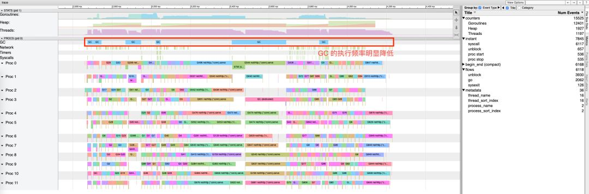

在实际实践中可表现为需要紧急处理一些由 GC 带来的瓶颈时，人为将 GOGC 调大，加钱加内存，扛过这一段峰值流量时期。

当然，这种做法其实是治标不治本，并没有从根本上解决内存分配过于频繁的问题，极端情况下，反而会由于 GOGC 太大而导致回收不及时而耗费更多的时间来清理产生的垃圾，这对时间不算敏感的应用还好，但对实时性要求较高的程序来说就是致命的打击了。

因此这时更妥当的做法仍然是，定位问题的所在，并从代码层面上进行优化。

### 3、小结

通过上面的三个例子我们可以看到在 GC 调优过程中 `go tool pprof` 和 `go tool trace`的强大作用是帮助我们快速定位 GC 导致瓶颈的具体位置，但这些例子中仅仅覆盖了其功能的很小一部分，我们也没有必要完整覆盖所有的功能，因为总是可以通过http pprof 官方文档、runtime pprof官方文档以及trace 官方文档来举一反三。

现在我们来总结一下前面三个例子中的优化情况：

1. 控制内存分配的速度，限制 goroutine 的数量，从而提高赋值器对 CPU 的利用率。
2. 减少并复用内存，例如使用 sync.Pool 来复用需要频繁创建临时对象，例如提前分配足够的内存来降低多余的拷贝。
3. 需要时，增大 GOGC 的值，降低 GC 的运行频率。

这三种情况几乎涵盖了 GC 调优中的核心思路，虽然从语言上还有很多小技巧可说，但我们并不会在这里事无巨细的进行总结。实际情况也是千变万化，我们更应该着重于培养具体问题具体分析的能力。

当然，我们还应该谨记 **过早优化是万恶之源**这一警语，在没有遇到应用的真正瓶颈时，将宝贵的时间分配在开发中其他优先级更高的任务上。
