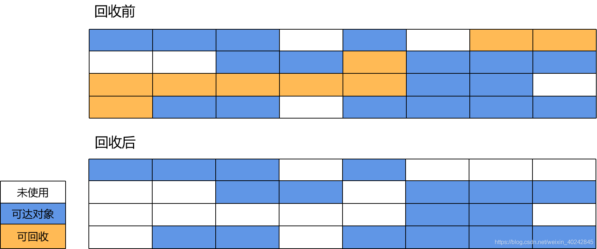
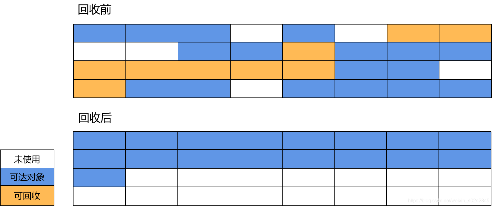
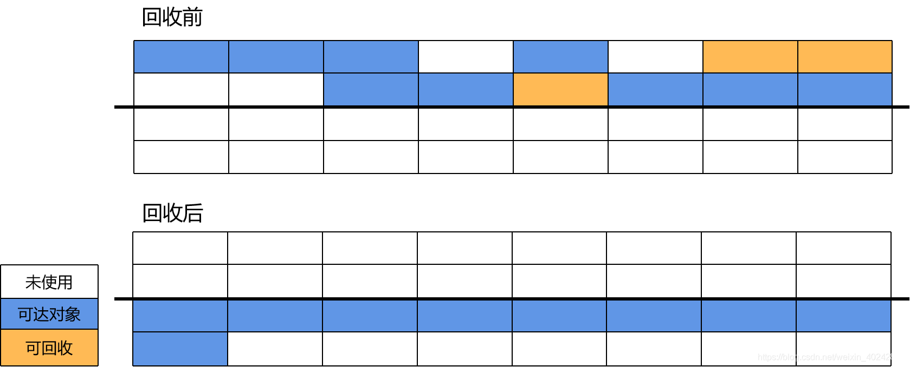

# Golang GC

来源：[Go GC](https://blog.csdn.net/weixin_40242845/article/details/114744783)

## 一、Garbage Collection

GC，Garbage Collection的缩写，自动内存管理机制。

程序创建对象等引用类型实体时会在虚拟内存中分配给它们一块内存空间，如果该内存空间不再被任何引用变量引用时就成为需要被回收的垃圾。

从原理上而言，所有的语言都能够自行实现 GC。从语言诞生之初就提供 GC 的语言，例如：Python、JavaScript、Java、Objective-C、Swift

而不以 GC 为目标，被直接设计为手动管理内存、但可以自行实现 GC 的语言有：C、C++

也有一些语言可以在编译期，依靠编译器插入清理代码的方式，实现精准的清理，例如：Rust

**GC 的优势**：垃圾回收使程序员无需手动处理内存释放，从而能够消除一些需要手动管理内存才会出现的运行时错误：

- 在仍然有指向内存区块的指针的情况下释放这块内存时，会产生悬挂指针，从而后续可能错误的访问已经用于他用的内存区域。
- 多重释放同一块申请的内存区域可能导致不可知的内存损坏。

当然，垃圾回收也会伴随一些缺陷，这也就造就了**没有 GC 的一些优势**：

- 没有额外的性能开销
- 精准的手动内存管理，极致的利用机器的性能

### 1、垃圾回收器组件

垃圾回收器分为两个半独立的组件

- 赋值器 Mutator：对用户态对象图进行操作(上色)
- 回收器 Collector：负责执行垃圾回收(回收)

用户程序Mutator通过内存分配器Allocator在堆Heap上申请内存，垃圾回收器Collector会定时清理堆上的内存。

### 2、垃圾回收器的目标

- 无内存泄漏：垃圾回收器最基本的目标就是减少防止程序员未及时释放导致的内存泄漏，垃圾回收器会识别并清理内存中的垃圾
- 自动回收无用内存：垃圾回收器作为独立的子任务，不需要程序员显式调用即可自动清理内存垃圾
- 内存整理：如果只是简单回收无用内存，那么堆上的内存空间会存在较多碎片而无法满足分配较大对象的需求，因此垃圾回收器需要重整内存空间，提高内存利用率

### 3、触发机制

- 主动触发：runtime GC，阻塞式等待当前GC调用完成
- 被动触发：
  - 系统监控，超过2分钟没有引用就强制GC
  - 步调(Pacing算法)，控制内存增长的比例

## 二、常见 GC 算法

常见GC分为两大类：

- 追踪法(tracing)：从根对象出发，根据对象之间的引用信息，扫描，直到确定要保留的对象，回收无引用对象。一般是GO，JAVA，V8等
- 引用计数法：每个对象自身包含一个计数器，当计数器归零的自动回收。一般是Python，object-C等

### 1、追踪法

#### 1）标记清扫

标记-清除算法将垃圾回收分为两个阶段：标记阶段和清除阶段。

一种可行的实现是，在标记阶段，首先通过根节点，标记所有从根节点开始的可达对象。因此，未被标记的对象就是未被引用的垃圾对象。然后，在清除阶段，清除所有未被标记的对象。**这也是GO的GC算法的基础**



优点：

- 以解决循环调用问题

缺点：

- 效率较慢，因为在标记和清除时都要遍历所有的对象，并且在每次GC开始的时候都要STW
- 因为内存分配时的碎片化，导致在回收之后也会有不同程度的碎片化，导致内存利用率不高

#### 2）标记压缩

它在标记-清除算法的基础上做了一些优化。和标记-清除算法一样，标记-压缩算法也首先需要从根节点开始，对所有可达对象做一次标记。但之后，它并不简单的清理未标记的对象，而是将所有的存活对象压缩到内存的一端。之后，清理边界外所有的空间。



优点：

- 标记-压缩算法适合用于存活对象较多的场合，如老年代
- 降低堆内存碎片化问题

缺点：

- 效率相较标记清扫更低了

#### 3）标记复制

将原有的内存空间分为两块，每次只使用其中一块，在垃圾回收时，将正在使用的内存中的存活对象复制到未使用的内存块中，之后，清除正在使用的内存块中的所有对象，交换两个内存的角色，完成垃圾回收。



优点：

- 与标记-清除算法相比，复制算法是一种相对高效的回收方法（默认应用于青年代）
- 效率较高

缺点：

- 浪费空间
- 对可达对象存活周期长的效率不高

#### 4）分代式

对于一个大型的系统，当创建的对象和方法变量比较多时，堆内存中的对象也会比较多，如果逐一分析对象是否该回收，那么势必造成效率低下。

分代收集算法是基于这样一个事实：不同的对象的生命周期(存活情况)是不一样的，而不同生命周期的对象位于堆中不同的区域，因此对堆内存不同区域采用不同的策略进行回收可以提高 JVM 的执行效率。当代商用虚拟机使用的都是分代收集算法：新生代对象存活率低，就采用复制算法；老年代存活率高，就用标记清除算法或者标记整理算法。Java堆内存一般可以分为新生代、老年代和永久代三个模块。

根据不同对象的存活周期分为不同的几块

- 老年代：标记清扫 或 标记整理
- 青年代：标记复制
  

### 2、引用计数法

**引用计数 Reference counting 会为每个对象维护一个计数器，当该对象被其他对象引用时加一，引用失效时减一，当引用次数归零后即可回收对象**。

使用这类GC方法的语言包括python、php、objective-C和C++标准库中的std::shared_ptr等。

以python为例，python中的每个对象都包含如下结构：

```
typedef struct_object {
    int ob_refcnt;
    struct_typeobject *ob_type;
}PyObject;
```

其中ob_refcnt为引用计数器，当一个对象有新的引用时计数器增一，当引用它的对象被删除时计数器减一。

引用计数法优点包括：

- 原理和实现都比较简单
- 回收的即时性：当对象的引用计数为0时立即回收，不像其他GC机制需要等待特定时机再回收，提高了内存的利用率
- 不需要暂停应用即可完成回收

缺点包括：

- 无法解决循环引用的回收问题：当ObjA引用了ObjB，ObjB也引用ObjA时，这两个对象的引用次数使用大于0，从而占用的内存无法被回收
- 时间和空间成本较高：一方面是因为每个对象需要额外的空间存储引用计数器变量，另一方面是在栈上的赋值时修改引用次数时间成本较高（原本只需要修改寄存器中的值，现在计数器需要不断更新因此不是只读的，需要额外的原子操作来保证线程安全）
- 引用计数是一种摊销算法，会将内存的回收分摊到整个程序的运行过程，但是当销毁一个很大的树形结构时无法保证响应时间

## 三、Go 的 GC 算法

无分代、不整理、并发的三色标记法

对象整理目的：

- 是解决内存碎片问题，但是Go给予tcmalloc分配算法，基本没有碎片问题。
  另外顺序内存分配器在多线程并不适用，整理内存队tcmalloc分配没有实质提升
- 分代GC目标主要是针对新创建对象，不会频繁检查所有对象。但是Go会通过逃逸分析将大部分“新生”对象存储在栈上，需要长期保存的对象存在于堆中。栈会被回收，不需要GC。
  Go的GC更专注于如何让GC和用户代码并发执行