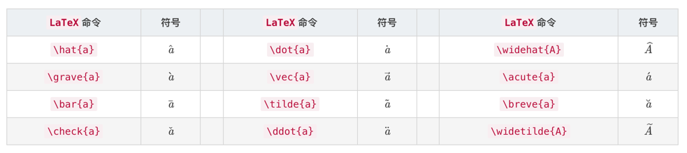

# 数学符号

参考：https://blog.csdn.net/anscor/article/details/80878285

## 一、运算符

| LaTeX 命令     | 符号 | LaTeX 命令       | 符号 | LaTeX 命令     | 符号 |
| -------------- | ---- | ---------------- | ---- | -------------- | ---- |
| +              | +    | \pm              | ±    | \oplus         | ⊕    |
| -              | -    | \mp              | ∓    | \ominus        | ⊖    |
| \times         | ×    | \ast             | ∗    | \otimes        | ⊗    |
| \div           | ÷    | \setminus        | ∖    | \oslash        | ⊘    |
| \cdot          | ⋅    | \bullet          | ∙    | \odot          | ⊙    |
| \star          | ⋆    | \circ            | ∘    | \diamond       | ⋄    |
| \bigcirc       | ◯    | \triangleleft    | ◃    | \triangleright | ▹    |
| \bigtriangleup | △    | \bigtriangledown | ▽    | \amalg         | ⨿    |
| \wedge，land   | ∧    | \vee，\lor       | ∨    | \ddagger       | ‡    |
| \cup           | ∪    | \cap             | ∩    | \wr            | ≀    |
| \sqcup         | ⊔    | \sqcap           | ⊓    | \%             | %    |
| \uplus         | ⊎    | \dagger          | †    |                |      |

**大尺寸运算符**

| LaTeX 命令 | 符号 | LaTeX 命令 | 符号 | LaTeX 命令 | 符号 |
| ---------- | ---- | ---------- | ---- | ---------- | ---- |
| `\\sum`    | ∑    | \bigcup    | ⋃    | \bigvee    | ⋁    |
| \prod      | ∏    | \bigcap    | ⋂    | \bigwedge  | ⋀    |
| \coprod    | ∐    | \bigsqcup  | ⨆    | biguplus   | ⨄    |
| \int       | ∫    | \oint      | ∮    | \bigodot   | ⨀    |
| \bigoplus  | ⨁    | \bigotimes | ⨂    |            |      |

## 二、关系符

| LaTeX 命令  | 符号 | LaTeX 命令  | 符号 | LaTeX 命令 | 符号 |
| ----------- | ---- | ----------- | ---- | ---------- | ---- |
| <           | <    | >           | >    | =          | =    |
| \leq，\le   | ≤    | \geq，\ge   | ≥    | \equiv     | ≡    |
| \ll         | ≪    | \gg         | ≫    | \doteq     | ≐    |
| \prec       | ≺    | \succ       | ≻    | \sim       | ∼    |
| \preceq     | ⪯    | \succeq     | ⪰    | \simeq     | ≃    |
| \subset     | ⊂    | \supset     | ⊃    | \approx    | ≈    |
| \subseteq   | ⊆    | \supseteq   | ⊇    | \cong      | ≅    |
| \sqsubseteq | ⊑    | \sqsupseteq | ⊒    | \bowtie    | ⋈    |
| \in         | ∈    | \ni，\owns  | ∋    | \propto    | ∝    |
| \vdash      | ⊢    | \dashv      | ⊣    | \models    | ⊨    |
| \mid        | ∣    | \parallel   | ∥    | \perp      | ⊥    |
| \smile      | ⌣    | \frown      | ⌢    | \asymp     | ≍    |
| :           | :    | \notin      | ∈/   | \neq，ne   | ̸=    |

## 三、定界符

| LaTeX 命令    | 符号 | LaTeX 命令    | 符号 |
| ------------- | ---- | ------------- | ---- |
| (             | (    | )             | )    |
| [，\lbrack    | [    | ]，rbrack     | ]    |
| `\{`，\lbrace | {    | `\}`，\rbrace | }    |
| \langle       | ⟨    | \rangle       | ⟩    |
| \lfloor       | ⌊    | \rfloor       | ⌋    |
| \lceil        | ⌈    | \rceil        | ⌉    |
| `\|`，\vert   | `|`  | `\\|`，\Vert      | ∥    |
| / | / | \backslash | \ |
| \lgroup | ⟮ | \rgroup | ⟯ |
| \lmoustache | ⎰ | \rmoustache | ⎱ |

## 四、箭头

| LaTeX 命令         | 符号 | LaTeX 命令          | 符号 | LaTeX 命令   | 符号 |
| ------------------ | ---- | ------------------- | ---- | ------------ | ---- |
| \leftarrow，\gets  | ←    | \longleftarrow      | ⟵    | \uparrow     | ↑    |
| \rightarrow，\to   | →    | \longrightarrow     | ⟶    | \downarrow   | ↓    |
| \leftrightarrow    | ↔    | \longleftrightarrow | ⟷    | \updownarrow | ↕    |
| \Leftarrow         | ⇐    | \Longleftarrow      | ⟸    | \Uparrow     | ⇑    |
| \Rightarrow        | ⇒    | \Longrightarrow     | ⟹    | \Downarrow   | ⇓    |
| \Leftrightarrow    | ⇔    | \Longleftrightarrow | ⟺    | \Updownarrow | ⇕    |
| \mapsto            | ↦    | \longmapsto         | ⟼    | \nearrow     | ↗    |
| \hookleftarrow     | ↩    | \hookrightarrow     | ↪    | \searrow     | ↘    |
| \leftharpoonup     | ↼    | \rightharpoonup     | ⇀    | \swarrow     | ↙    |
| \leftharpoondown   | ↽    | \rightharpoondown   | ⇁    | \nwarrow     | ↖    |
| \rightleftharpoons | ⇌    | \iff                | ⟺    | \            | $$   |

## 五、希腊字母

| 大写 LaTeX 命令 | 小写 LaTeX 命令       | 大写 | 小写     |
| --------------- | --------------------- | ---- | -------- |
| A               | \alpha                | *A*  | *α*      |
| B               | \beta                 | *B*  | *β*      |
| \Gamma          | \gamma                | Γ    | *γ*      |
| \Delta          | \delta                | Δ    | *δ*      |
| E               | \epsilon，\varepsilon | *E*  | *ϵ*，*ε* |
| Z               | \zeta                 | *Z*  | *ζ*      |
| H               | \eta                  | *H*  | *η*      |
| Theta           | \theta，\vartheta     | Θ    | *θ*，*ϑ* |
| I               | \iota                 | *I*  | *ι*      |
| K               | \kappa                | *K*  | *κ*      |
| \Lambda         | \lambda               | Λ    | *λ*      |
| M               | \mu                   | *M*  | *μ*      |
| N               | \nu                   | *N*  | *ν*      |
| \Xi             | \xi                   | Ξ    | *ξ*      |
| O               | o                     | *O*  | *o*      |
| Pi              | \pi，\varpi           | Π    | *π*，*ϖ* |
| P               | \rho，\varrho         | *P*  | *ρ*，*ϱ* |
| \Sigma          | \sigma，\varsigma     | Σ    | *σ*，*ς* |
| T               | \tau                  | *T*  | *τ*      |
| \Upsilon        | \upsilon              | Υ    | *υ*      |
| \Phi            | \phi，\varphi         | Φ    | *ϕ*，*φ* |
| X               | \chi                  | *X*  | *χ*      |
| \Psi            | \psi                  | Ψ    | *ψ*      |
| \Omega          | \omega                | Ω    | *ω*      |

## 六、常用符号

| LaTeX 命令   | 符号 | LaTeX 命令 | 符号 | LaTeX 命令 | 符号 | LaTeX 命令 | 符号 |
| ------------ | ---- | ---------- | ---- | ---------- | ---- | ---------- | ---- |
| \dots        | …    | \cdots     | ⋯    | \vdots     | ⋮    | \ddtos     | ⋱    |
| \hbar        | ℏ    | \imath     | ı    | \jmath     | ȷ    | \ell       | ℓ    |
| \Re          | ℜ    | \Im        | ℑ    | \aleph     | ℵ    | \wp        | ℘    |
| \forall      | ∀    | \exists    | ∃    | \partial   | ∂    |            |      |
| ‘            | ’    | \prime     | ′    | \emptyset  | ∅    | \infty     | ∞    |
| \nabla       | ∇    | \triangle  | △    |            |      |            |      |
| \bot         | ⊥    | \top       | ⊤    | \angle     | ∠    | \surd      | √    |
| \diamondsuit | ♢    | \heartsuit | ♡    | \clubsuit  | ♣    | \spadesuit | ♠    |
| \neg，lnot   | ¬    | \flat      | ♭    | \natural   | ♮    | \sharp     | ♯    |

## 七、数字模式重音符

