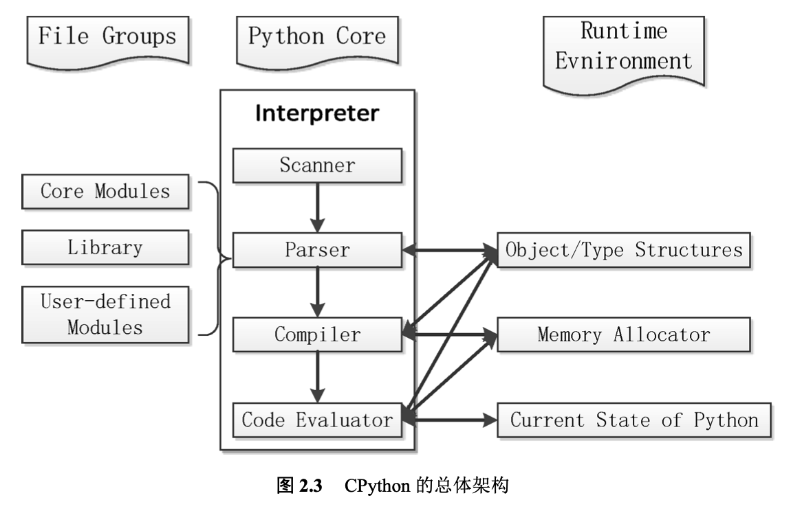
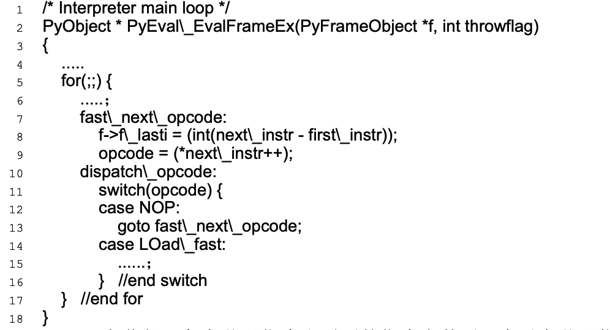

# 动态编译器 **CPython** 的架构

## 整体架构

CPython 是 Python 语言的官方解释器，其核心 思想类似于 Java 和.NET。CPython 在执行时，首先会将.py 文件中的源代码编译 成 Python 的 byte code(字节码)，然后再由 Python Virtual Machine(Python 虚 拟机)来执行这些编译好的 byte code。

在最高层次上，CPython 的整体架构可以分为三个主要部分

在图 2.3的左边是 CPython 提供的大量的模块、库以及用户自定义的模型。比如，在执行 import os 时，这个 os 就是 CPython 内建的模块。用户还可以通过自定义模块来扩展 CPython 系统。

在图 2.3的右边是 CPython 的运行时环境，包括对象/类型系统，内存分配器和运行时状态信息。

- 对象/类型系统则包含了 Python 中 存在的各种内建对象，比如整数、list 和 dict，以及各种用户自定义的类型和对象。
- 内存分配器则全权负责 CPython 中创建对象时对内存的申请工作

- 运行时状态维护了解释器在执行字节码时不同的状态(比如正常状态和异常状态)之间切换的动作，我们可以将它视为一个巨大而复杂的有穷状态机。

中间部分展示的是 CPython 的核心 –解释器(interpreter)，或者称 为虚拟机。在解析器中，箭头的方向指示了 CPython 运行过程中的数据流方向。 

- Scanner 对应词法分析，将文件输入的 Python 源码或从命令行输入的一行行 Python 代码切分为一个个的 token;
- Parser 对应语法分析，在 Scanner 的分析结果上进行语法分析，建立抽象语法树(AST);
- Compiler 是根据建立的 AST 生成指令集合 –Python 字节码(byte code);
- 最后，由 Code Evaluator(亦称为虚拟机)来执行这些字节码。

> 解释器与右边的对象/类型系统、内存分配器之间的箭头表示 “使用”关系，而与运行时状态之间的箭头表示“修改”关系，即 CPython 在执行的过程中会不断的修改当前解释器所处的状态，在不同的状态之间切换。

## CPython 中的虚拟机架构

虚拟机是动态编译器中的核心。在.py 源代码被编译为字节码指令序列之后，就将由 CPython 的虚拟机接手整个工作。

CPython 的虚拟机会从编译得到 的 PyCodeObject 对象中一次读入每一条字节码指令，并在当前的上下文环境中执行这条字节码指令。如此反复运行，所有由 CPython 源代码所规定的动作都会如期望一样，一一展开和执行。

CPython 虚拟机的核心实现在文件 ceval.c 中，如下代码展示了虚拟机执行字节码指令的整体架构。

- CPython 在获得一条字节码指令和需要的指令参数后，会对字节码指令利用 switch 进行判断，根据字节码指令的不同类型找到对应的 case 语句块。每个字节码指令都会对应一个 case 语句，**在 case 语句块中就是 CPython 对字节码指令的实现**。

- 在成功执行一条字节码指令之后，CPython 的执行流会跳转到fast_next_opcode 处或者是 for 循环处，获得下一条字节码指令和指令参数，完成下一条指令的执行。

- 如此一条条的遍历所有字节码指令，最终完成对 Python 程序的执行。