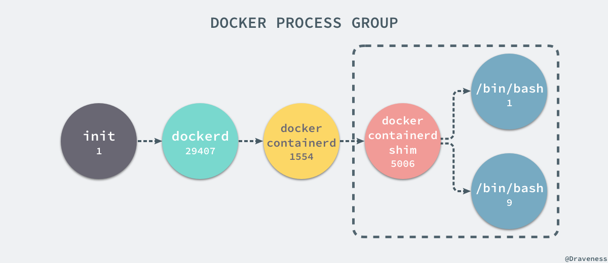

# Docker 核心技术与实现原理

来源：[Docker 核心技术与实现原理](https://draveness.me/docker/)

Docker 的出现是因为目前的后端在开发和运维阶段确实需要**一种虚拟化技术解决开发环境和生产环境环境一致的问题**

通过 Docker 我们可以将**程序运行的环境也纳入到版本控制**中，排除因为环境造成不同运行结果的可能。

Docker 目前的组件较多，并且实现也非常复杂，但是本文不想过多的介绍 Docker 具体的实现细节，我们更想谈一谈 Docker 这种虚拟化技术的出现有哪些核心技术的支撑。


## 一、Namespaces

命名空间 (namespaces) 是 Linux 为我们提供的用于分离进程树、网络接口、挂载点以及进程间通信等资源的方法。

在日常使用 Linux 或者 macOS 时，我们并没有运行多个完全分离的服务器的需要，但是如果我们在服务器上启动了多个服务，这些服务其实会相互影响的，每一个服务都能看到其他服务的进程，也可以访问宿主机器上的任意文件，这是很多时候我们都不愿意看到的，我们更希望运行在同一台机器上的不同服务能做到「完全隔离」，就像运行在多台不同的机器上一样。


在这种情况下，一旦服务器上的某一个服务被入侵，那么入侵者就能够访问当前机器上的所有服务和文件，这也是我们不想看到的

**而 Docker 其实就通过 Linux 的 Namespaces 对不同的容器实现了隔离**

Linux 的命名空间机制提供了以下七种不同的命名空间，包括 

- CLONE_NEWCGROUP
- CLONE_NEWIPC
- CLONE_NEWNET
- CLONE_NEWNS
- CLONE_NEWPID
- CLONE_NEWUSER
- CLONE_NEWUTS

通过这七个选项我们能在**创建新的进程时设置新进程应该在哪些资源上与宿主机器进行隔离**

### 1、进程

进程是 Linux 以及现在操作系统中非常重要的概念，它表示一个正在执行的程序，也是在现代分时系统中的一个任务单元。

在每一个 Linix 的操作系统上，我们都能够通过 `ps` 命令打印出当前操作系统中正在执行的进程，比如在 Ubuntu 上，使用该命令就能得到以下的结果：

```shell
$ ps -ef
UID        PID  PPID  C STIME TTY          TIME CMD
root         1     0  0 Apr08 ?        00:00:09 /sbin/init
root         2     0  0 Apr08 ?        00:00:00 [kthreadd]
root         3     2  0 Apr08 ?        00:00:05 [ksoftirqd/0]
root         5     2  0 Apr08 ?        00:00:00 [kworker/0:0H]
root         7     2  0 Apr08 ?        00:07:10 [rcu_sched]
root        39     2  0 Apr08 ?        00:00:00 [migration/0]
root        40     2  0 Apr08 ?        00:01:54 [watchdog/0]
...
```

当前机器上有很多的进程正在执行，在上述进程中有两个非常特殊

- `pid` 为 1 的 `/sbin/init` 进程
- `pid` 为 2 的 `kthreadd` 进程

这两个进程都是被 Linux 中的上帝进程 `idle` 创建出来的，其中前者负责执行内核的一部分初始化工作和系统配置，也会创建一些类似 `getty` 的注册进程，而后者负责管理和调度其他的内核进程


如果我们在当前的 Linux 操作系统下运行一个新的 Docker 容器，并通过 `exec` 进入其内部的 `bash` 并打印其中的全部进程，我们会得到以下的结果：

```shell
root@iZ255w13cy6Z:~# docker run -it -d ubuntu
b809a2eb3630e64c581561b08ac46154878ff1c61c6519848b4a29d412215e79
root@iZ255w13cy6Z:~# docker exec -it b809a2eb3630 /bin/bash
root@b809a2eb3630:/# ps -ef
UID        PID  PPID  C STIME TTY          TIME CMD
root         1     0  0 15:42 pts/0    00:00:00 /bin/bash
root         9     0  0 15:42 pts/1    00:00:00 /bin/bash
root        17     9  0 15:43 pts/1    00:00:00 ps -ef
```

在新的容器内部执行 `ps` 命令打印出了非常干净的进程列表，只有包含当前 `ps -ef`在内的三个进程，在宿主机器上的几十个进程都已经消失不见了。

当前的 **Docker 容器成功将容器内的进程与宿主机器中的进程隔离**，如果我们在宿主机器上打印当前的全部进程时，会得到下面三条与 Docker 相关的结果：

```shell
UID        PID  PPID  C STIME TTY          TIME CMD
root     29407     1  0 Nov16 ?        00:08:38 /usr/bin/dockerd --raw-logs
root      1554 29407  0 Nov19 ?        00:03:28 docker-containerd -l unix:///var/run/docker/libcontainerd/docker-containerd.sock --metrics-interval=0 --start-timeout 2m --state-dir /var/run/docker/libcontainerd/containerd --shim docker-containerd-shim --runtime docker-runc
root      5006  1554  0 08:38 ?        00:00:00 docker-containerd-shim b809a2eb3630e64c581561b08ac46154878ff1c61c6519848b4a29d412215e79 /var/run/docker/libcontainerd/b809a2eb3630e64c581561b08ac46154878ff1c61c6519848b4a29d412215e79 docker-runc
```

在当前的宿主机器上，可能就存在由上述的不同进程构成的进程树：



这就是在使用 `clone(2)` 创建新进程时传入 `CLONE_NEWPID` 实现的，也就是**使用 Linux 的命名空间实现进程的隔离**，Docker 容器内部的任意进程都对宿主机器的进程一无所知

```go
containerRouter.postContainersStart
└── daemon.ContainerStart
    └── daemon.createSpec
        └── setNamespaces
            └── setNamespace
```

Docker 的容器就是使用上述技术实现与宿主机器的进程隔离

当我们每次运行 `docker run` 或者 `docker start` 时，都会在下面的方法中创建一个用于设置进程间隔离的 Spec：

```go
func (daemon *Daemon) createSpec(c *container.Container) (*specs.Spec, error) {
	s := oci.DefaultSpec()

	// ...
	if err := setNamespaces(daemon, &s, c); err != nil {
		return nil, fmt.Errorf("linux spec namespaces: %v", err)
	}

	return &s, nil
}
```

在 `setNamespaces` 方法中不仅会设置进程相关的命名空间，还会设置与用户、网络、IPC 以及 UTS 相关的命名空间：

```go
func setNamespaces(daemon *Daemon, s *specs.Spec, c *container.Container) error {
	// user
	// network
	// ipc
	// uts

	// pid
	if c.HostConfig.PidMode.IsContainer() {
		ns := specs.LinuxNamespace{Type: "pid"}
		pc, err := daemon.getPidContainer(c)
		if err != nil {
			return err
		}
		ns.Path = fmt.Sprintf("/proc/%d/ns/pid", pc.State.GetPID())
		setNamespace(s, ns)
	} else if c.HostConfig.PidMode.IsHost() {
		oci.RemoveNamespace(s, specs.LinuxNamespaceType("pid"))
	} else {
		ns := specs.LinuxNamespace{Type: "pid"}
		setNamespace(s, ns)
	}

	return nil
}
```

所有命名空间相关的设置 `Spec` 最后都会作为 `Create` 函数的入参在创建新的容器时进行设置：

```go
daemon.containerd.Create(context.Background(), container.ID, spec, createOptions)
```

所有与命名空间的相关的设置都是在上述的两个函数中完成的，Docker 通过命名空间成功完成了与宿主机进程和网络的隔离。

### 2、网络

如果 Docker 的容器通过 Linux 的命名空间完成了与宿主机进程的网络隔离，但是却又没有办法通过宿主机的网络与整个互联网相连，就会产生很多限制。 Docker 中的服务仍然需要与外界相连才能发挥作用。

每一个使用 `docker run` 启动的容器其实都具有单独的网络命名空间

Docker 为我们提供了四种不同的网络模式，Host、Container、None 和 Bridge 模式。


#### 网桥模式

在这一部分，我们将介绍 Docker 默认的网络设置模式：网桥模式。

在这种模式下，除了分配隔离的网络命名空间之外，Docker 还会为所有的容器设置 IP 地址。

当 Docker 服务器在主机上启动之后会创建新的虚拟网桥 docker0，随后在该主机上启动的全部服务在默认情况下都与该网桥相连。


在默认情况下，每一个容器在创建时都会创建一对虚拟网卡，两个虚拟网卡组成了数据的通道

其中一个会放在创建的容器中，另一个会加入到名为 docker0 网桥中。我们可以使用如下的命令来查看当前网桥的接口：

```shell
$ brctl show
bridge name	bridge id		STP enabled	interfaces
docker0		8000.0242a6654980	no		veth3e84d4f
							            veth9953b75
```

docker0 会为每一个容器分配一个新的 IP 地址并将 docker0 的 IP 地址设置为默认的网关。

网桥 docker0 通过 iptables 中的配置与宿主机器上的网卡相连，所有符合条件的请求都会通过 iptables 转发到 docker0 并由网桥分发给对应的容器。

```shell
$ iptables -t nat -L
Chain PREROUTING (policy ACCEPT)
target     prot opt source               destination
DOCKER     all  --  anywhere             anywhere             ADDRTYPE match dst-type LOCAL

Chain DOCKER (2 references)
target     prot opt source               destination
RETURN     all  --  anywhere             anywhere
```

我们在当前的机器上使用 `docker run -d -p 6379:6379 redis` 命令启动了一个新的 Redis 容器

在这之后我们再查看当前 `iptables` 的 NAT 配置就会看到在 `DOCKER` 的链中出现了一条新的规则：

```shell
DNAT       tcp  --  anywhere             anywhere             tcp dpt:6379 to:192.168.0.4:6379
```

上述规则会将从任意源发送到当前机器 6379 端口的 TCP 包转发到 192.168.0.4:6379 所在的地址上

这个地址其实也是 Docker 为 Redis 服务分配的 IP 地址，如果我们在当前机器上直接 ping 这个 IP 地址就会发现它是可以访问到的：

```shell
$ ping 192.168.0.4
PING 192.168.0.4 (192.168.0.4) 56(84) bytes of data.
64 bytes from 192.168.0.4: icmp_seq=1 ttl=64 time=0.069 ms
64 bytes from 192.168.0.4: icmp_seq=2 ttl=64 time=0.043 ms
^C
--- 192.168.0.4 ping statistics ---
2 packets transmitted, 2 received, 0% packet loss, time 999ms
rtt min/avg/max/mdev = 0.043/0.056/0.069/0.013 ms
```

从上述的一系列现象，我们就可以推测出 Docker 是如何将容器的内部的端口暴露出来并对数据包进行转发的了；

当有 Docker 的容器需要将服务暴露给宿主机器，就会为容器分配一个 IP 地址，同时向 iptables 中追加一条新的规则。


当我们使用 `redis-cli` 在宿主机器的命令行中访问 127.0.0.1:6379 的地址时，经过 iptables 的 NAT PREROUTING 将 ip 地址定向到了 192.168.0.4，

重定向过的数据包就可以通过 iptables 中的 FILTER 配置，最终在 NAT POSTROUTING 阶段将 ip 地址伪装成 127.0.0.1，

到这里虽然从外面看起来我们请求的是 127.0.0.1:6379，但是实际上请求的已经是 Docker 容器暴露出的端口了。

```shell
$ redis-cli -h 127.0.0.1 -p 6379 ping
PONG
```

Docker 通过 Linux 的命名空间实现了网络的隔离，又**通过 iptables 进行数据包转发**，让 Docker 容器能够优雅地为宿主机器或者其他容器提供服务。

#### libnetwork

整个网络部分的功能都是通过 Docker 拆分出来的 libnetwork 实现的，它提供了一个连接不同容器的实现，同时也能够为应用给出一个能够提供一致的编程接口和网络层抽象的**容器网络模型**。

> The goal of libnetwork is to deliver a robust Container Network Model that provides a consistent programming interface and the required network abstractions for applications.

libnetwork 中最重要的概念，容器网络模型由以下的几个主要组件组成，分别是 Sandbox、Endpoint 和 Network：


在容器网络模型中，每一个容器内部都包含一个 Sandbox，其中存储着当前容器的网络栈配置，包括容器的接口、路由表和 DNS 设置

Linux 使用网络命名空间实现这个 Sandbox，每一个 Sandbox 中都可能会有一个或多个 Endpoint，在 Linux 上就是一个虚拟的网卡 veth，Sandbox 通过 Endpoint 加入到对应的网络中，这里的网络可能就是我们在上面提到的 Linux 网桥或者 VLAN

> 想要获得更多与 libnetwork 或者容器网络模型相关的信息，可以阅读 [Design · libnetwork](https://github.com/docker/libnetwork/blob/master/docs/design.md) 了解更多信息，当然也可以阅读源代码了解不同 OS 对容器网络模型的不同实现。

### 3、挂载点

虽然我们已经通过 Linux 的命名空间解决了进程和网络隔离的问题，在 Docker 进程中我们已经没有办法访问宿主机器上的其他进程并且限制了网络的访问，但是 Docker 容器中的进程仍然能够访问或者修改宿主机器上的其他目录，这是我们不希望看到的。

在新的进程中创建隔离的挂载点命名空间需要在 `clone` 函数中传入 `CLONE_NEWNS`，这样子进程就能得到父进程挂载点的拷贝，如果不传入这个参数**子进程对文件系统的读写都会同步回父进程以及整个主机的文件系统**。

如果一个容器需要启动，那么它一定需要提供一个根文件系统（rootfs），容器需要使用这个文件系统来创建一个新的进程，所有二进制的执行都必须在这个根文件系统中。


想要正常启动一个容器就需要在 rootfs 中挂载以上的几个特定的目录，除了上述的几个目录需要挂载之外我们还需要建立一些符号链接保证系统 IO 不会出现问题。


为了保证当前的容器进程没有办法访问宿主机器上其他目录，我们在这里还需要通过 libcontainer 提供的 `pivot_root` 或者 `chroot` 函数改变进程能够访问个文件目录的根节点。

```go
// pivor_root
put_old = mkdir(...);
pivot_root(rootfs, put_old);
chdir("/");
unmount(put_old, MS_DETACH);
rmdir(put_old);

// chroot
mount(rootfs, "/", NULL, MS_MOVE, NULL);
chroot(".");
chdir("/");
```

到这里我们就将容器需要的目录挂载到了容器中，同时也禁止当前的容器进程访问宿主机器上的其他目录，保证了不同文件系统的隔离

> 这一部分的内容是作者在 libcontainer 中的 [SPEC.md](https://github.com/opencontainers/runc/blob/master/libcontainer/SPEC.md) 文件中找到的，其中包含了 Docker 使用的文件系统的说明，对于 Docker 是否真的使用 `chroot` 来确保当前的进程无法访问宿主机器的目录，作者其实也**没有确切的答案**，一是 Docker 项目的代码太多庞大，不知道该从何入手，作者尝试通过 Google 查找相关的结果，但是既找到了无人回答的 [问题](https://forums.docker.com/t/does-the-docker-engine-use-chroot/25429)，也得到了与 SPEC 中的描述有冲突的 [答案](https://www.quora.com/Do-Docker-containers-use-a-chroot-environment) ，如果各位读者有明确的答案可以在博客下面留言，非常感谢。

**chroot**

在这里不得不简单介绍一下 `chroot`（change root），在 Linux 系统中，系统默认的目录就都是以 `/` 也就是根目录开头的，`chroot` 的使用能够改变当前的系统根目录结构，通过改变当前系统的根目录，我们能够限制用户的权利，在新的根目录下并不能够访问旧系统根目录的结构个文件，也就建立了一个与原系统完全隔离的目录结构。

> 与 chroot 的相关内容部分来自 [理解 chroot](https://www.ibm.com/developerworks/cn/linux/l-cn-chroot/index.html) 一文，各位读者可以阅读这篇文章获得更详细的信息。

## 二、CGroups