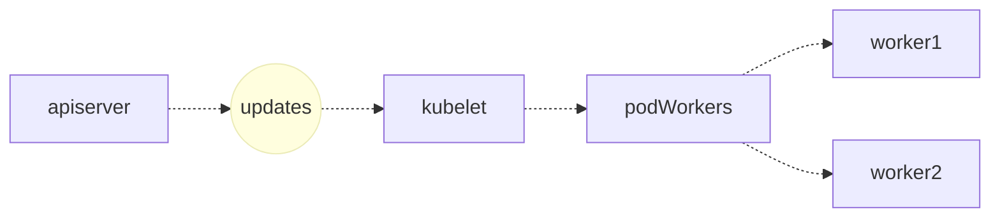
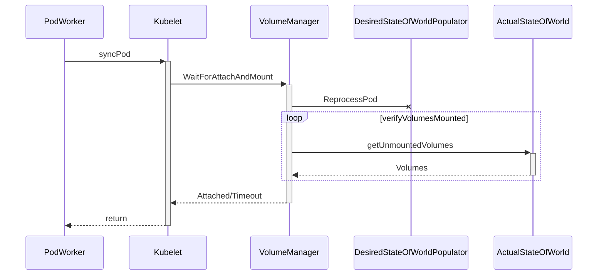
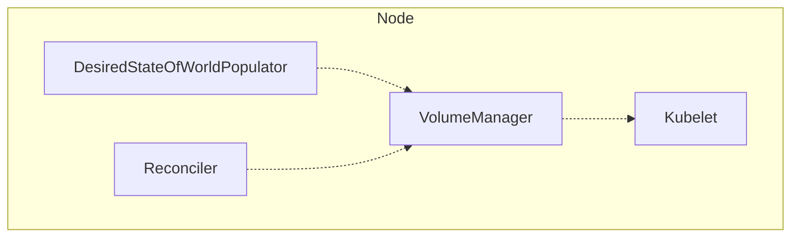
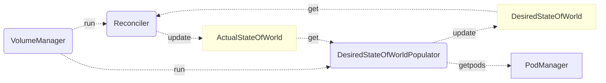

# 详解 Kubernetes Volume 的实现原理

来源：[详解 Kubernetes Volume 的实现原理](https://draveness.me/kubernetes-volume/)

在 Kubernetes 集群中，虽然无状态的服务非常常见，但是在实际的生产中仍然会需要在集群中部署一些「有状态」的节点，比如一些存储中间件、消息队列等等。

然而 Kubernetes 中的每一个容器随时都可能因为某些原因而被删除和重启，容器中的文件也会随着它的删除而丢失，所以我们需要对集群中的某些文件和数据进行『持久化』；除此之外，由于同一个 Pod 中的多个 Container 可能也会有共享文件的需求，比如通过共享文件目录的方式为 nginx 生成需要代理的静态文件，所以我们需要一种方式来解决这两个问题。

作为 Kubernetes 集群中除了 Pod 和 Service 之外最常见的基本对象，Volume 不仅能够解决 Container 中文件的临时性问题，也能够让同一个 Pod 中的多个 Container 共享文件。

## 一、概述

Kubernetes 中的 Volume 种类非常多，它不仅要支持临时的、易失的磁盘文件，还需要解决持久存储的问题；第一个问题往往都比较容易解决，后者作为持久存储在很多时候都需要与云服务商提供的存储方案打交道，如果是 Kubernetes 中已经支持的存储类型倒是还好，遇到不支持的类型还是比较麻烦的。


除了卷和持久卷之外，Kubernetes 还有另外一种更加复杂的概念 - 动态存储供应，它能够允许存储卷按需进行创建，不再需要集群的管理员手动调用云服务商提供的接口或者界面创建新的存储卷。

集群中的每一个卷在被 Pod 使用时都会经历四个操作，也就是附着（Attach）、挂载（Mount）、卸载（Unmount）和分离（Detach）。

如果 Pod 中使用的是 EmptyDir、HostPath 这种类型的卷，那么这些卷并不会经历附着和分离的操作，它们只会被挂载和卸载到某一个的 Pod 中，不过如果使用的云服务商提供的存储服务，**这些持久卷只有附着到某一个节点之后**才可以被挂在到相应的目录下，不过在其他节点使用这些卷时，该存储资源也需要先与当前的节点分离。

### 1、卷

在这一节中提到的卷（Volume）其实是一个比较特定的概念，它并不是一个持久化存储，可能会随着 Pod 的删除而删除，常见的卷就包括 EmptyDir、HostPath、ConfigMap 和 Secret，这些卷与所属的 Pod 具有相同的生命周期，它们可以通过如下的方式挂载到 Pod 下面的某一个目录中：

```yaml
apiVersion: v1
kind: Pod
metadata:
  name: test-pod
spec:
  containers:
  - name: test-container
    image: k8s.gcr.io/busybox
    volumeMounts:
    - name: cache-volume
      mountPath: /cache
    - name: test-volume
      mountPath: /hostpath
    - name: config-volume
      mountPath: /data/configmap
    - name: special-volume
      mountPath: /data/secret
  volumes:
  - name: cache-volume
    emptyDir: {}
  - name: hostpath-volume
    hostPath:
      path: /data/hostpath
      type: Directory
  - name: config-volume
    configMap:
      name: special-config
  - name: secret-volume
    secret:
      secretName: secret-config
```

需要注意的是，当我们将 ConfigMap 或者 Secret 『包装』成卷并挂载到某个目录时，我们其实创建了一些新的 Volume，这些 Volume 并不是 Kubernetes 中的对象，它们只存在于当前 Pod 中，随着 Pod 的删除而删除，但是需要注意的是这些『临时卷』的删除并不会导致相关 `ConfigMap` 或者 `Secret` 对象的删除。

从上面我们其实可以看出 Volume 没有办法脱离 Pod 而生存，它与 Pod 拥有完全相同的生命周期，而且它们也不是 Kubernetes 对象，所以 Volume 的主要作用还是用于跨节点或者容器对数据进行同步和共享。

### 2、持久卷

临时的卷没有办法解决数据持久存储的问题，想要让数据能够持久化，首先就需要将 Pod 和卷的声明周期分离，这也就是引入持久卷 `PersistentVolume(PV)` 的原因。我们可以将 `PersistentVolume` 理解为集群中资源的一种，它与集群中的节点 Node 有些相似，PV 为 Kubernete 集群提供了一个如何提供并且使用存储的抽象，与它一起被引入的另一个对象就是 `PersistentVolumeClaim(PVC)`，这两个对象之间的关系与节点和 Pod 之间的关系差不多：


`PersistentVolume` 是集群中的一种被管理员分配的存储资源，而 `PersistentVolumeClaim` 表示用户对存储资源的申请，它与 Pod 非常相似，PVC 消耗了持久卷资源，而 Pod 消耗了节点上的 CPU 和内存等物理资源。

因为 PVC 允许用户消耗抽象的存储资源，所以用户需要不同类型、属性和性能的 PV 就是一个比较常见的需求了，在这时我们可以通过 `StorageClass` 来提供不同种类的 PV 资源，上层用户就可以直接使用系统管理员提供好的存储类型。

#### 1）访问模式

Kubernetes 中的 PV 提供三种不同的访问模式，分别是 `ReadWriteOnce`、`ReadOnlyMany` 和 `ReadWriteMany`，这三种模式的含义和用法我们可以通过它们的名字推测出来：

- `ReadWriteOnce` 表示当前卷可以被一个节点使用读写模式挂载；
- `ReadOnlyMany` 表示当前卷可以被多个节点使用只读模式挂载；
- `ReadWriteMany` 表示当前卷可以被多个节点使用读写模式挂载；

不同的卷插件对于访问模式其实有着不同的支持，AWS 上的 `AWSElasticBlockStore` 和 GCP 上的 `GCEPersistentDisk` 就只支持 `ReadWriteOnce` 方式的挂载，不能同时挂载到多个节点上，但是 `CephFS` 就同时支持这三种访问模式。

#### 2）回收策略

当某个服务使用完某一个卷之后，它们会从 apiserver 中删除 PVC 对象，这时 Kubernetes 就需要对卷进行回收（Reclaim），持久卷也同样包含三种不同的回收策略，这三种回收策略会指导 Kubernetes 选择不同的方式对使用过的卷进行处理。


第一种回收策略就是保留（Retain）PV 中的数据，如果希望 PV 能够被重新使用，系统管理员需要删除被使用的 `PersistentVolume` 对象并手动清除存储和相关存储上的数据。

另一种常见的回收策略就是删除（Delete），当 PVC 被使用者删除之后，如果当前卷支持删除的回收策略，那么 PV 和相关的存储会被自动删除，如果当前 PV 上的数据确实不再需要，那么将回收策略设置成 Delete 能够节省手动处理的时间并快速释放无用的资源。

#### 3）存储供应

Kubernetes 集群中包含了很多的 PV 资源，而 PV 资源有两种供应的方式，一种是静态的，另一种是动态的，静态存储供应要求集群的管理员预先创建一定数量的 PV，然后使用者通过 PVC 的方式对 PV 资源的使用进行声明和申请；但是当系统管理员创建的 PV 对象不能满足使用者的需求时，就会进入动态存储供应的逻辑，供应的方式是基于集群中的 `StorageClass` 对象，当然这种动态供应的方式也可以通过配置进行关闭。

## 二、管理

Volume 的创建和管理在 Kubernetes 中主要由卷管理器 `VolumeManager` 和 `AttachDetachController` 和 `PVController` 三个组件负责。其中卷管理器会负责卷的创建和管理的大部分工作，而 `AttachDetachController` 主要负责对集群中的卷进行 Attach 和 Detach，`PVController` 负责处理持久卷的变更，文章接下来的内容会详细介绍这几部分之间的关系、工作原理以及它们是如何协作的。

### 1、kubelet

作者在 [详解 Kubernetes Pod 的实现原理](https://draveness.me/kubernetes-pod) 一文中曾简单介绍过 kubelet 和 Pod 的关系，前者会负责后者的创建和管理，kubelet 中与 Pod 相关的信息都是从 apiserver 中获取的：



两者的通信会使用一个 `kubetypes.PodUpdate` 类型的 Channel，kubelet 从 apiserver 中获取 Pod 时也会通过字段过滤器 `fields.OneTermEqualSelector(api.PodHostField, string(nodeName))` 仅选择被调度到 kubelet 所在节点上的 Pod：

```go
func NewSourceApiserver(c clientset.Interface, nodeName types.NodeName, updates chan<- interface{}) {
	lw := cache.NewListWatchFromClient(c.CoreV1().RESTClient(), "pods", metav1.NamespaceAll, fields.OneTermEqualSelector(api.PodHostField, string(nodeName)))
	newSourceApiserverFromLW(lw, updates)
}
```

所有对 Pod 的变更最终都会通知给具体的 PodWorker，这些 Worker 协程会调用 kubelet `syncPod` 函数完成对 Pod 的同步：



在一个 100 多行的 `syncPod` 方法中，kubelet 会调用 `WaitForAttachAndMount` 方法，等待某一个 Pod 中的全部卷已经被成功地挂载：

```go
func (kl *Kubelet) syncPod(o syncPodOptions) error {
	pod := o.pod
	
	// ...
	if !kl.podIsTerminated(pod) {
		kl.volumeManager.WaitForAttachAndMount(pod)
	}
	// ...

	return nil
}
```

这个方法会将当前的 Pod 加入需要重新处理卷挂载的队列并在循环中持续调用 `verifyVolumesMounted` 方法来比较期望挂载的卷和实际挂载卷的区别，这个循环会等待两者变得完全相同或者超时后才会返回，当前方法的返回一般也意味着 Pod 中的全部卷已经挂载成功了。

### 2、卷管理器

当前节点卷的管理就都是由 `VolumeManager` 来负责了，在 Kubernetes 集群中的每一个节点（Node）上的 kubelet 启动时都会运行一个 `VolumeManager`Goroutine，它会负责在当前节点上的 Pod 和 Volume 发生变动时对 Volume 进行挂载和卸载等操作。



这个组件会在运行时启动两个 Goroutine 来管理节点中的卷，其中一个是 `DesiredStateOfWorldPopulator`，另一个是 `Reconciler`：



如上图所示，这里的 `DesiredStateOfWorldPopulator` 和 `Reconciler` 两个 Goroutine 会通过图中两个的 `XXXStateOfWorld` 状态进行通信，`DesiredStateOfWorldPopulator` 主要负责从 Kubernetes 节点中获取新的 Pod 对象并更新 `DesiredStateOfWorld` 结构；而后者会根据实际状态和当前状态的区别对当前节点的状态进行迁移，也就是通过 `DesiredStateOfWorld` 中状态的变更更新 `ActualStateOfWorld` 中的内容。

卷管理器中的两个 Goroutine，一个根据工程师的需求更新节点的期望状态 `DesiredStateOfWorld`，另一个 Goroutine 保证节点向期望状态『迁移』，也就是说 `DesiredStateOfWorldPopulator` 是卷管理器中的生产者，而 `Reconciler` 是消费者，接下来我们会分别介绍这两个 Goroutine 的工作和实现。