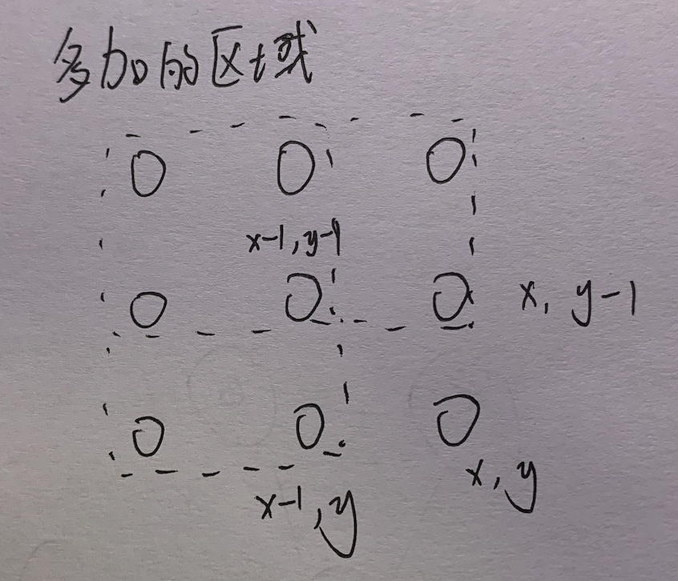

# [前缀和](https://oi-wiki.org/basic/prefix-sum/)

前缀和是一种重要的预处理，能大大降低查询的时间复杂度。可以简单理解为 **数列的前n项的和**。


## 一维前缀和

有 n 个的正整数放到数组 A 里，现在要求一个新的数组 B，新数组的第 i 个数B[i] 是原数组 A 第 0 到第 i 个数的和

```
B[0] = A[0]，对于i>0 则 B[i] = B[i-1] + A[i]
```

```python
n = 5
A = [i for i in range(n)]
B = [0 for _ in range(n)]
B[0] = A[0]

# 计算一维前缀和
for i in range(1, n):
    B[i] = B[i-1] + A[i]
    
print(B) # [0, 1, 3, 6, 10]
```

## 二维/多维前缀和

比如我们有这样一个矩阵 $$a$$，可以视为二维数组：

```
1 2 4 3
5 1 2 4
6 3 5 9
```

再定义一个矩阵$$sum$$，使$$sum_{x,y} = \sum\limits_{i=1}^{x} \sum\limits_{i=1}^{y} a_{x,y}$$ 那么这个矩阵长这样：

```
1  3  7  10
6  9  15 22
12 18 29 45
```

递推求矩阵$$sum$$，：

$$
sum_{x,y} = sum_{x-1,y} + sum_{x,y-1} - sum_{x-1,y-1} + a_{x,y}
$$



求$$(x_1,y_1)-(x_2,y_2)$$子矩阵的和：
$$
sub = sum_{x_2,y_2} - sum_{x_1-1,y_2} - sum_{x_2,y_1-1} + sum_{x_1-1,y_1-1}
$$


**例题**

在一个 rows x cols 的只包含 0 和 1 的矩阵 a 里找出一个不包含 0 的最大正方形，输出边长。

```python
b = [[0 for _ in range(cols)] for _ in range(rows)]
b[0][0] = a[0][0]

# 初始化上边界
for c in range(1, cols):
    b[0][c] = b[0][c-1] + a[0][c]
# 初始化左边届
for r in range(1, rows):
    b[r][0] = b[r-1][0] + a[r][0]

# 计算二维前缀和
for r in range(1, rows):
    for c in range(1, cols):
        b[r][c] = b[r][c-1] + b[r-1][c] - b[r-1][c-1] + a[r][c]

ans = float("-inf")
side = 2   # 边长
while side < min(n, m):
    # 当变长为side时搜索所有可能，搜索范围在side<=r<rows, side<=c<cols的区域
    for r in range(side, rows):
        for c in range(side, cols):
            # 子矩阵右下角的点为[r][c]，左上角的点为[r-side+1][c-side+1]
            # 子矩阵内1的和 等于 边长的平方时 为正方形
            if b[r][c] - b[r-side][c] - b[r][c-side] + b[r-side][c-side] == side*side:
                ans = max(ans, side)
    side += 1
print(ans)
```

