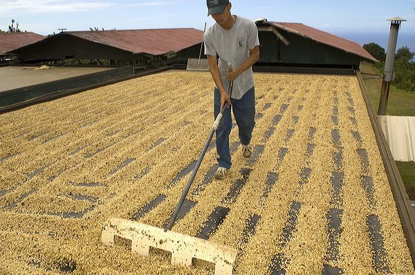
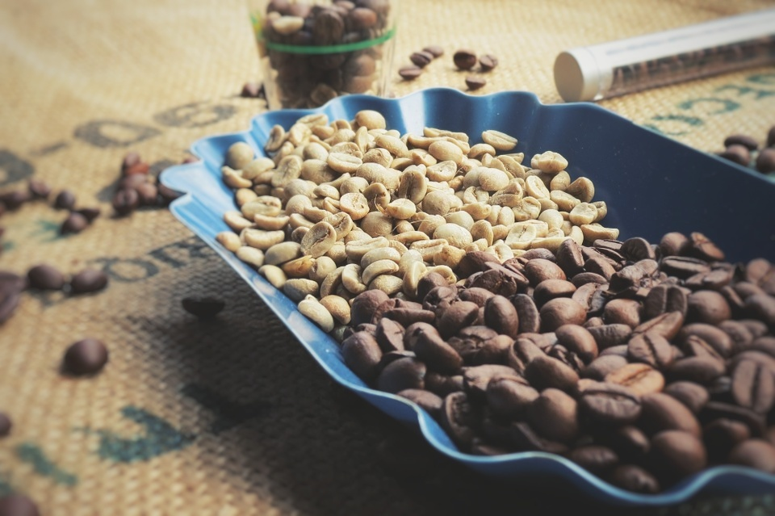
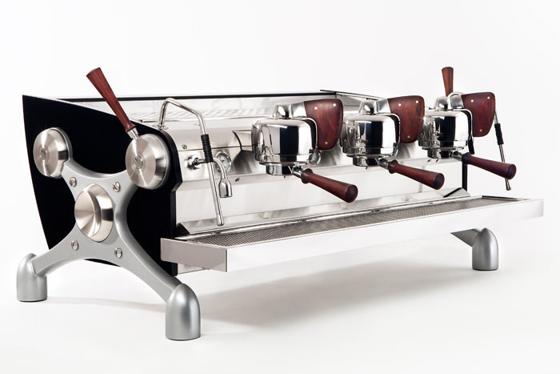
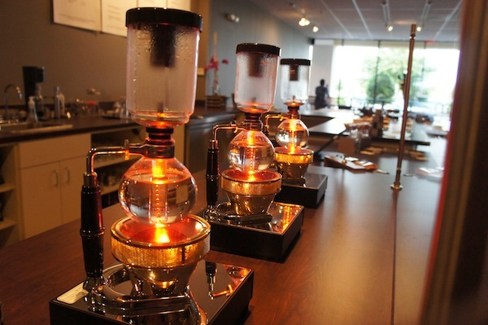
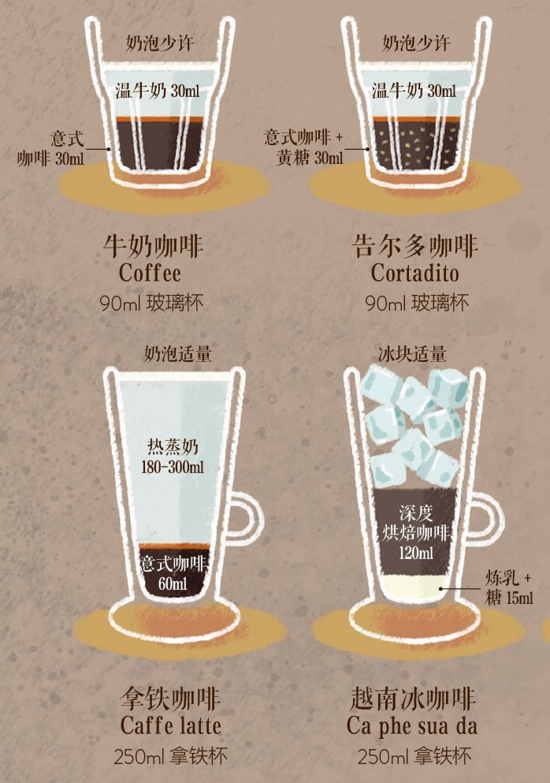
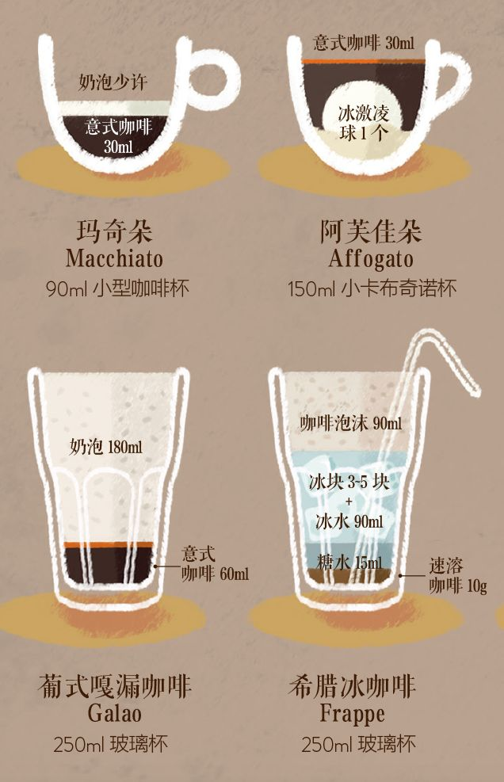
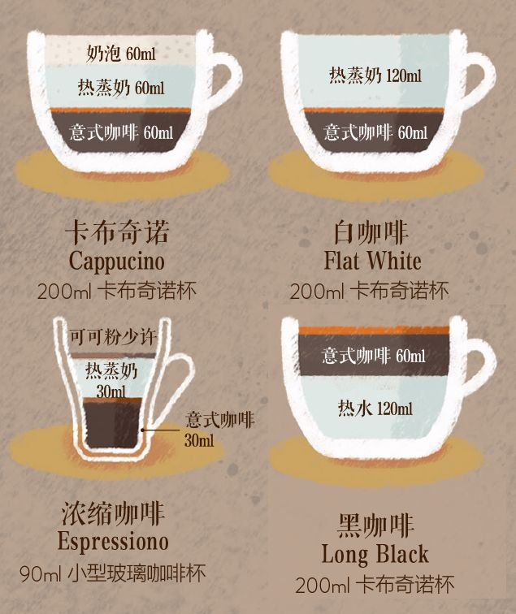
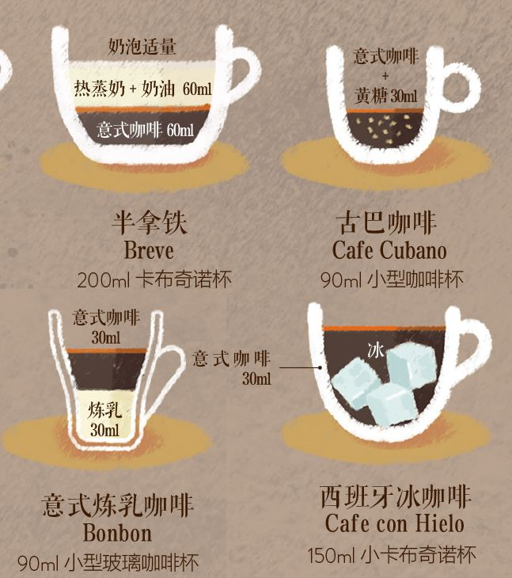

# 咖啡种类

咖啡从山间的农作物，到成为我们手中的饮料，粗略划分，**经历了种植、收获、处理、烘焙、萃取这五大步骤。**

目前我们看到的所有分类，基本是**基于这些步骤中的不同因素/方法**而划分的。

## **一、种植维度分类**

种植阶段有两大影响咖啡品质的因素——**咖啡树的种植地(产地)和品种。**于是有了以下咖啡分类

### 1、基于产地的分类

**按国家可分为：肯尼亚咖啡、依索比亚咖啡、越南咖啡等等**，其中优质的咖啡通常会来自[巴拿马](https://www.zhihu.com/search?q=巴拿马&search_source=Entity&hybrid_search_source=Entity&hybrid_search_extra={"sourceType"%3A"answer"%2C"sourceId"%3A230190367})、肯尼亚、埃塞俄比亚等非洲和中南美洲国家；

北美洲：夏威夷，墨西哥 

中美洲：哥斯达黎加，[危地马拉](https://www.zhihu.com/search?q=危地马拉&search_source=Entity&hybrid_search_source=Entity&hybrid_search_extra={"sourceType"%3A"article"%2C"sourceId"%3A"125618758"})，巴拿马，牙买加 

南美洲：巴西，哥伦比亚，[玻利维亚](https://www.zhihu.com/search?q=玻利维亚&search_source=Entity&hybrid_search_source=Entity&hybrid_search_extra={"sourceType"%3A"article"%2C"sourceId"%3A"125618758"})

非洲：埃塞俄比亚，刚果，[肯尼亚](https://www.zhihu.com/search?q=肯尼亚&search_source=Entity&hybrid_search_source=Entity&hybrid_search_extra={"sourceType"%3A"article"%2C"sourceId"%3A"125618758"})

亚洲：越南、云南、印度尼西亚（爪哇、[苏门答腊](https://www.zhihu.com/search?q=苏门答腊&search_source=Entity&hybrid_search_source=Entity&hybrid_search_extra={"sourceType"%3A"article"%2C"sourceId"%3A"125618758"})） 

再深一层，根据某一国家的不同产区也可划分：比如依索比亚的西达摩和耶加雪啡、牙买加的蓝山、印尼的苏门答腊等等，这些都是以地名命名的分类；再往深，对于爱好者和专业人士，还会根据不同的庄园进行划分标记。

### 2、基于咖啡树品种的分类

**按大的品种，咖啡可简单分为阿拉比卡种和罗布斯塔种。**

通常情况下，阿拉比卡的口味优于罗布斯塔（实际不能这样简单地一概而论），比如，我们经常听到某连锁快餐声称采用 100% 的阿拉比卡咖啡豆。但需要注意的是，阿拉比卡不一定代表了好咖啡，或者说多数的阿拉比卡咖啡豆距离优质还差得很远。

精细化的阿拉比卡分类：在阿拉比卡下面，有无数亚种，以及亚种交配的品种，比如我们常听到的：[黄波旁](https://www.zhihu.com/search?q=黄波旁&search_source=Entity&hybrid_search_source=Entity&hybrid_search_extra={"sourceType"%3A"answer"%2C"sourceId"%3A230190367})、铁皮卡、瑰夏等等。

## 二、收获维度分类（不涉及）

这个阶段包括采摘和筛选，不涉及我们通常能听到的咖啡分类

## 三、处理维度分类

所谓处理，是指将樱桃状的咖啡果实（也叫 Coffee Cherry），去掉外果皮、果肉等等，得到包裹之下的黄绿色咖啡生豆的过程，这是咖啡豆粗加工的过程。

**基于 3 种常见的处理方法，我们会听到这 3 咖啡分类：日晒、水洗、蜜处理**

**日晒：**较天然的处理方法，多数是很粗放地暴晒，但也可以精细化操作，精品咖啡中的日晒豆都是精细处理的结果，通常好的**日晒豆水果风味会更突出**

**水洗：**水洗处理法较为复杂，暂不赘述，这种处理法通常只用于较为优质的咖啡豆，**水洗豆的特点是口感干净、能品尝到明亮的果酸**

**蜜处理（也叫半水洗）：**蜜处理结合了上面两种方法，所得到的豆子，口感也兼具上面两种方法的特点

## 四、烘焙维度分类

咖啡豆经过烘豆机的加热，发生美拉德反应，从黄绿色的生豆，变成我们在咖啡店和超市里见到的棕色豆子，这个过程，就叫做烘焙。

针对烘焙阶段，通常会听到这几种咖啡分类。

### 1、按烘焙度分类：通常有浅度、中度、深度之分

通常，我们听到的意式烘焙、法式烘焙，都是指深度烘焙的咖啡，City Roast 通常是中度烘焙的一种。

深烘中烘，口感醇厚，更有传统的”咖啡香“；

浅烘则更能体现出咖啡豆本身的味道，往往各种果香四溢，是名副其实的一杯”果汁“。但是如果不喜欢酸味的饮料，可能会不太习惯。

### 3、按烘焙对象分类：可分为单品咖啡和拼配咖啡

**单品咖啡（或单品豆）：**对于优质的咖啡生豆，为了最大化展示它本身的特点——也就是所谓的地域之味。我们不会把它和其他品种、种植国的咖啡混合在一起烘焙和萃取，这就是所谓的“单品咖啡”。最严格（狭义）的单品咖啡，信息具体到了品种、产地、庄园、处理法，不同批次与年份的“单品咖啡”，味道也不是一成不变的，每年有每年的惊喜。

**拼配咖啡**（更常见的说法是拼配豆）**：**而一些出品量大的咖啡店，比如星巴克、Costa 等等，为了保证出品咖啡口味的稳定，和数量的保障，会在烘焙阶段采用多种豆子拼配的方式（可能是生豆拼在一起烘焙，也可能是烘焙好的熟豆拼在一起）。通常情况下，拼配所使用的咖啡豆没有单品优质，而且会采用深度烘焙。但是，对于拼配咖啡这件事经验丰富的意大利人，总能拼出非常美味的好咖啡。

所以**如果遇到有朋友问你，喜欢喝单品吗**？那通常是指，你是否喜欢喝优质的单一产地咖啡豆制作的咖啡。

## 五、萃取维度分类

有人说咖啡师在吧台主要做一件事——萃取。所谓萃取，就是在把咖啡豆研磨成粉后，用水把粉中的芳香物质提取出来，制作成一杯咖啡。关于这一阶段，通常涉及最多常见的咖啡分类

### 1、**按照萃取的方法分类，**常见分为

**意式咖啡：**用意式咖啡机，将热水加压到约 9 个大气压冲煮出的一杯浓缩咖啡，通常被我们成为意式咖啡。想做出美式、拿铁、卡布奇诺，都要先有这一小杯意式浓缩咖啡才可以。有人管用摩卡壶煮的咖啡也叫意式咖啡，但严格说来，这只能是意大利人在家做咖啡的代表方式，而不是真正的意式咖啡。

**滴滤式咖啡：**用 V60、Chemex 等萃取工具，在普通大气压下，用热水浇注的方式从咖啡粉中萃取出一杯咖啡。这种萃取方法也叫手冲咖啡，家用的电动美式咖啡机也是模仿的这个原理(严格来说，家用美式咖啡机做出来的可不是美式咖啡，美式咖啡是稀释过的意式咖啡，需要上面那台意式机器高温高压萃取)。

**虹吸式咖啡：**用虹吸壶加热萃取的咖啡。

**浸泡式咖啡：**这种萃取方式的代表是法压壶制作的咖啡，以及冰酿咖啡。

### 2、萃取后的再制作

**在意式浓缩咖啡的基础上，发展出的咖啡饮料：**一杯意式浓缩咖啡制作完成后，选择加奶制品、加水、甚至是酒和可可，也造就出了一杯不同的咖啡，也就是我们所说的意式基底的咖啡 Espresso-based drink 。在这个分类下，可以发展出：Americano、拿铁咖啡、卡布基诺、Flat White 、Piccolo 等等。你在星巴克，甚至是世界上绝大多数咖啡店都最经常听到的，都是这个层面的咖啡分类。

## 来源

[https://www.zhihu.com/question/22311781/answer/230190367](https://www.zhihu.com/question/22311781/answer/230190367)

