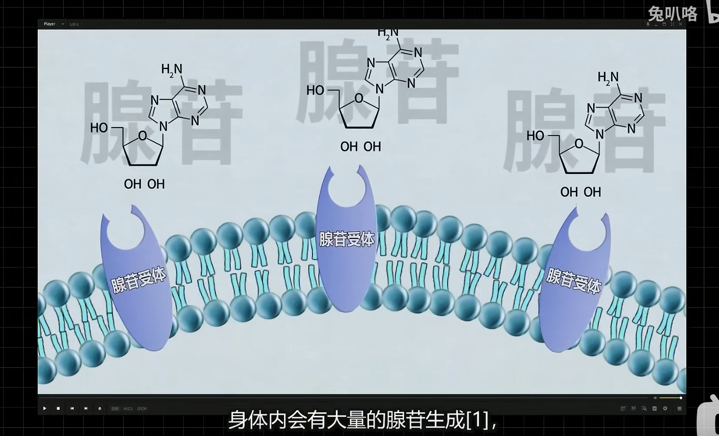

# 咖啡饮用

来源：[https://www.bilibili.com/video/BV1t3411e7PA?spm_id_from=333.999.0.0](https://www.bilibili.com/video/BV1t3411e7PA?spm_id_from=333.999.0.0)

## 如何饮用

1. **要想喝咖啡提神，一定要在「还没困的时候喝」** 

2. `Coffe Nap` **喝完咖啡后，小憩一会提神效果更佳。**因为在休息的时候，腺苷会与腺苷受体分开，这时候咖啡因就会与受体结合。

### 提神机理

1. 人正常情况下会有大量的腺苷受体

2. 当腺苷与腺苷受体结合的时候就产生了困意

3. 如果咖啡因先与腺苷受体结合，腺苷就无法与腺苷受体结合，进而抑制了困意

4. 如果腺苷与腺苷受体已经结合了，都产生困意了，咖啡因再来就没有作用了

## 饮用剂量

65kg 的成年人
$$
咖啡因摄入量 < 400\ mg/日
$$

大剂量的咖啡因摄入会引发焦虑 

## 避免成瘾

当咖啡因经常霸占着腺苷受体，腺苷没地方去，因为体内的「负反馈调节」，在困的时候会产生更多的腺苷受体。这个时候需要更多的咖啡因摄入

所以需要在忙碌的工作学习之后，**及时的睡觉，来避免腺苷堆积** 

