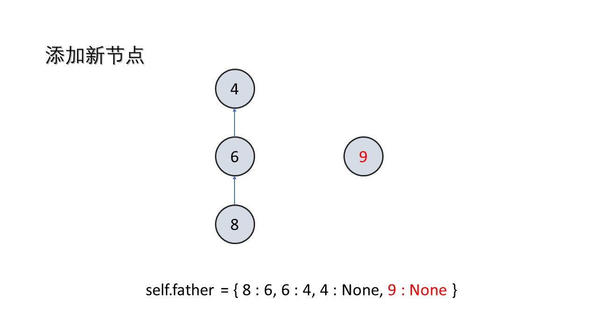
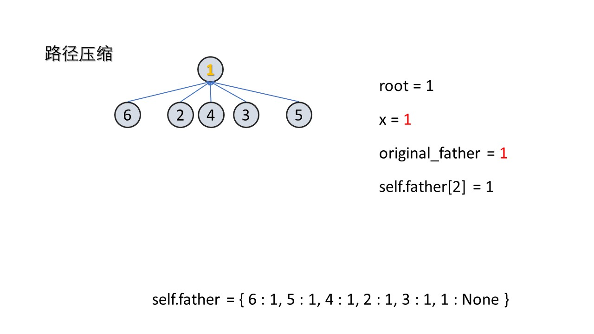
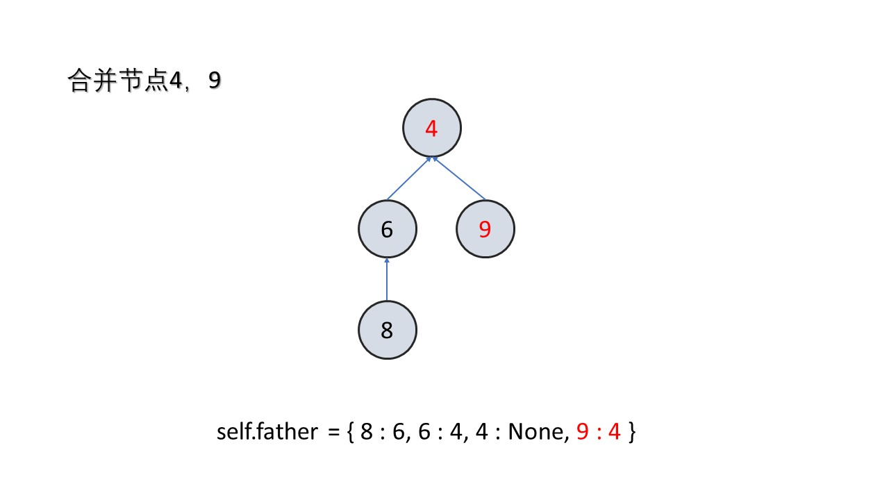

## [并查集](https://leetcode-cn.com/problems/number-of-provinces/solution/python-duo-tu-xiang-jie-bing-cha-ji-by-m-vjdr/)

### 基本概念

1. 并查集是一种数据结构
2. 并查集这三个字，一个字代表一个意思。
3. 并（Union），代表合并
4. 查（Find），代表查找
5. 集（Set），代表这是一个以字典为基础的数据结构，它的基本功能是合并集合中的元素，查找集合中的元素
6. 并查集的典型应用是有关连通分量的问题
7. **并查集解决单个问题（添加，合并，查找）的时间复杂度都是O(1)**
8. 因此，并查集可以应用到在线算法中

### 并查集的实现

#### 数据结构


并查集跟树有些类似，只不过她跟树是相反的。在树这个数据结构里面，每个节点会记录它的子节点。在并查集里，**每个节点会记录它的父节点**。

可以看到，如果节点是相互连通的（从一个节点可以到达另一个节点），那么他们在同一棵树里，或者说在同一个集合里，或者说他们的**祖先是相同的**。

#### 初始化

当把一个新节点添加到并查集中，它的父节点应该为空



#### 查找祖先

查找祖先的方法是：**如果节点的父节点不为空，那就不断迭代。**

这里有一个优化的点：如果我们树很深，比如说退化成链表，那么每次查询的效率都会非常低。所以我们要做一下**路径压缩。也就是把树的深度固定为二。**

这么做可行的原因是，**并查集只是记录了节点之间的连通关系，而节点相互连通只需要有一个相同的祖先就可以了。**路径压缩可以用递归，也可以迭代

路径压缩的时间复杂度为O(log*n) = O(1)，当成结论记下



#### 合并两个节点

如果发现两个节点是连通的，那么就要把他们合并，也就是他们的祖先是相同的。这里究竟把谁当做父节点一般是没有区别的。



#### 两节点是否连通

我们判断两个节点是否处于同一个连通分量的时候，就需要判断它们的祖先是否相同

### 并查集的模版

```python
class UnionFind:
    def __init__(self):
        """
        记录每个节点的父节点
        """
        self.father = {}

    def add(self,x):
        """
        添加新节点
        当把一个新节点添加到并查集中，它的父节点应该为空
        """
        if x not in self.father:
            self.father[x] = None
    
    def find(self,x):
        """
        查找根节点，如果节点的父节点不为空，那就不断迭代。
        路径压缩：
        1、如果我们树很深，比如说退化成链表，那么每次查询的效率都会非常低。所以我们要做一下路径压缩。也就是把树的深度固定为二。
        2、这么做可行的原因是，并查集只是记录了节点之间的连通关系，而节点相互连通只需要有一个相同的祖先就可以了。
        3、路径压缩可以用递归，也可以迭代。这里用迭代的方法。
        """
        root = x

        while self.father[root] != None:
            root = self.father[root]

        # 路径压缩
        while x != root:
            original_father = self.father[x]
            self.father[x] = root
            x = original_father
         
        return root
    
    def merge(self,x,y,val):
        """
        合并两个节点
        """
        root_x,root_y = self.find(x),self.find(y)
        
        if root_x != root_y:
            self.father[root_x] = root_y

    def is_connected(self,x,y):
        """
        判断两节点是否相连
        判断两个节点是否处于同一个连通分量的时候，就需要判断它们的祖先是否相同
        """
        return self.find(x) == self.find(y)
      
```

```c++
class UnionFind{
public:
    int find(int x){
        int root = x;
        
        while(father[root] != -1){
            root = father[root];
        }
        
        while(x != root){
            int original_father = father[x];
            father[x] = root;
            x = original_father;
        }
        
        return root;
    }
    
    bool is_connected(int x,int y){
        return find(x) == find(y);
    }
    
    void merge(int x,int y){
        int root_x = find(x);
        int root_y = find(y);
        
        if(root_x != root_y){
            father[root_x] = root_y;
        }
    }
    
    void add(int x){
        if(!father.count(x)){
            father[x] = -1;
        }
    }
    
private:
    // 记录父节点
    unordered_map<int,int> father;
};

```

